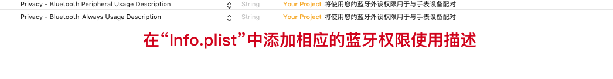
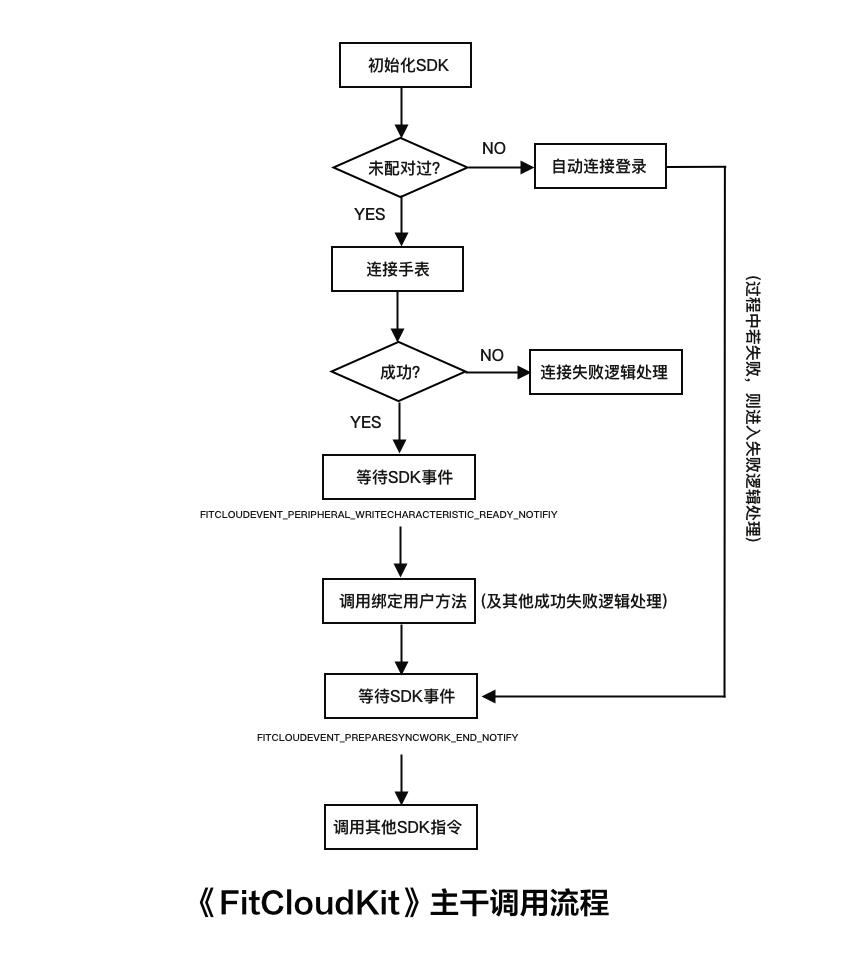

# 和唐智能手表（FitCloudKit）iOS 开发指南

## 简介 / Summary

- 什么是和唐智能手表 SDK ?

  > ###### 和唐智能手表 SDK 是提供给和唐的合作伙伴的开发套件，该开发套件负责与手表设备通信等功能的封装，旨在方便合作伙伴定制自己的智能手表应用。

- 适用范围

  ```
  需要个性化定制自己的 iOS 智能手表 APP 的合作伙伴。
  ```

- 兼容性

  ###### 1. iOS 8.0 及以上操作系统；

  ###### 2. 支持 armv7/i386/x86_64/arm64 指令集；

  ###### 3. 支持 Bitcode；

## 特性 / Features

1. 初始化/扫描/连接手表；

2. 获取/设置手表相关功能及显示；

3. 同步运动健康数据到 APP；

4. 启动/停止健康实时测量(心率/血压/血氧/心电等)；

5. 同步天气信息；

6. 查找手表/iOS 设备；

7. 一键恢复出厂设置；

8. 手表重启/关机；

9. 进入 DFU 模式前安全检查(保证手表有充足的电量)；

## 版本 / Releases

版本 V1.2.8 Build202305300001

```
  发布日期：2023年05月30日
  功能更新：
  1.表盘尺寸支持410*502方/416*416圆/240*288方
  2.新增自定义标签功能 @see withCustomLabels
  3.支付宝Iot支持, @see allowAliot
  4.蓝牙连接支持设置是否使用一键双连同时连接经典蓝牙(BT), @see allowConnectWithBT
  5.新增通过广播数据获取相关厂商信息及参数 @see FitCloudManufacturer
  6.手表运动GPS数据传输支持 @see FitCloudGPSRecordObject
  7.表盘尺寸支持340*340圆
  8.新增指定支持的收款码和名片，仅支持的收款码和名片才应该在App上展示推送入口 @see specifySupportedMoneyReceiveAndBusinessQRCode
  9.修改习惯养成指令
  10.新增省电模式设置 @see withPowerSavingMode & allowPowerSavingModePeriod
  11.设定每日目标新增时间戳参数
  12.调整支付宝Iot安全认证指令
  13.修改自动登录日志，userId支持String
  14.修改获取手表UI信息指令解析，兼容固件版本
  15.更新和新增了一大批运动类型定义
  16.提升SDK稳定性
```

版本 V1.2.7 Build202212300001

```
  发布日期：2022年12月30日
  功能更新：
  1.新增禁用睡眠模块
  2.新增核酸码推送功能 @see allowNucleicAcidQRCode
  3.天气新增大气压强/风力/能见度信息
  4.新增习惯养成相关指令 @see allowHabits
  5.新增收款码：Paytm收款码/PhonePe收款码/GPay收款码/BHTM收款码，新增名片：Email名片/Phone名片/LinkedIn名片, @see showAdditionalQRCodeTransfer
  6.新增通知手表查找手机响铃播放完毕，适配蓝牙通话手表
  7.新增获取每日运动目标指令
  8.优化外设MTU值获取
```

版本 V1.2.6 Build202209200001

```
  发布日期：2022年09月20日
  功能更新：
  1.修正GPS互联运动指令的问题
  2.新增基于气压泵的真血压(部分手表支持)
  3.部分手表支持手表手动测量数据同步
  4.部分手表支持发起SOS请求
  5.新增第三方外设启停操作支持
  6.新增手表启动震动参数设置
  7.新增手表上存储的消息删除指令
  8.新增取消手表当前消息显示
  9.新增游戏锁设置
  10.登录/绑定指令新增iOS系统版本标志
  11.新增获取单个游戏最高三个游戏记录(部分手表支持)
  12.修正真血压数据同步问题
  13.GPS互联指令修改
  14.新增游戏排名趋势设置(部分手表支持)
  15.获取闹钟闹钟列表更新SDK闹钟列表缓存
  16.更新SDK错误码翻译
  17.运动健康数据防丢失处理
  18.新增是否禁用在App上表盘模块化标志 @see disableWatchfaceModularInApp
  19.新增表盘尺寸240*296方
  20.提升SDK稳定性
```

版本 V1.2.5 Build202201260001

```
  发布日期：2022年01月26日
  功能更新：
  1.新增板球/自由运动/力量训练/室内健走/室内骑行/哑铃/跳舞/呼啦圈/高尔夫/跳远/仰卧起坐/排球运动定义
  2.新增手表GPS互联运动
  3.新增唤醒APP相机功能，该功能有缺陷，慎用
  4.新增血压报警&心率报警功能设备支持检查
  5.手表偏好设置新增FITCLOUDPREFER_REMINDWHENSPORTSGOALACHIEVEMENT，手表运动(计步/距离/卡路里)目标达成提醒
  6.修正常用联系人指令数据量较大时的问题
  7.修正OTA过程中关闭蓝牙可能导致闪退的问题
  8.新增收款码和名片二维码推送
  9.修正当手表断开连接的情况下解绑，当手表重新靠近手机的时候可能会重新回连的问题
  10.修正测量心电时蓝牙断开连接可能导致无法正确回连的问题
  11.新增通话手表绑定失败时音频蓝牙名称返回
  12.新增印地语
```

版本 V1.2.4 Build202110120001

```
  发布日期：2021年10月12日
  功能更新：
  1.新增是否支持游戏皮肤推送标志
  2.新增是否支持Apple Music、Zoom & Tiktok 提醒标志及其通知定义
  3.新增是否支持扫码连接标志
  4.添加硬件标识FITCLOUDHARDWARE_DFUSHOULDSILENTMODE
  5.新增俄罗斯方块游戏/数独游戏/答题游戏定义
  6.扫码绑定项目新增绑定失败原因(手表主动取消/手表超时未点击确认)
  7.新增获取/设置亮屏时长、亮度、振动等信息
  8.新增是否应该禁用自定义表盘功能标识
  9.新增手表离开查找手机功能界面回调
  10.手表偏好设置新增蓝牙断开时手表振动选项
  11.修复同步心电数据时手表断开连接导致之后无法回连的问题
  12.新增获取屏幕分辨率原始信息(lcd宽高/是否圆形屏幕/圆角大小等)指令，仅部分固件支持
  13.Nordic平台表盘编号也扩展到3个字节
  14.修复游戏皮肤获取只能获取到3条的问题
  15.修改表盘/游戏皮肤最大可推送文件的大小计算规则
  16.修改天气硬件功能标志位定义
  17.新增手表是否支持运动模式(DIY)固件推送标识
  18.新增获取设备可支持的运动模式类型列表/设备当前运动模式类型列表，仅部分手表支持
```

版本 V1.2.3 Build202107200001

```
  发布日期：2021年07月20日
  功能更新：
  1.新增压力指数测量，仅部分手表支持
  2.修正日程设置指令的问题
  3.修正锁屏密码设置指令的问题
  4.表盘尺寸支持280*240方/200*320方/368*448方/320*390方
  5.新增表盘模块化(组件化)支持
  7.修正日程获取指令的问题
  7.支持自定义设定手表语言
    @note: 如果你希望SDK初始化时就设定好，@see watchPreferLang for FitCloudOption
    如果你希望在APP运行中动态改变手表语言设定请调用setSmartWatchLanguage:completion:
    此外，原先的syncSystemLanguageWithBlock也会受到影响，也就是说如果你自定义设定了手表语言，
    原先的syncSystemLanguageWithBlock也会同步自定义的手表语言设定
  8. 新增设置是否允许手表设置日程，仅当时手表支持日程功能时有效
  9. 支持将自行扫描的外设转换成可连接的外设
  10. 新GUI结构相关协议更新
  11. 下一代厂商名称支持，下一代厂商名称可以确定不需要过滤蓝牙名称中首字母H
  12. 修正切换表盘导致表盘模块信息丢失的问题
  13. 多表盘推送支持获取每个表盘位置最大可推送固件的大小，单位：kB
  14. 支持Nordic芯片
  15. 新增获取手表支持的游戏类型，仅部分手表支持
  16. 新增获取游戏最高三个游戏记录，仅部分手表支持
  17. 新增获取手环上所有游戏对应的皮肤信息，仅部分手表支持
  18. 表盘尺寸支持172*320方/454*454圆/128*220方
  19. +(void)ignoreConnectedPeripheral:(BOOL)silent; 添加 silent 参数
  20. 新增FITCLOUDEVENT_WATCH_PAIRINGINFO_NOTMATCH_OR_MISSING_NOTIFY通知，
    建议用户进入系统设置解除与该手表的配对信息，杀死App进程并重新启动App。具体参照其定义
    @note: 该通知可能连续发送，应用层需要避免重复提示用户，给用户造成困扰
```

版本 V1.2.2 Build202102050001

```
  发布日期：2021年02月05日
  功能更新：
  1.新增天气推送开关，仅部分手表支持
  2.新增通知手表App定位服务状态
  3.新增洗手提醒功能
  4.表盘尺寸支持240*280方
  5.数据解析异常处理，条目过大，直接丢弃，不再解析数据
  6.新增设置锁屏密码，仅部分手表支持
  7.新增设置日程提醒，仅部分手表支持
  8.新增Hike和YouTube通知提醒，仅部分手表支持
  9.表盘尺寸支持348*442方
  10.多表盘推送信息获取支持
  11.新增运动类型定义
```

版本 V1.2.1 Build202010300001

```
  发布日期：2020年10月30日
  功能更新：
  1.FitCloudOption 支持 preferSystemLocale 选项，当改选项设置为 TRUE 时，将向手表同步 iOS 系统的语言设置，否则向手表同步当前 APP 的语言设置，默认为 FALSE。
    @note: 由于系统限制，当你手动修改了APP的语言，则该选项也会无效。
  2.修正睡眠调试数据不正确响应的问题
  3.支持设置健康监测间隔，需要手表支持，@see allowSetHealthMonitorInterval
  4.支持设置久坐提醒间隔，需要手表支持，@see allowSetLSRInterval
  5.支持设置天气预报，需要手表支持，@see allowWeatherForecast
  6.新增天气更新时间，调整天气预报最大支持天数为14天
  7.修正健康监测间隔/久坐提醒间隔设置不正确的问题
  8.修正手表标志位解析不正确的问题
  9.新增阿尔巴尼亚语
  10.新增土耳其语/乌克兰语
  11.修正无法同步韩语至手表的问题
  12.补丁：当allowShowAdditionalReminder标志位为true时，allowShowMailReminder/allowShowTelegramAndViberReminder强制为true
```

版本 V1.2.0 Build202007180001

```
  发布日期：2020年07月18日
  功能更新：
  1.支持手表通知APP退出拍照模式
  2.新增女性健康功能
  3.新增防护提醒功能
  4.修正匈牙利语不能同步到手表的问题
  5.新增设置广播数据自定义字段 key1，华盛达专用
  6.修正设置用户资料时年龄不正确的问题
  7.新增获取当天睡眠调试数据
  8.修正年龄设置不正确的问题
  9.最新的健康测量数据新增体温数据(需要手表支持体温)
  10.新增新的表盘尺寸的相关注释说明
  11.支持设置SDK定义的所有本地化语言至手表
```

版本 V1.1.9 Build202005150001

```
  发布日期：2020年05月15日
  功能更新：
  1.支持体温测量，仅部分手表支持
```

版本 V1.1.8 Build202004250001

```
  发布日期：2020年04月25日
  功能更新：
  1.修正解绑有可能出现未断开连接的问题
  2.修正在自动登录过程中手表断开连接有可能导致提示手表被其他手机终端绑定或已经被解绑的问题
  3.修正当命令执行超时的情况下会丢掉下一条待执行的命令的问题
  4.修正同步数据量较大的健康数据时可能导致超时的问题
  5.解绑后清除电量信息
  6.支持常用联系人，仅部分手表支持
  7.手表运动模式新增椭圆机/瑜伽/乒乓球/跳绳等运动
  8.修正心电启动失败时逻辑处理不正确的问题
  9.修正连接手表超时不执行连接超时逻辑的问题
```

版本 V1.1.7 Build202002250001

```
  发布日期：2020年02月25日
  功能更新：
  1.新增斯洛伐克语
  2.修正手表返回的睡眠数据睡眠质量可能为非法值的情况
  3.取消自动解绑逻辑,新增手表被其他手机终端绑定或已经被解绑通知 @see FITCLOUDEVENT_PERIPHERAL_ALREADYUNBUND_OR_BIND_BY_OTHERCLIENT_NOTIFY
  4.所有回调以及通知均改成在 Gloal Queue 中调用，如果要在回调或者通知中更新UI，请务必切换到主队列(Main Queue)
  5.外部调用 disconnect 将不会自动回连
  6.新增 FITCLOUDUSERBINDSTATUS_KICKEDOUT 用户绑定状态
  7.新增 FITCLOUDEVENT_PERIPHERAL_WRITECHARACTERISTIC_READY_NOTIFIY 通知
  8.新增支持新的睡眠格式 @see newSleepDataFormat
  9.日志信息支持查看较大数据包的完整数据
  10.手表端主动更改了开关设置(例如：抬腕唤醒开关，通知开关等)会适时更新到App端 @see FITCLOUDEVENT_WATCHCONFIG_REMOTE_MANUAL_CHANGED_NOTIFY
  11.表盘信息获取方法修改
  12.其他一些改进
```

版本 V1.1.6 Build201911210001

```
  发布日期：2019年11月21日
  功能更新：
  1.修正表盘UI信息接口无法正确响应的问题
  2.解绑用户后取消当前手表连接记录的自动重连
  3.优化手表连接初始化过程，防止意外重连
  4.调整手表硬件相关信息为只读
  5.绑定用户的UserId由整型修改成字符串型
  6.新增获取手表最后一次健康测量数据(心率/血氧/血压)，仅部分手表支持，@see allowRetrieveLatestMeasurementData
  7.修改进入和退出固件升级模式方法，现在您在首次固件升级之前以及所有固件升级操作完成之后分别手动调用进入固件升级模式和退出固件升级模式，同时适用于普通固件升级与表盘推送
  8.新增DFU模式回连成功通知，这通常用于等待表盘推送/普通固件升级之后手表重启的场景
  9.提升SDK稳定性
```

版本 V1.1.5 Build201911130001

```
  发布日期：2019年11月13日
  功能更新：
  1.新增勿扰模式(仅部分手表支持 @see allowDNDMode)
```

版本 V1.1.4 Build201910240001

```
  发布日期：2019年10月24日
  功能更新：
  1.实时测量moment修改精确到秒
  2.修正同步数据moment使得不会超过当前同步时间
```

版本 V1.1.3 Build201910160001

```
  发布日期：2019年10月16日
  功能更新：
  1.计步数据引入距离&卡路里新算法
  2.新增获取用户最后绑定时间
  3.新增心率报警/血压报警设置
  4.新增Snapchat消息提醒选项
  5.设备扫描取消设备名称过滤
  6.心电实时测量新增手表主动结束逻辑
  7.新增获取表盘UI信息接口
  8.新增获取手表广播数据缓存,因此现在您可以获取到曾经连接过的手表的Mac地址
  9.新增蓝牙名称变更通知，新增蓝牙RSSI变更通知
  10.提升SDK稳定性
  11.避免歧义，+(NSArray<FitCloudPeripheral *>*_Nonnull)peripherals 修改为  +(NSArray<FitCloudPeripheral *>*_Nonnull)discoveredPeripherals
```

版本 V1.1.3-beta.9 Build201909300001

```
  发布日期：2019年09月30日
  功能更新：
  1.计步数据引入距离&卡路里新算法
  2.新增获取用户最后绑定时间
  3.新增心率报警/血压报警设置
  4.新增Snapchat消息提醒选项
  5.设备扫描取消设备名称过滤
  6.心电实时测量新增手表主动结束逻辑
  7.新增获取表盘UI信息接口
  8.提升SDK稳定性
```

版本 V1.1.2 Build201908190002

```
  发布日期：2019年08月19日
  功能更新：
  1.修正蓝牙连接开始的通知时刻问题
```

版本 V1.1.1 Build201908190001

```
  发布日期：2019年08月19日
  功能更新：
  1.修正手表解绑没有清除上一次绑定手表的Mac地址的问题
  2.新增绑定/登录成功后需要完成一些基础准备同步操作的开始与结束通知
  3.修正SDK初始化选项shouldAutoConnect不起作用的问题
```

版本 V1.1.0 Build201908120001

```
  发布日期：2019年08月12日
  功能更新：
  1、 支持后台蓝牙数据同步功能
```

版本 V1.0.9 Build201907210001

```
  发布日期：2019年07月21日
  功能更新：
  1、 支持获取当前SDK版本信息
```

版本 V1.0.8 Build201907200001

```
  发布日期：2019年07月20日
  功能更新：
  1、 修正iPhone日历设置成佛教日历或者日本日历的时候导致手表同步时间失败的问题
  2、 优化手表回连机制
```

版本 V1.0.7 Build201906280001

```
  发布日期：2019年06月28日
  功能更新：
  1、 修正无法获取消息通知设置的一些问题
```

版本 V1.0.6 Build201906270001

```
  发布日期：2019年06月27日
  功能更新：
  1、 扫描到的外部设备新增mac地址数据
```

版本 V1.0.5 Build201906250001

```
  发布日期：2019年06月25日
  功能更新：
  1、 修改支持设置运动目标
```

版本 V1.0.4 Build201906110001

```
  发布日期：2019年06月11日
  功能更新：
  1、 支持手表设置更多语言。
  2、 修复了手表同步的一些问题。
```

版本 V1.0.0 Build201905010001

```
  发布日期：2019年05月01日
  功能更新：
  1、 首次发布SDK版本。
```

## 获取 APPID 和 APPKEY

目前尚未开放 APPID 和 APPKEY，暂时无需申请。

## 安装 / Installation

方法一：`FitCloudKit` 支持通过 CocoaPods 安装. 您只需要在您的 Podfile 文件中简单地加上下面这行:

```
pod 'FitCloudKit'
```

如果你想集成 beta 测试版，则 Podfile 文件中应该使用如下配置：

```
pod 'FitCloudKit', git: 'https://github.com/htangsmart/FitCloudPro-SDK-iOS.git'
```

方法二：从 Github 上下载 `FitCloudKit`，手动集成到您的项目中。

1. FitCloudKit SDK 开发包含：

- FitCloudKit.framework 静态库，智能手表开发套件核心 framework

- FitCloudKit.bundle 智能手表开发套件核心资源包

2. 将 framework 添加到项目中;
3. 将 bundle 资源包添加到项目中;
4. 添加其他系统依赖库支持：

   - CoreGraphics.framework

   - CoreBluetooth.framework

5. 添加 `-ObjC` 链接标志
   在项目的 `Build Settings` 的 `Other Linker Flags` 中添加 `-ObjC` 链接标志，如下图所示：

   

## 设置隐私权限

在项目的`Info.plist`中设置以下隐私权限使用描述，实际描述内容各项目自行设置



## 设置蓝牙后台模式


## 引用头文件

```objc
#import <FitCloudKit/FitCloudKit.h>
```

## 初始化 SDK

```objc
FitCloudOption *option = [FitCloudOption defaultOption];
option.debugMode = NO;
option.shouldAutoConnect = YES;
self.fitCloudKit = [FitCloudKit initWithOption:option callback:self];
```

## 实现 FitCloudCallback 回调协议

```objc
/**
 *@brief 手表请求查找手机
 */
-(void) OnFindiPhoneEvent
{
    //在这里实现当手机收到查找请求时你的APP响应逻辑，比如振动，播放一段音乐，或创建一个本地通知等等
}

/**
 *@brief 手表请求天气信息
 *@param block 天气信息回调
 */
-(void) OnRequestWeatherWithCallback:(FitCloudWeatherCallbackBlock)block
{
    //手表请求天气信息，您需要自行获取天气信息并回调给手表SDK，
    //但目前该方法基本不会回调（手表没有实现该逻辑），目前需要自行同步天气给手表。
    //@see syncWeather:block:
}

/**
 *@brief 实时运动健康测量数据（心电数据例外）
 *@param records 数据
 */
-(void) OnRealTimeHealthMeasuringData:(NSArray<FitCloudRealTimeHealthMeasuringResultObject*>*)records
{
    //根据实际业务逻辑响应手表实时测量数据
}

/**
 *@brief 心电实时测量结果
 *@param ecgDataArray 数据
 *@param interval 采样间隔, 单位：毫秒(ms)
 */
-(void)OnRealTimeECGData:(NSArray<NSNumber *> *)ecgDataArray interval:(NSInteger)interval
{
    //根据实际业务逻辑响应手表心电实时测量数据
}

/**
 *@brief 心电实时测量结束
 */
-(void) OnRealTimeECGStop
{
    //通知业务逻辑心电实时测量停止了
}

/**
 *@brief 手表控制手机拍照
 */
-(void)OnTakePhotoCtrl
{
    //App 可以在此实现拍照逻辑
}

/**
 *@brief 收到手表的活跃通知(当前手表与手机连接还活跃着)
 */
-(void) OnBraceletAlive
{
    //App 可以主动同步手表的运动健康数据以达到后台同步数据的功能，请根据具体项目需要添加，注意后台定期同步数据可能影响手表设备的功耗
}

/**
 *@brief 日志信息回调
 *@param message 日志信息
 *@param level 日志等级
 */
-(void) OnLogMessage:(NSString*)message level:(FITCLOUDKITLOGLEVEL)level
{
    //您可以根据实际需要处理日志逻辑
}
```

## 获取蓝牙中心设备(Central)状态

```objc
FITCLOUDBLECENTRALSTATE bleState = [FitCloudKit bleState];
//蓝牙设备未处于打开状态
if(bleState != FITCLOUDBLECENTRALSTATE_POWEREDON)
{
    //蓝牙已被关闭
    if(bleState == FITCLOUDBLECENTRALSTATE_POWEREDOFF)
    {
        [[UIApplication sharedApplication] openURL:[NSURL URLWithString:UIApplicationOpenSettingsURLString]];
    }
    else
    {
        //请求打开蓝牙来允许连接到配件
        [FitCloudKit requestShowBluetoothPowerAlert];
    }
}
```

## 扫描手表

```objc

//监听扫描相关事件通知
[[NSNotificationCenter defaultCenter] addObserver:self selector:@selector(OnPeripheralDiscoveredNotification:) name:FITCLOUDEVENT_PERIPHERAL_DISCOVERED_NOTIFY object:nil];
[[NSNotificationCenter defaultCenter] addObserver:self selector:@selector(OnPeripheralDiscoveredUpdatedNotification:) name:FITCLOUDEVENT_PERIPHERAL_DISCOVERED_UPDATED_NOTIFY object:nil];
[[NSNotificationCenter defaultCenter] addObserver:self selector:@selector(OnPeripheralScanStopNotification:) name:FITCLOUDEVENT_PERIPHERAL_SCANSTOP_NOTIFY object:nil];
//开始扫描
[FitCloudKit scanPeripherals];
```

## 连接手表

```objc
//监听连接相关事件通知
[[NSNotificationCenter defaultCenter] addObserver:self selector:@selector(OnPeripheralConnectedNotification:) name:FITCLOUDEVENT_PERIPHERAL_CONNECTED_NOTIFY object:nil];
[[NSNotificationCenter defaultCenter] addObserver:self selector:@selector(OnPeripheralConnectFailureNotification:) name:FITCLOUDEVENT_PERIPHERAL_CONNECT_FAILURE_NOTIFY object:nil];

//开始连接
FitCloudPeripheral* item = [self.peripherals objectAtIndex:indexPath.row];
[FitCloudKit connect:item.peripheral];
```

## 绑定用户

```objc
//监听绑定相关事件通知
[[NSNotificationCenter defaultCenter] addObserver:self selector:@selector(OnFitCloudBindUserObjectBegin:) name:FITCLOUDEVENT_BINDUSEROBJECT_BEGIN_NOTIFY object:nil];
[[NSNotificationCenter defaultCenter] addObserver:self selector:@selector(OnFitCloudBindUserObjectResult:) name:FITCLOUDEVENT_BINDUSEROBJECT_RESULT_NOTIFY object:nil];
[[NSNotificationCenter defaultCenter] addObserver:self selector:@selector(OnFitCloudGetAllConfigBegin:) name:FITCLOUDEVENT_GETALLCONFIG_BEGIN_NOTIFY object:nil];
[[NSNotificationCenter defaultCenter] addObserver:self selector:@selector(OnFitCloudGetAllConfigResult:) name:FITCLOUDEVENT_GETALLCONFIG_RESULT_NOTIFY object:nil];
[[NSNotificationCenter defaultCenter] addObserver:self selector:@selector(OnFitCloudInitializeResult:) name:FITCLOUDEVENT_INITIALIZE_RESULT_NOTIFY object:nil];
//开始绑定
NSInteger userId = 1000;
[FitCloudKit bindUserObject:userId abortIfExist:YES block:^(BOOL succeed, NSError *error) {
}];
```

## 解绑用户

```objc
//开始解绑，解绑成功后是否需要自动断开手表连接
[FitCloudKit unbindUserObject:YES block:^(BOOL succeed, NSError *error) {
}];
```

## 手动同步历史运动健康数据

```objc
[FitCloudKit manualSyncDataWithOption:FITCLOUDDATASYNCOPTION_ALL progress:^(CGFloat progress, NSString *tip) {
    NSLog(@"同步进度：%.0f%%, %@",progress*100.0f, tip);
} block:^(BOOL succeed, NSArray<FitCloudManualSyncRecordObject*> *records, NSError *error) {
    //同步结果
}];
```

## 获取当天运动健康数据信息(综合信息, 当天运动总步数/平均心率/卡路里等)

```objc
 [FitCloudKit requestHealthAndSportsDataTodayWithBlock:^(BOOL succeed, FitCloudDailyHealthAndSportsDataObject *dataObject, NSError *error) {
}];
```

## 启动/关闭实时健康测量（心率、血氧、血压、呼吸频率、心电等）

⚠️ 注意事项：心电请勿与其他实时测量同时进行。

```objc
//设置参数
//示例：启动心率和血压测量，其他情况根据实际业务逻辑设置该参数
FITCLOUDREALTIMEMHEALTHEASUREITEM item = FITCLOUDREALTIMEMHEALTHEASUREITEM_HEARTRATE | FITCLOUDREALTIMEMHEALTHEASUREITEM_BLOODPRESSURE;
/*
    //停止测量
    //FITCLOUDREALTIMEMHEALTHEASUREITEM item = FITCLOUDREALTIMEMHEALTHEASUREITEM_NONE;
*/
FitCloudRealTimeHealthMeasuringParam *param = [FitCloudRealTimeHealthMeasuringParam new];
param.item = item;
param.interval = 5;
param.maxMeasuringMinutes = 1;

//调用SDK，启动或停止测量（取决于传入的参数）
[FitCloudKit requestRealTimeHealthMeasuring:param block:^(BOOL succeed, NSError *error) {
}];
```

实时测量结果：
@see FitCloudCallback 回调协议

```objc
/**
 *@brief 实时运动健康测量数据（心电数据例外）
 *@param records 数据
 */
-(void) OnRealTimeHealthMeasuringData:(NSArray<FitCloudRealTimeHealthMeasuringResultObject*>*)records
{
    //根据实际业务逻辑响应手表实时测量数据
}

/**
 *@brief 心电实时测量结果
 *@param ecgDataArray 数据
 *@param interval 采样间隔, 单位：毫秒(ms)
 */
-(void)OnRealTimeECGData:(NSArray<NSNumber *> *)ecgDataArray interval:(NSInteger)interval
{
    //根据实际业务逻辑响应手表心电实时测量数据
}

/**
 *@brief 心电实时测量结束
 */
-(void) OnRealTimeECGStop
{
    //通知业务逻辑心电实时测量停止了
}
```

## 常见功能

[常见功能](COMMON_FEATURES.md)

## 板球比赛

[板球比赛](../Others/CricketMatch/CRICKETMATCH.md)

## 其他设置和操作

参看`<FitCloudKit/FitCloudKit.h>`头文件中详细注释说明。

## FAQ

> Q: FitCloudKit 主干调用流程是什么？
>
> A: 如下图所示：
>
> 

<!-- more -->

> Q: 如何判断当前手表固件是否支持特定的功能，例如：怎么判断当前手表固件是否支持勿扰模式？
>
> A: 您可以根据固件提供的信息获取当前手表所支持的功能，包含软件功能和硬件功能的部分。
>
> 以勿扰模式为例，代码如下：

```objc
FitCloudAllConfigObject* allConfig = [FitCloudKit allConfig];
BOOL isDNDSupported = (allConfig && allConfig.firmware && allConfig.firmware.allowDNDMode);
```

> 以上是软件功能的示例，硬件功能参看下一个 FAQ。

<!-- more -->

> Q: 如何判断当前手表是否支持特定的硬件功能，例如：怎么判断是否是具有心电功能的手表？
>
> A: 您可以根据固件提供的信息获取当前手表所支持的功能，例如：该手表是否具有心率/血氧/血压/呼吸频率/天气预报/心电/是否支持运动模式/是否支持微信运动/是否需要使用新的固件升级平台/是否支持动态心率等。
>
> 以心电功能为例，代码如下：

```objc
FitCloudAllConfigObject* allConfig = [FitCloudKit allConfig];
BOOL isECGSupported = (allConfig && allConfig.firmware && (allConfig.firmware.hardwareSupported & FITCLOUDHARDWARE_ECG));
```

> Q: 如何理解睡眠格式？
>
> A: 如下图所示：
>
> 

<!-- more -->

> Q: 绑定用户过程中，弹出蓝牙配对请求弹窗，用户是否必须选择与手表进行配对？
>
> A: 理论上不是必须的，但是如果选择不配对的话，手表的消息提醒功能(如 QQ/微信/Facebook/Twitter 等)将不能正常工作。

<!-- more -->

> Q: 如何处理多台 iOS 设备先后绑定配对同一个手表导致的异常情况？
>
> A: 通常情况下，用户只会拿一台 iOS 设备去绑定配对手表，但仍然有少部分用户会拿多台 iOS 设备先后去绑定配对一个手表，从而导致先前连接配对的那台 iOS 设备与手表配对异常，无法重新连接手表，这是由于这些手表设备同时只能存储与一台 iOS 设备的配对信息所导致的，后面设备的配对信息覆盖了之前的配对信息，从而导致 iOS 设备上的配对信息与手表上的配对信息不匹配，请参照 FITCLOUDEVENT_WATCH_PAIRINGINFO_NOTMATCH_OR_MISSING_NOTIFY 通知进行处理。

## 技术支持

和唐智能

戴工 / iOS Developer
