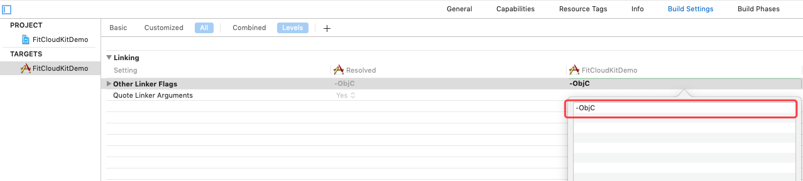
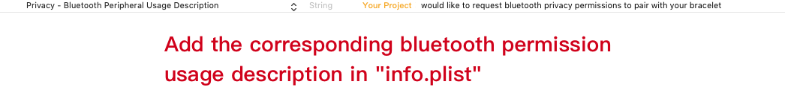
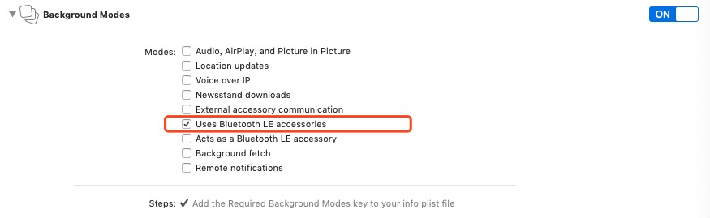
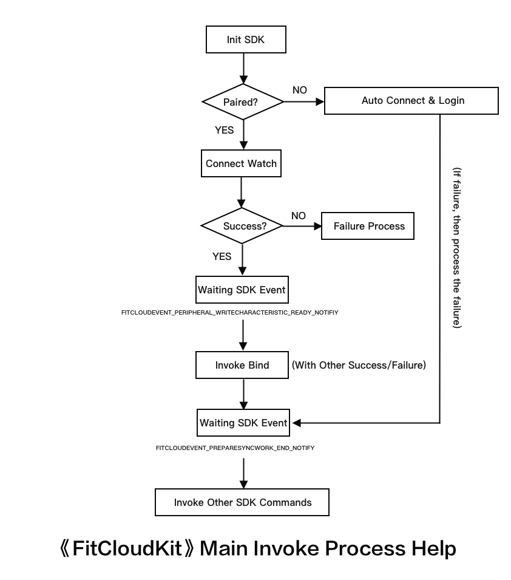
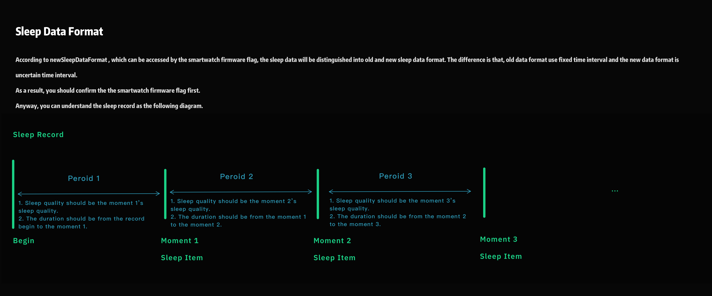

# FitCloudKit iOS Development Guide

## Summary

- What is FitCloudKit?

  > ###### iOS framework for FitCloud smartwatch, which is responsible for the communication with watch.

- Scope

  ```
  Partners who need to customize their own iOS smartwatch APP.
  ```

- Compatibility

  ###### 1. iOS 8.0 and Above；

  ###### 2. armv7/i386/x86_64/arm64 Instruction Set；

  ###### 3. Bitcode；

## Features

1. Initialize/scan/connect the watch;

2. Obtain/set related functions and display of the watch;

3. Synchronize exercise health data to APP;

4. Start/stop health real-time measurement (heart rate/blood pressure/blood oxygen/ecg, etc.);

5. Synchronize weather information;

6. Find the smartwatch /iOS device;

7. One-click restore factory Settings;

8. Restart/shutdown of the smartwatch;

9. Safety check before entering DFU mode (ensure the smartwatch has sufficient power);

## Releases

V1.2.8 Build202305300001

```
  Release Date：2023-05-30
  Features：
  1. Watchface size supports 410*502 square/416*416 circular/240*288 square.
  2. Added custom label, @see withCustomLabels.
  3. Added support for Alipay IoT, @see allowAliot.
  4. Bluetooth connection now supports setting whether to use one-click dual connection to connect classic Bluetooth (BT) simultaneously, @see allowConnectWithBT.
  5. Added the ability to obtain related manufacturer information and parameters through broadcast data, @see FitCloudManufacturer.
  6. Added support for transmitting watch exercise GPS data, @see FitCloudGPSRecordObject.
  7. Watch face size now supports 340*340 circular.
  8. Added support for specifying supported payment codes and business cards. Only supported payment codes and business cards should be displayed in the App's push entry, @see specifySupportedMoneyReceiveAndBusinessQRCode.
  9. Modified habit-forming instructions.
  10. Added power saving mode settings, @see withPowerSavingMode & allowPowerSavingModePeriod.
  11. Added timestamp parameter for setting daily goals.
  12. Adjusted Alipay IoT security authentication instructions.
  13. Modified automatic login logs, where userId now supports String.
  14. Modified watch UI information instruction parsing to be compatible with firmware versions.
  15. Updated and added a large number of exercise type definitions.
  16. Improved the SDK stability.
```

V1.2.7 Build202212300001

```
  Release Date：2022-12-30
  Features：
  1. Sleep module disable flag support.
  2. Add nucleic acid qrcode. @see allowNucleicAcidQRCode
  3. Add atmospheric pressure/wind force/visibility for weather.
  4. Add habits. @ see allowHabits
  5. Add Paytm qrcode/PhonePe qrcode/GPay qrcode/BHTM qrcode, Email business card/Phone business card/LinkedIn business card, @see showAdditionalQRCodeTransfer
  6. Add a new notification watch to find out that the mobile phone ring has finished playing, and adapt to the Bluetooth call watch
  7. Add command to acquire daily sports goal.
  8. Optimize the peripheral MTU value.
```

V1.2.6 Build202209200001

```
  Release Date：2022-09-20
  Features：
  1. Fix the issue of GPS interconnected motion command.
  2. Add true blood pressure based on air pressure pump (supported for some of the watches).
  3. Some watches support manual measurement data synchronization.
  4. Some watches support SOS request.
  5. Add third-party peripheral start & stop control.
  6. Watch start vibration parameter settings.
  7. Add command to delete the notification message on the watch.
  8. Add command to cancel the current notification message display on the watch.
  9. Add game lock settings.
  10. Login/bind command enhancement.
  11. Support to obtain the top three game records of a single game (supported for some of the watches).
  12. Fix the issue of true blood pressure data synchronization.
  13. Modification of GPS interconnection command.
  14. Add game ranking trend settings (supported for some of the watches).
  15. Aalarm list optimization.
  16. Update SDK error code.
  17. Health&Sports data sync optimization.
  18. Add flag to disable the watchface modularization display on the App. @ see disableWatchfaceModularInApp
  19. 240 * 296 square watchface support.
  20. Improve SDK stability.
```

V1.2.5 Build202201260001

```
  Release Date：2022-01-26
  Features：
  1. Watch sports definitions for Cricket / Free exercise / Strength training / Indoor walking / Indoor cycling / Dumbbell / Dancing / Hula hoop / Golf / Long jump / Sit ups / Volleyball.
  2. Add watch GPS-Connect sports.
  3. Add command to wake-up app camera.
  4. Add Blood pressure & Heart rate alarm check.
  5. Add FITCLOUDPREFER_REMINDWHENSPORTSGOALACHIEVEMENT watch prefer for reminder of the goal achievement for watch sports (Steps / Distance / Calories).
  6. Fix favorite contacts command issue for large command length.
  7. Fix issue for app crash when close bluetooth in OTA process.
  8. Add Money receive QRCode & Business card QRCode push.
  9. Fix issue that if you unpair the watch when the bluetooth disconnected, it may cause reconnect when the watch is close to the iPhone device again.
  10.Fix issue that reconnect failure if bluetooth disconnected when ECG measuring.
  11.Add audio bluetooth name response when bind failure with bluetooth call watch.
  12.Add Hindi.
```

V1.2.4 Build202110120001

```
  Release Date：2021-10-12
  Features：
  1. Add flag to identify whether allow the game skin dfu update.
  2. Add Apple Music、Zoom & Tiktok Notification support, only for some of the watches.
  3. Add flag to identify whether allow the QRCode scan connnect.
  4. Add hardware flag FITCLOUDHARDWARE_DFUSHOULDSILENTMODE.
  5. Add Game defines for TETRIS/SUDOKU/ANSWER.
  6. Add QRCode scan connect failure reason(Cancel by the watch/Timeout with click confirm).
  7. Obtain/set information such as bright screen duration, brightness, vibration, etc. added.
  8. Add flag to identify whether should disable the watchface customize.
  9. Add notify for the watch ui leave the "Find the iPhone".
  10.Add option for vibration when ble disconnect at FITCLOUDPREFER.
  11.Fix issue reconnect failure when disconnect during ECG data sync.
  12.Add command to obtain the original information of screen resolution (LCD width and height / whether the screen is round / screen corner size, etc.), only for some of the watches.
  13.The Nordic platform Watchface No. is also extended to 3 bytes.
  14.Fix the issue that the game skin can only get 3 items.
  15.Modify the calculation rules of the maximum pushable file size of the watchface / game skin.
  16.Modify the definition of weather hardware function flag.
  17.Add flag to identify whether allow the sports mode dfu update.
  18.Add sports mode supported list and the current list, only for some of the watches.
```

V1.2.3 Build202107200001

```
  Release Date：2021-07-20
  Features：
  1. Stress index measurement support, only for some of the watches.
  2. Schedule settings issue fixed.
  3. Lock screen password settings issue fixed.
  4. New watchface size 280 * 240 square / 200 * 320 squre / 368 * 448 square / 320 * 390 square  support.
  5. The watchface modular support.
  6. Schedule settings get issue fixed.
  7. Set the watch localization language by app support.
     @note: if you would like to set it when the sdk initialize, @see watchPreferLang for FitCloudOption
     if you would like to set it anytime when the app running, invoke setSmartWatchLanguage:completion:
     besides, the original syncSystemLanguageWithBlock may be affected by this behaviour.
  8. The watch schedule can set by itself option set support.
  9. You can scan the peripheral yourself and tranlate the peripheral you scanned to the connnectable peripheral.
  10. Next GUI support.
  11. The next generation manufacturer name supports. The next generation manufacturer name prefix letter H not need to be filtered.
  12. The watchface modular information missed issue fixe when switch the watchface.
  13. The maximum size of firmware that can be pushed for each watch position added, unit: kB.
  14. Nordic support.
  15. Game features: retrieve game categories, only for some of the watches.
  16. Game features: retrieve top game rank records, only for some of the watches.
  17. Game features: retrieve game skins, only for some of the watches.
  18. New watchface size 172 * 320 square / 454 * 454 round / 128 * 220 square  support.
  19. +(void)ignoreConnectedPeripheral:(BOOL)silent; add silent param.
  20. Add FITCLOUDEVENT_WATCH_PAIRINGINFO_NOTMATCH_OR_MISSING_NOTIFY,
      It is suggested that the user enter the system settings to remove the pairing information with the watch, kill the app process and restart the app.
      @Note: the notification may be sent continuously, and the app needs to avoid repeatedly prompting the user, causing trouble to the user.
```

V1.2.2 Build202102050001

```
  Release Date：2021-02-05
  Features：
  1. Weather push switch added, only for some of the watches.
  2. App location service state notify to the watch added.
  3. Hand washing reminder added.
  4. New watchface size 240 * 280 square support.
  5. Synchronization data parsing exception process, we will drop the data illegal.
  6. Lock screen password support, only for some of the watches.
  7. Schedule reminder added, only for some of the watches.
  8. Hike & Youtube notification support, only for some of the watches.
  9. New watchface size 348 * 442 square support.
  10. Specifies the watchface push position/index support, you can retrieve the related information from FitCloudKit.
  11. New definitions of sports type.
```

V1.2.1 Build202010300001

```
  Release Date：2020-10-30
  Features：
  1. preferSystemLocale option support for FitCloudOption, When the option is set to true, the language settings of IOS system will be synchronized with the watch. Otherwise, the current app language settings will be synchronized with the watch. The default is false.
    @note: Due to system limitations, if you manually change the language of the app, this option will also be invalid.
  2. Fixed incorrect response of sleep debug data.
  3. Interval set for auto health monitor support, only for some of the watches, @see allowSetHealthMonitorInterval
  4. Interval set for long sit reminder support, only for some of the watches, @see allowSetLSRInterval
  5. Add weather forecast, only for some of the watches, @see allowWeatherForecast
  6. The latest weather update date added, and adjust weather forecast days to 14 days.
  7. Fix problem of interval set for auto health monitor/long sit reminder.
  8. Fix some hardware flags parser problem.
  9. Albanian added.
  10. Turkish / Ukrainian added.
  11. Fixed the problem of korean language sync with the watch.
  12. Patch: when allowShowAdditionalReminder flag set to be true，allowShowMailReminder/allowShowTelegramAndViberReminder will be forced to be set as true.
```

V1.2.0 Build202007180001

```
  Release Date：2020-07-18
  Features：
  1. The smart watch can now notify app to quit the photo taking mode.
  2. Add women health settings.
  3. Add virus protection reminder settings.
  4. Fixed the Hungarian language synchronize problem.
  5. User-defined broadcast field key1 for our business partner Huashengda.
  6. Fixed incorrect age problem for setting user profile.
  7. Sleep debugging data support.
  8. Fix age setting problems.
  9. Add body temperature data for latest health measurement data.  (the watch should support body temperature)
  10. New watchface screensolution.
  11. Support synchronize all localized languages defined by SDK to the smart watch.
```

V1.1.9 Build202005150001

```
  Release Date：2020-05-15
  Features：
  1. Body temperature measurement, only for some watches.
```

V1.1.8 Build202004250001

```
  Release Date：2020-04-25
  Features：
  1. Fix the problem that may not be disconnected when unpaired the smart watch.
  2. Correct the problem that the watch disconnection may cause the prompt that the watch is paired by other mobile device or already unpaired.
  3. Fix the problem that the next command to be executed will be lost when the command is executed overtime.
  4. Fix the timeout problem with large amount of synchronous data.
  5. Clear the cache battery level of the smart watch after unpaired.
  6. Favorite contacts support, only for some of the watches.
  7. Add elliptical machine / Yoga / table tennis / rope skipping and other sports in watch sports mode.
  8. Correct the problem of incorrect logic processing when the ECG fails to start.
  9. Fixed the problem of not executing the connection timeout logic when connecting the watch.
```

V1.1.7 Build202002250001

```
  Release Date：2020-02-25
  Features：
  1. New language Slovak supported for the smart watch.
  2. Correct the sleep quality data returned by the smart watch which may be illegal.
  3. Cancel automatic unbinding from the smart watch, and add new notification of bound by other mobile phone or the smart watch already unbinded, @see FITCLOUDEVENT_PERIPHERAL_ALREADYUNBUND_OR_BIND_BY_OTHERCLIENT_NOTIFY.
  4. All blocks or callbacks now are changed to be invoked at Global Queue. If you'd like to update UI at the blocks or callbacks, make sure to switch to the main queue (Main Queue).
  5. The smart watch disconnect invoked by the app now will not automatically reconnect back.
  6. Add new user bind status FITCLOUDUSERBINDSTATUS_KICKEDOUT.
  7. Add new notification of FITCLOUDEVENT_PERIPHERAL_WRITECHARACTERISTIC_READY_NOTIFIY.
  8. Add new sleep data format, @see newSleepDataFormat.
  9. Log data information improvment.
  10.Add new notification of FITCLOUDEVENT_WATCHCONFIG_REMOTE_MANUAL_CHANGED_NOTIFY.
  11.The smart watch dial info retrieve invoke method changed now.
  12.Other improvements.
```

V1.1.6 Build201911210001

```
  Release Date：2019-11-21
  Features：
  1. Correct the problem that the UI information interface of the watchface does not respond correctly.
  2. After unbinding the user object, cancel the automatic reconnection of the current Bracelet connection record.
  3. Optimize the initialization process of bracelet connection to prevent accidental reconnection.
  4. Adjust the information related to the bracelet firmware to read-only.
  5. The userid of the bound user is changed from integer type to string type.
  6. Add method to obtain the lastest health measurement data (bpm / SpO2 / BP), which is only supported by some of the bracelets, @ see allowRetrieveLatestMeasurementData
  7. Modify the method of entering and exiting the DFU mode. Now you should manually invoke entering and exiting the DFU mode before the first DFU also after all the DFU operations completed. It is also applicable to common DFU and watchface push.
  8. Add reconnection notification in DFU Mode, which is usually used in the scenario of waiting for the bracelet to restart after the watchface push / common DFU.
  9. Improve SDK stability
```

V1.1.5 Build201911130001

```
  Release Date：2019-11-13
  Features：
  1. Do Not Disturb Mode support. (only available for some of the smart watches @see allowDNDMode)
```

V1.1.4 Build201910240001

```
  Release Date：2019-10-24
  Features：
  1. Real-time measurement moment modification accurate to seconds
  2. Correct synchronization data moment so that the current synchronization time cannot be exceeded
```

V1.1.3 Build201910160001

```
  Release Date：2019-10-16
  Features：
  1. New distance-calorie algorithm into the step-counting data.
  2. Obtain the last binding time of the user support.
  3. Settings of heart rate /blood pressure alarm value support.
  4. Add Snapchat message reminder.
  5. Device scanning removes device name filtering.
  6. Real-time ecg measurement can be abort by bracelet now.
  7. Obtain watch face ui information support now.
  8. Add peripheral broadcast data cache, as a result, you may retrieve mac addr if you once connect the peripheral.
  9. Add notify for peripheral name and rssi change.
  10. Improve SDK stability.
  11. Avoid ambiguity, rename function '+(NSArray<FitCloudPeripheral *>*_Nonnull)peripherals' to '+(NSArray<FitCloudPeripheral *>*_Nonnull)discoveredPeripherals'.
```

V1.1.3-beta.9 Build201909300001

```
  Release Date：2019-09-30
  Features：
  1. New distance-calorie algorithm into the step-counting data.
  2. Obtain the last binding time of the user support.
  3. Settings of heart rate /blood pressure alarm value support.
  4. Add Snapchat message reminder.
  5. Device scanning removes device name filtering.
  6. Real-time ecg measurement can be abort by bracelet now.
  7. Obtain watch face ui information support now.
  8. Improve SDK stability.
```

V1.1.2 Build201908190002

```
  Release Date：2019-08-19
  Features：
  1、 Fixed problem with notification moment when bluetooth connection begin.
```

V1.1.1 Build201908190001

```
  Release Date：2019-08-19
  Features：
  1、 Fixed the problem that the last binding Mac address of the bracelet was not cleared when the bracelet was unbound.
  2、 Add begin/end notification for prepare sync work when bind or login bracelet succeed.
  3、 Fix the problem that shouldAutoConnect attribute does not work for the SDK initialization option.
```

V1.1.0 Build201908120001

```
  Release Date：2019-08-12
  Features：
  1、 Background bluetooth data synchronization support.
```

V1.0.9 Build201907210001

```
  Release Date：2019-07-21
  Features：
  1、 SDK version query support.
```

V1.0.8 Build201907200001

```
  Release Date：2019-07-20
  Features：
  1、 Fixed an issue failed to synchronize system time for the iPhone calendar settings to be a buddhist or Japanese calendar.
  2、 Optimize the reconnection mechanism with bracelet.
```

V1.0.7 Build201906280001

```
  Release Date：2019-06-28
  Features：
  1、 Fix some problems with retrieving notification remind configuration.
```

V1.0.6 Build201906270001

```
  Release Date：2019-06-27
  Features：
  1、 Add mac address for peripheral when scanned.
```

V1.0.5 Build201906250001

```
  Release Date：2019-06-25
  Features：
  1、 You can set more daily sports goal now.
```

V1.0.4 Build201906110001

```
  Release Date：2019-06-11
  Features：
  1、 More languages are supported for the bracelet.
  2、 Fix some problems of synchronization.
```

V1.0.0 Build201905010001

```
  Release Date：2019-05-01
  Features：
  1、 First SDK release.
```

## APPID & APPKEY

Currently, APPID and APPKEY have not been opened, so there is no need to apply for them.

## Installation

Method 1：`FitCloudKit` is available through CocoaPods. To install it, simply add the following line to your Podfile:

```
pod 'FitCloudKit'
```

If you want to integrate beta FitCloudKit, you should use the following configuration in the podfile file:

```
pod 'FitCloudKit', git: 'https://github.com/htangsmart/FitCloudPro-SDK-iOS.git'
```

Method 2: download from making `FitCloudKit`, manual integrated into your project.

1. FitCloudKit SDK includes:

   - FitCloudKit. Framework  
     static library, smart bracelet development kit core framework
   - FitCloudKit.bundle  
     smart bracelet development kit core resource package

2. Add the framework to the project;

3. Add the resource bundle to the project;

4. Add support for other system dependency libraries:

   - CoreGraphics framework
   - CoreBluetooth framework

5. add `-ObjC` link flag
   add`-ObjC` link flag at `Other Linker Flags` in `Build Settings` as following:

   

## Privacy Permissions

In the project `Info.Plist` set the following privacy permissions using description, the actual describe the content depends on your business.



## Bluetooth Background Mode



## Import Header File

```objc
#import <FitCloudKit/FitCloudKit.h>
```

## Initialize the SDK

```objc
FitCloudOption *option = [FitCloudOption defaultOption];
option.debugMode = NO;
option.shouldAutoConnect = YES;
self.fitCloudKit = [FitCloudKit initWithOption:option callback:self];
```

## Implement FitCloudCallback Protocol

```objc
/**
 *@brief The bracelet asks to find the phone
 */
-(void) OnFindiPhoneEvent
{
    //Implement your logic here when the app receives a phone find request event, such as vibration, playing a music, or creating a local notification, etc
}

/**
 *@brief The bracelet asks for weather information
 *@param block weather information callback
 */
-(void) OnRequestWeatherWithCallback:(FitCloudWeatherCallbackBlock)block
{
    //Weather information is requested by the bracelet. You need to get weather information by yourself and call back to the bracelet SDK.
    //However, at present, this method basically does not callback (the bracelet does not implement the logic), and it needs to synchronize the weather to the bracelet by itself.
    //@see syncWeather:block:
}

/**
 *@brief Real-time exercise health measurement data callback (ecg data exception)
 *@param records measurement data
 */
-(void) OnRealTimeHealthMeasuringData:(NSArray<FitCloudRealTimeHealthMeasuringResultObject*>*)records
{
    //According to the actual business logic response bracelet real-time measurement data
}

/**
 *@brief Real-time ecg measurement results
 *@param ecgDataArray ecg data array
 *@param interval Sampling interval in milliseconds (ms)
 */
-(void)OnRealTimeECGData:(NSArray<NSNumber *> *)ecgDataArray interval:(NSInteger)interval
{
    //According to the actual business logic response bracelet real-time ecg measurement data
}

/**
 *@brief Real-time ecg measurement stopped
 */
-(void) OnRealTimeECGStop
{
    //Notify the business logic ecg real-time measurement stopped
}

/**
 *@brief The bracelet controls the phone's camera
 */
-(void)OnTakePhotoCtrl
{
    //the App can implement photo take logic here
}

/**
 *@brief The bracelet notify the app it is alive.
 */
-(void) OnBraceletAlive
{
    //the App can actively synchronize the movement health data of the bracelet to achieve the function of background synchronization data. Please add it according to the specific project needs. Note that frequent synchronization data in the background may affect the power consumption of the bracelet device.
}

/**
 *@brief Log message callback
 *@param message log message
 *@param level log level
 */
-(void) OnLogMessage:(NSString*)message level:(FITCLOUDKITLOGLEVEL)level
{
    //You can process the log message according to your actual business logic
}
```

## Get the Status of the Bluetooth Central Device

```objc
FITCLOUDBLECENTRALSTATE bleState = [FitCloudKit bleState];
//the bluetooth Central device is not powered on
if(bleState != FITCLOUDBLECENTRALSTATE_POWEREDON)
{
    //the bluetooth Central device is powered off
    if(bleState == FITCLOUDBLECENTRALSTATE_POWEREDOFF)
    {
        [[UIApplication sharedApplication] openURL:[NSURL URLWithString:UIApplicationOpenSettingsURLString]];
    }
    else
    {
        //Request bluetooth enabled to allow connection to accessories
        [FitCloudKit requestShowBluetoothPowerAlert];
    }
}
```

## Scan the Bracelet Peripheral

```objc

//Listen for scanning related events/notifications
[[NSNotificationCenter defaultCenter] addObserver:self selector:@selector(OnPeripheralDiscoveredNotification:) name:FITCLOUDEVENT_PERIPHERAL_DISCOVERED_NOTIFY object:nil];
[[NSNotificationCenter defaultCenter] addObserver:self selector:@selector(OnPeripheralDiscoveredUpdatedNotification:) name:FITCLOUDEVENT_PERIPHERAL_DISCOVERED_UPDATED_NOTIFY object:nil];
[[NSNotificationCenter defaultCenter] addObserver:self selector:@selector(OnPeripheralScanStopNotification:) name:FITCLOUDEVENT_PERIPHERAL_SCANSTOP_NOTIFY object:nil];
//start the scanning
[FitCloudKit scanPeripherals];
```

## Connect the Bracelet Peripheral

```objc
//Listen for connect related events/notifications
[[NSNotificationCenter defaultCenter] addObserver:self selector:@selector(OnPeripheralConnectedNotification:) name:FITCLOUDEVENT_PERIPHERAL_CONNECTED_NOTIFY object:nil];
[[NSNotificationCenter defaultCenter] addObserver:self selector:@selector(OnPeripheralConnectFailureNotification:) name:FITCLOUDEVENT_PERIPHERAL_CONNECT_FAILURE_NOTIFY object:nil];

//start to connect
FitCloudPeripheral* item = [self.peripherals objectAtIndex:indexPath.row];
[FitCloudKit connect:item.peripheral];
```

## Bind User Information

```objc
//Listen for bind related events/notifications
[[NSNotificationCenter defaultCenter] addObserver:self selector:@selector(OnFitCloudBindUserObjectBegin:) name:FITCLOUDEVENT_BINDUSEROBJECT_BEGIN_NOTIFY object:nil];
[[NSNotificationCenter defaultCenter] addObserver:self selector:@selector(OnFitCloudBindUserObjectResult:) name:FITCLOUDEVENT_BINDUSEROBJECT_RESULT_NOTIFY object:nil];
[[NSNotificationCenter defaultCenter] addObserver:self selector:@selector(OnFitCloudGetAllConfigBegin:) name:FITCLOUDEVENT_GETALLCONFIG_BEGIN_NOTIFY object:nil];
[[NSNotificationCenter defaultCenter] addObserver:self selector:@selector(OnFitCloudGetAllConfigResult:) name:FITCLOUDEVENT_GETALLCONFIG_RESULT_NOTIFY object:nil];
[[NSNotificationCenter defaultCenter] addObserver:self selector:@selector(OnFitCloudInitializeResult:) name:FITCLOUDEVENT_INITIALIZE_RESULT_NOTIFY object:nil];
//start to bind
NSInteger userId = 1000;
[FitCloudKit bindUserObject:userId abortIfExist:YES block:^(BOOL succeed, NSError *error) {
}];
```

## Unbind User Information

```objc
//Start to unbind, disconnect the bracelet automatically after unbind successfully.
[FitCloudKit unbindUserObject:YES block:^(BOOL succeed, NSError *error) {
}];
```

## Manual Synchronization of Historical Exercise & Health Data

```objc
[FitCloudKit manualSyncDataWithOption:FITCLOUDDATASYNCOPTION_ALL progress:^(CGFloat progress, NSString *tip) {
    NSLog(@"Sync Progress：%.0f%%, %@",progress*100.0f, tip);
} block:^(BOOL succeed, NSArray<FitCloudManualSyncRecordObject*> *records, NSError *error) {
    //Synchronization Result
}];
```

## Obtain Today's Exercise & Health Summary Data (total steps/average heart rate/calories, etc.)

```objc
 [FitCloudKit requestHealthAndSportsDataTodayWithBlock:^(BOOL succeed, FitCloudDailyHealthAndSportsDataObject *dataObject, NSError *error) {
}];
```

## Start/Stop Real-time Health Measurements (heart rate, blood oxygen, blood pressure, respiratory rate, ecg, etc.)

⚠️Caution: ecg measurement should not be taken in conjunction with other real-time measurements.

```objc
//Set the parameters
//Example: start heart rate and blood pressure measurements, otherwise set this parameter according to the actual business logic
FITCLOUDREALTIMEMHEALTHEASUREITEM item = FITCLOUDREALTIMEMHEALTHEASUREITEM_HEARTRATE | FITCLOUDREALTIMEMHEALTHEASUREITEM_BLOODPRESSURE;
/*
    //Stop the measurement
    //FITCLOUDREALTIMEMHEALTHEASUREITEM item = FITCLOUDREALTIMEMHEALTHEASUREITEM_NONE;
*/
FitCloudRealTimeHealthMeasuringParam *param = [FitCloudRealTimeHealthMeasuringParam new];
param.item = item;
param.interval = 5;
param.maxMeasuringMinutes = 1;

//Invoke the SDK to start or stop the measurement (depending on the parameters passed in)
[FitCloudKit requestRealTimeHealthMeasuring:param block:^(BOOL succeed, NSError *error) {
}];
```

The Real-time Health Measurements results:
@see FitCloudCallback

```objc
/**
 *@brief Real-time exercise health measurement data callback (ecg data exception)
 *@param records measurement data
 */
-(void) OnRealTimeHealthMeasuringData:(NSArray<FitCloudRealTimeHealthMeasuringResultObject*>*)records
{
    //According to the actual business logic response bracelet real-time measurement data
}

/**
 *@brief Real-time ecg measurement results
 *@param ecgDataArray ecg data array
 *@param interval Sampling interval in milliseconds (ms)
 */
-(void)OnRealTimeECGData:(NSArray<NSNumber *> *)ecgDataArray interval:(NSInteger)interval
{
    //According to the actual business logic response bracelet real-time ecg measurement data
}

/**
 *@brief Real-time ecg measurement stopped
 */
-(void) OnRealTimeECGStop
{
    //Notify the business logic ecg real-time measurement stopped
}
```

## Common features

[Common features](COMMON_FEATURES.md)

## Cricket match

[Cricket match](../Others/CricketMatch/CRICKETMATCH_EN.md)

## Other Settings and Operations

see detail comments in `<FitCloudKit/FitCloudKit.h>` header file.

## FAQ

> Q: What is the FitCloudKit main invoke process？
>
> A: As the following:
>
> 

<!-- more -->

> Q: How determine whether the current smartwatch supports specific features, for example, how to determine whether the smartwatch with DND feature?
>
> A: You can get the current features supported by the smartwatch according to the information provided by the firmware, such as the dnd mode feature. Software feature & hardware feature included.
>
> Take the dnd mode feature for example, the code is as follows:

```objc
FitCloudAllConfigObject* allConfig = [FitCloudKit allConfig];
BOOL isDNDSupported = (allConfig && allConfig.firmware && allConfig.firmware.allowDNDMode);
```

> Above is the example for the software feature, and the hardware feature see the next FAQ.

<!-- more -->

> Q: How to determine whether the current smartwatch supports specific hardware features, for example, how to determine whether the smartwatch with ecg feature?
>
> A: You can get the current features supported by the smartwatch according to the information provided by the firmware, such as: whether the smartwatch has heart rate/blood oxygen/blood pressure/breathing frequency/weather forecast/ecg/sports mode/WeChat sports/the new firmware upgrade platform/dynamic heart rate, etc.
>
> Take the ecg feature as an example, the code is as follows:

```objc
FitCloudAllConfigObject* allConfig = [FitCloudKit allConfig];
BOOL isECGSupported = (allConfig && allConfig.firmware && (allConfig.firmware.hardwareSupported & FITCLOUDHARDWARE_ECG));
```

<!-- more -->

> Q: When bind the user information, the bluetooth pairing request pops up. Must the user choose to pair with the bracelet?
>
> A: It is not required in theory, howerver, if you choose not to pair, the bracelet's message alert function (e.g. QQ/ WeChat /Facebook/Twitter, etc.) will not work properly.

<!-- more -->

> Q: Where is the part of getting data from self server?
>
> A: Our sdk has no communication with any server, you have to do that as yourself. Once you got data from the sdk, you may save it to your own server as you can. Our sdk always offline, we do nothing with that.

<!-- more -->

> Q: How to get sport data yesterday?
>
> A: You can get sport data by synchronize data from the smart watch with our SDK, once you synchronzied data you should save it to db by your self, or you can upload it to your server, then you can query it later. However, if you have not synchronized the data from the smart watch, you should invoke the code as follows to sychronized it:

```objc
[FitCloudKit manualSyncDataWithProgress:^(CGFloat progress, NSString *tip) {
    NSLog(@"Sync Progress:%.0f%%, %@",progress*100.0f, tip);
} block:^(BOOL succeed, NSArray<FitCloudManualSyncRecordObject*> *records, NSError *error) {
    //Synchronization Result
}];
```

> Of course, you should invoke the code when the sdk is ready.

<!-- more -->

> Q: How to get the state of every notification?
>
> A: You can invoke the following code to get the state of notification provided by the sdk, note that ‘FITCLOUDMN’ is NS_OPTIONS struct. I think you know how to use that.

```objc
[FitCloudKit getMessageNotificationSettingWithBlock:^(BOOL succeed, FITCLOUDMN mnSetting, NSError* error){
}];
```

<!-- more -->

> Q: How to get the current daily goal?
>
> A: We have not provide the api to retrieve the current daily goal, usually, the daily goal is set by the app, most of the time you may manage it by yourself at the app side. However, the following is the method to set the daily goal.

```objc
[FitCloudKit setDailyGoalWithStepCount:8000 distance:8*1000*100 calory:100*1000 block:^(BOOL succeed, NSError* error){
}];
```

<!-- more -->

> Q: The sleep data
>
> A: As the following:
>
> 

<!-- more -->

> Q: How to deal with the abnormal situation caused by multiple iOS devices successively binding and pairing the same watch?
>
> A: Generally, users will only bind and pair watch with one iOS device, but a small number of users will bind and pair one watch with multiple iOS devices successively, which leads to abnormal pairing between the iOS device and the watch that was previously connected & paired, and the watch cannot be reconnected. This is due to the fact that these watch devices can only store the pairing information with one iOS device at the same time, The pairing information of the later device covers the previous pairing information, which causes the pairing information on iOS device to not match the pairing information on the watch. Please refer to FITCLOUDEVENT_WATCH_PAIRINGINFO_NOTMATCH_OR_MISSING_NOTIFY notification, and process in your app.

## Technical Support

Hetang Smart.

Dai / iOS Developer
