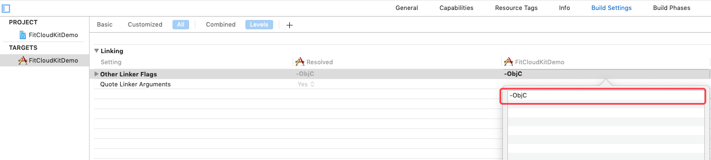

# 和唐智能手表表盘开发套件（FitCloudNWFKit）iOS开发指南

## 简介 / Summary
* 什么是和唐智能手表表盘 SDK ?

  >###### 和唐智能手表表盘 SDK 是提供给和唐的合作伙伴的开发套件，该开发套件旨在帮助您轻松自定义属于您自己的表盘文件。       


* 适用范围

  ```
  需要个性化定制自己的 iOS 智能手表 APP 的合作伙伴。
  ```

* 兼容性

  ###### 1. iOS 9.0及以上操作系统；

  ###### 2. 支持armv7/i386/x86_64/arm64指令集；

  ###### 3. 支持Bitcode；


## 特性 / Features

1. 修改表盘推送位置；

## 版本 / Releases

版本V1.0.1 Build202205190001

```
  发布日期：2022年05月19日
  功能更新：
  1、 bitcode支持。
```

版本V1.0.0 Build202108310001

```
  发布日期：2021年08月31日
  功能更新：
  1、 首次发布SDK版本。
```

## 获取 APPID 和 APPKEY

目前尚未开放 APPID 和 APPKEY，暂时无需申请。

## 安装 / Installation

方法一：`FitCloudNWFKit` 支持通过 CocoaPods 安装. 您只需要在您的 Podfile 文件中简单地加上下面这行:

```
pod 'FitCloudNWFKit'
```

如果你想集成 beta 测试版，则 Podfile 文件中应该使用如下配置：
```
pod 'FitCloudNWFKit', git: 'https://github.com/htangsmart/FitCloudPro-SDK-iOS.git'
```

方法二：从 Github 上下载 `FitCloudNWFKit`，手动集成到您的项目中。

1. FitCloudNWFKit SDK开发包含：

  * FitCloudNWFKit.framework   静态库，智能手表开发套件核心framework

  * FitCloudNWFKit.bundle     智能手环开发套件核心资源包

2. 将framework添加到项目中;
3. 将bundle资源包添加到项目中;
4. 添加其他系统依赖库支持：

    * Foundation.framework
5. 添加 `-ObjC` 链接标志
   在项目的 `Build Settings` 的 `Other Linker Flags` 中添加 `-ObjC` 链接标志，如下图所示：

   

6. 在Podfile中添加
   
   pod 'zipzap', '8.1.1'


## 引用头文件

```objc
#import <FitCloudNWFKit/FitCloudNWFKit.h>
```


## 修改表盘推送位置
```objc
NSString* templateBinPath = [[NSBundle mainBundle] pathForResource:@"240USER_DEFAULT_20200618142928_MP-cc0c13932ab8ca2f89301678993cfdeb" ofType:@"bin"];

[FitCloudNWFKit modifyWatchfaceBinPushIndexTo:1 fromTemplateBin:templateBinPath logging:^(FCNWKLOGLEVEL level, NSString * _Nullable message) {
    message = [[message stringByReplacingOccurrencesOfString:@"<" withString:@"["] stringByReplacingOccurrencesOfString:@">" withString:@"]"];
    if(level == FCNWKLOGLEVEL_INFO)
    {
        XLOG_INFO(@"%@", message);
    }
    else if(level == FCNWKLOGLEVEL_WARNING)
    {
        XLOG_WARNING(@"%@", message);
    }
    else if(level == FCNWKLOGLEVEL_ERROR)
    {
        XLOG_ERROR(@"%@", message);
    }
} completion:^(BOOL success, NSString* _Nullable resultBinPath, NSError* _Nullable error) {
    if(success)
    {
        XLOG_INFO(@"modify push index success, bin file: %@", resultBinPath);
    }
    else
    {
        XLOG_ERROR(@"modify push index failure with error: %@", error.localizedDescription);
        
    }
}];
```


## 其他设置和操作

参看`<FitCloudNWFKit/FitCloudNWFKit.h>`头文件中详细注释说明。

## FAQ

>Q: 什么是模版Bin文件，在什么地方获取？
>
>A: 模版Bin文件是自定义表盘的基础，不同型号不同尺寸的手表模版Bin文件都不相同，您需要在自己的服务器上存放这些模版Bin文件，然后根据手表信息下载特定的模版Bin文件后再进行后续流程，您可以联系我们的商务提供后续的支持。


## 技术支持

和唐智能

戴工 / iOS Developer
