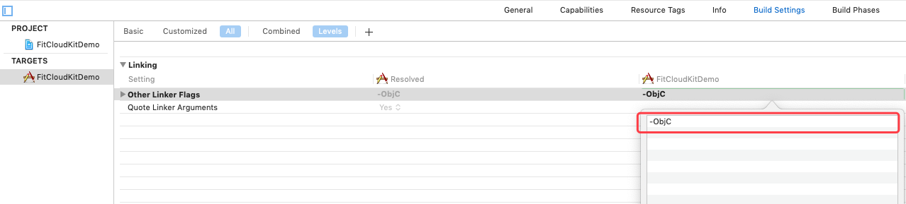

# FitCloudNWFKit iOS Development Guide

## Summary
* What is FitCloudNWFKit?

  >###### iOS framework help you customize watchface for fitcloud smart watch easily.

* Scope

  ```
  Partners who need to customize their own iOS smartwatch APP.
  ```

* Compatibility

  ###### 1. iOS 9.0 and Above；

  ###### 2. armv7/i386/x86_64/arm64 Instruction Set；

  ###### 3. Bitcode；


## Features

1. Modify watchface push index.


## Releases

V1.0.1 Build202205190001

```
  Release Date：2022-05-19
  Features：
  1、 bitcode support.
```

V1.0.0 Build202108310001

```
  Release Date：2021-08-31
  Features：
  1、 First SDK release.
```

## APPID & APPKEY

Currently, APPID and APPKEY have not been opened, so there is no need to apply for them.

## Installation

Method 1：`FitCloudNWFKit` is available through CocoaPods. To install it, simply add the following line to your Podfile:

```
pod 'FitCloudNWFKit'
```

If you want to integrate beta FitCloudNWFKit, you should use the following configuration in the podfile file:
```
pod 'FitCloudNWFKit', git: 'https://github.com/htangsmart/FitCloudPro-SDK-iOS.git'
```

Method 2: download from making ` FitCloudNWFKit `, manual integrated into your project.

1. FitCloudNWFKit SDK includes:
    * FitCloudNWFKit. Framework  
      static library, smart watch development kit core framework
    * FitCloudNWFKit.bundle   
      smart watch development kit core resource package

2. Add the framework to the project;

3. Add the resource bundle to the project;

4. Add support for other system dependency libraries:

    * Foundation framework
5. add `-ObjC` link flag
   add`-ObjC` link flag at `Other Linker Flags` in `Build Settings` as following:


   

6. Add dependency in Podfile:

   pod 'zipzap', '8.1.1'

## Import Header File

```objc
#import <FitCloudWFKit/FitCloudWFKit.h>
```

## Change the push index of the watchface
```objc
NSString* templateBinPath = [[NSBundle mainBundle] pathForResource:@"240USER_DEFAULT_20200618142928_MP-cc0c13932ab8ca2f89301678993cfdeb" ofType:@"bin"];

[FitCloudNWFKit modifyWatchfaceBinPushIndexTo:1 fromTemplateBin:templateBinPath logging:^(FCNWKLOGLEVEL level, NSString * _Nullable message) {
    message = [[message stringByReplacingOccurrencesOfString:@"<" withString:@"["] stringByReplacingOccurrencesOfString:@">" withString:@"]"];
    if(level == FCNWKLOGLEVEL_INFO)
    {
        XLOG_INFO(@"%@", message);
    }
    else if(level == FCNWKLOGLEVEL_WARNING)
    {
        XLOG_WARNING(@"%@", message);
    }
    else if(level == FCNWKLOGLEVEL_ERROR)
    {
        XLOG_ERROR(@"%@", message);
    }
} completion:^(BOOL success, NSString* _Nullable resultBinPath, NSError* _Nullable error) {
    if(success)
    {
        XLOG_INFO(@"modify push index success, bin file: %@", resultBinPath);
    }
    else
    {
        XLOG_ERROR(@"modify push index failure with error: %@", error.localizedDescription);
        
    }
}];
```


## Other Settings and Operations

see detail comments in `<FitCloudNWFKit/FitCloudNWFKit.h>` header file.

## FAQ

>Q: What is the watchface template bin file, how to get it？
>
>A: The template Bin file is the basis of the custom watchface. Different models and sizes of watch template Bin files are different. You need to store these template Bin files on your own server, and then download the specific template Bin file according to the watch information before proceeding. Process, you can contact our business to provide follow-up support.

## Technical Support

Hetang Smart.

Dai / iOS Developer
