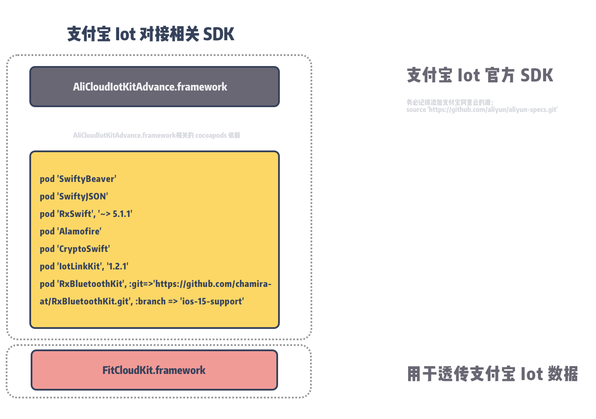

# 支付宝(阿里云)Iot对接文档



## 1. 将支付宝(阿里云)Iot SDK 添加进项目中

[AliCloudIotKitAdvance.framework](AliCloudIotKitAdvance.framework)

## 2. 添加并安装 cocoapods 依赖

建议采用 cocoapods 1.2.0 或以上版本。在xcode工程Podfile中添加以下行，集成SDK。

```
source 'https://github.com/aliyun/aliyun-specs.git'
target "YourProjectTarget" do
      pod 'SwiftyBeaver'
      pod 'SwiftyJSON'
      pod 'RxSwift', '~> 5.1.1'
      pod 'Alamofire'
      pod 'CryptoSwift'
      pod 'IotLinkKit', '1.2.1'
      pod 'RxBluetoothKit', :git=>'https://github.com/chamira-at/RxBluetoothKit.git', :branch => 'ios-15-support'
end
        
```

安装依赖

```
pod install
```

## 3. 引用头文件

```objective-c
//oc
#import <AliCloudIotKitAdvance/AliCloudIotKitAdvance.h>

```

```swift
//swift
import AliCloudIotKitAdvance
```

## 4. 设置代理

```objective-c
//oc
//设置代理
[AliConnectMananger shared].bleSendDataDelegate = self;

```

```swift
//swift
//设置代理
AliConnectMananger.shared.bleSendDataDelegate = self

```

## 5. 实现代理


```objective-c
//oc
- (void)sendBleDataWithData:(NSData *)data {
      XLOG_INFO(@"%@", APP_LOG_STRING(@"开始发送Aliot数据到手表..."));
    [FitCloudKit sendAliotData:data withBlock:^(BOOL succeed, NSError *error) {
        if(succeed)
        {
            XLOG_INFO(@"%@", APP_LOG_STRING(@"发送Aliot数据到手表成功..."));
            return;
        }
        if([error isKindOfClass:[NSError class]])
        {
            XLOG_ERROR(@"%@", APP_LOG_STRING(@"发送Aliot数据到手表失败：%@...", [error localizedDescription]));
        }
        else
        {
            XLOG_ERROR(@"%@", APP_LOG_STRING(@"发送Aliot数据到手表失败, 未知错误..."));
        }
    }];
}

```

```swift
//swift
extension ViewController: BleNeedSendDataDelegate {
    func sendBleData(data: Data) {
        //参照 objective-c 实现
    } 
}

```

## 6. 实现FitCloudCallback的部分

```objective-c
//oc
/**
 *@brief 支付宝Iot数据通信准备好了，可以开始传输付宝Iot数据，仅支持改功能的手表才有该回调
 */
-(void) OnAliotDataExchangeReady
{
    //oc-检查飞鸽书---需要先成功连接蓝牙
    [[AliConnectMananger shared] checkFgsStateWithResult:^(BOOL isSuccess, NSDictionary* data) {
        if (isSuccess) {
            
            XLOG_INFO(@"%@", APP_LOG_STRING(@"检查飞鸽书成功，已有三元组数据..."));
            //oc-Lp连接---需要先成功连接蓝牙
            [[AliConnectMananger shared] startConnectLpStateWithResult:^(BOOL isSuccess, NSDictionary* data) {
                if (isSuccess) {
                    XLOG_INFO(@"%@", APP_LOG_STRING(@"LP连接成功..."));
                }else {
                    XLOG_ERROR(@"%@", APP_LOG_STRING(@"LP连接失败,错误日志 : %@...", data[@"msg"]));
                }
            }];
        }else {
            XLOG_ERROR(@"%@", APP_LOG_STRING(@"没有三元组数据,错误日志 : %@...", data[@"msg"]));
        }
    }];
}

/**
 *@brief 支付宝Iot数据回调
 *@param aliotData 支付宝Iot数据
 *@param totalPacks 总数据包个数
 *@param packIndex 当前第几个数据包，下标从0开始
 *@param expectedTotalBytes 支付宝Iot数据总长度，即几个数据包加起来的总长度
 */
-(void) OnAliotData:(NSData*)aliotData totalPacks:(NSInteger)totalPacks packIndex:(NSInteger)packIndex expectedTotalBytes:(NSInteger)expectedTotalBytes
{
    if(packIndex == 0)
    {
        self.aliotData = [NSMutableData data];
    }
    if(totalPacks == 1)
    {
        [[AliConnectMananger shared] bleDataReceivedWithData:aliotData];
        return;
    }
    else
    {
        [self.aliotData appendData:aliotData];
    }
    if(packIndex == totalPacks - 1)
    {
        NSData* data = [NSData dataWithData:self.aliotData];
        [[AliConnectMananger shared] bleDataReceivedWithData:data];
        self.aliotData = nil;
    }
}

```

```swift
//swift
//参照 objective-c 实现

```