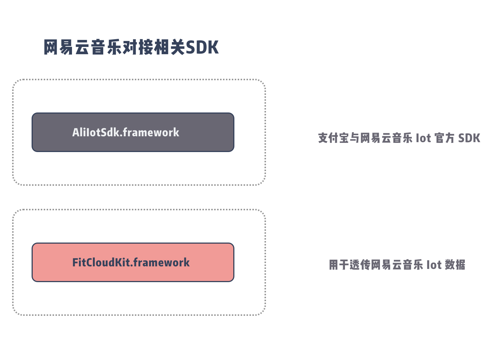

# 网易云音乐对接文档



## 1. 网易云音乐 Iot SDK 添加进项目中

[AliIotSdk.framework](AliIotSdk.framework)

## 2. 引用头文件

```objective-c
//oc
#import <AliIotSdk/AliIotSdk.h>

```

```swift
//swift
import AliIotSdk
```

## 3. 设置代理

```objective-c
//oc
//设置代理
[AliIot shareInstance].delegate = self;

```

```swift
//swift
//设置代理
AliIot.shareInstance().delegate = self

```

## 4. 实现代理

```objective-c
//oc
#pragma mark 网易云音乐
-(void)handleSendData:(NSData *)currData toDevice:(NSData *)mac error:(NSError *)error
{
    [FitCloudKit sendNetEaseBridgeData:currData];
}

```

## 5. 实现 FitCloudCallback 的部分

```objective-c
//oc
/**
 *@brief 网易云音乐MTU回调
 *@param mtu mtu值
 */
-(void) MTUNotifyForNetEaseCloudMusic:(NSUInteger)mtu
{
    [[AliIot shareInstance] setMtu:mtu];
}

/**
 *@brief 网易云音乐桥接数据回调
 *@param data 网易云音乐桥接数据
 */
-(void) OnNetEaseCloudMusicBridgeData:(NSData*)data
{
    [[AliIot shareInstance] handleReceivedData:data];
}

```

## 6. 连接

连接之前设置网易云音乐所需的广播数据

```objective-c
//oc
FitCloudPeripheral* item = [self.peripherals objectAtIndex:indexPath.row];
if([item isKindOfClass:[FitCloudPeripheral class]] && item.peripheral.state != CBPeripheralStateConnecting && (item.peripheral.state != CBPeripheralStateConnected || item.paired))
{
    if(item.allowNetEaseCloudMusic)
    {
#if (!TARGET_IPHONE_SIMULATOR)
    [[AliIot shareInstance] setAdvData:item.necmAdvData];
#endif
    }
    [FitCloudKit connect:item.peripheral btMode:item.allowConnectWithBT];
}
```
