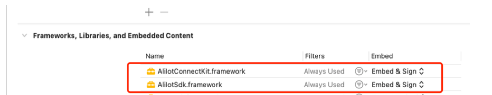
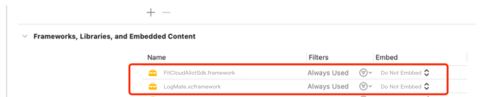

## FitCloudAliotSdk 对接文档

### 引入依赖库

将 AliIotSdk.framework 和 AliIotConnectKit.framework 添加进项目中。设置嵌入方式为 Embed &Sign



将 FitCloudAliIotSdk.framework 和 LogMate.xcframework 添加到项目中。



### 初始化

```objc

[FitCloudAliotSdk initWithCustomerName: @"xxxx" callback: self];

```

### 设置日志回调

```objc

[FitCloudAliotSdk setLogProvider: self];

```

### 记录保存 SDK 日志

```objc

/// implement to log the message
/// - Parameters:
///   - message: the log message
///   - level: the log level
///   - subsystem: the log subsystem
///   - category: the log category
-(void) onLogMateMessage:(NSString*)message level:(LOGMATELEVEL)level subsystem:(NSString*)subsystem category:(NSString*)category
{
    // 在这里记录保存SDK日志
}
```

### 实现 FitCloudAliotCallback

```objc

/// On received Aliot data from server.
/// > Important: Please invoke `+(void) sendAliotData:(NSData*)aliotData withBlock:(FitCloudResultBlock _Nullable)block` to send the data to the smartwatch
/// - Parameters:
///   - aliotData: the data received from Aliot server
-(void) onReceivedCloudAliotData:(NSData*)aliotData
{
    [FitCloudKit sendAliotData:data withBlock:^(BOOL succeed, NSError *error) {
        if(succeed)
        {
            XLOG_INFO(@"%@", APP_LOG_STRING(@"发送Aliot数据到手表成功..."));
            return;
        }
        if([error isKindOfClass:[NSError class]])
        {
            XLOG_ERROR(@"%@", APP_LOG_STRING(@"发送Aliot数据到手表失败：%@...", [error localizedDescription]));
        }
        else
        {
            XLOG_ERROR(@"%@", APP_LOG_STRING(@"发送Aliot数据到手表失败, 未知错误..."));
        }
    }];
}

/// On received netease cloud music bridge data from server.
/// > Important: Please invoke `+(void) sendNetEaseBridgeData:(NSData*)data` to send the data to the smartwatch
/// - Parameters:
///   - bridgeData: the bridge data received from server
-(void) onReceivedCloudNetEaseBridgeData:(NSData*) bridgeData
{
     [FitCloudKit sendNetEaseBridgeData:bridgeData];
}

```

### 实现 FitCloudCallback 的对应的部分 （FitCloudKit）

```objc
/**
 *@brief 通知App开始发起支付宝Iot认证
 */
-(void) OnNotifyAppToAliotAuth
{
    [FitCloudAliotSdk startAliotAuth];
}


/**
 *@brief 支付宝Iot数据回调
 *@param aliotData 支付宝Iot数据
 *@param totalPacks 总数据包个数
 *@param packIndex 当前第几个数据包，下标从0开始
 *@param expectedTotalBytes 支付宝Iot数据总长度，即几个数据包加起来的总长度
 */
-(void) OnAliotData:(NSData*)aliotData totalPacks:(NSInteger)totalPacks packIndex:(NSInteger)packIndex expectedTotalBytes:(NSInteger)expectedTotalBytes
{
    [FitCloudAliotSdk cascadeWithAliotData:aliotData totalPacks:totalPacks packIndex:packIndex expectedTotalBytes:expectedTotalBytes];
}

/**
 *@brief 网易云音乐桥接准备完毕
 */
-(void) OnNetEaseCloudMusicBridgeReady
{
    [FitCloudAliotSdk cascadeNetEaseCloudMusicBridgeReady];
}

/**
 *@brief 网易云音乐桥接数据回调
 *@param data 网易云音乐桥接数据
 */
-(void) OnNetEaseCloudMusicBridgeData:(NSData*)data
{
    [FitCloudAliotSdk cascadeWithNetEaseCloudMusicBridgeData:data];
}
```

### 设备连接后更新设备蓝牙名称

```objc

[[NSNotificationCenter defaultCenter] addObserver:self selector:@selector(OnPeripheralConnectedNotification:) name:FITCLOUDEVENT_PERIPHERAL_CONNECTED_NOTIFY object:nil];

-(void)OnPeripheralConnectedNotification:(NSNotification *) notification
{
    NSString* name = nil;
    FitCloudKitConnectRecord* lastConnectRecord = [FitCloudKit lastConnectPeripheral];
    if([lastConnectRecord isKindOfClass:[FitCloudKitConnectRecord class]])
    {
        name = lastConnectRecord.name;
        if([name hasPrefix:@"H"] && !lastConnectRecord.nextManufacturerName)
        {
            name = [name substringFromIndex:1];
        }
    }
    [FitCloudAliotSdk updateSmartWatchBluetoothNameWith:name];
}

```

### 设备断开后通知 SDK

```objc

 [[NSNotificationCenter defaultCenter] addObserver:self selector:@selector(OnFitCloudDisconnected:) name:FITCLOUDEVENT_PERIPHERAL_DISCONNECT_NOTIFY object:nil];


-(void) OnFitCloudDisconnected:(NSNotification*) notification {
    [FitCloudAliotSdk notifySmartWatchDisconnected];
    [FitCloudAliotSdk updateSmartWatchBluetoothNameWith:nil];
}


```
