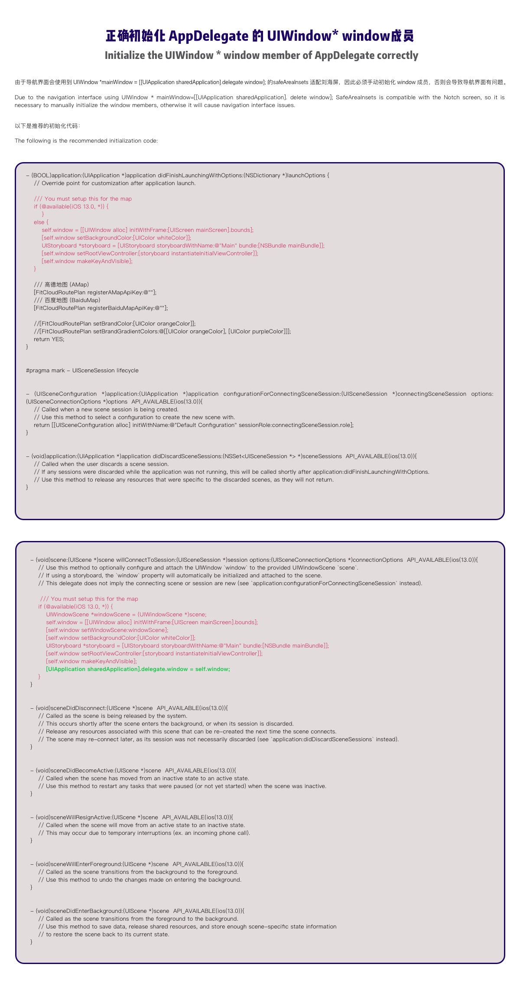

# 路线规划及步骑行导航对接文档

Route planning and cycling navigation Development Guide

**Step 1**

使用 Cocoapods 安装。由于依赖关系复杂，且需要大量的链接库，因此不建议手动安装。

Install using Cocoapods. Due to complex dependency relationships and the need for a large number of link libraries, manual installation is not recommended.

```objc

target 'RoutePlanDemo' do
  platform :ios, '10.0'
  workspace 'RoutePlanDemo.xcworkspace'
  project 'RoutePlanDemo.xcodeproj'
  # Uncomment this line if you're using Swift or would like to use dynamic frameworks
  use_frameworks!
  # Pods for RoutePlanDemo
  pod 'FitCloudRoutePlan',:path => '../'

end

```

**Step 2**

需要为 Info.plist 额外配置以下字段

The following additional fields need to be configured for Info.plist

```
Bundle display name
```

```
Privacy - Location Always Usage Description
```

```
Privacy - Location Always and When In Use Usage Description
```

```
Privacy - Location When In Use Usage Description
```

```
Required background modes
    App plays audio or streams audio/video using AirPlay
    App registers for location updates
```

**Step 3**

正确初始化 AppDelegate 的 UIWindow\* window 成员

Initialize the UIWindow \* window member of AppDelegate correctly

由于导航界面会使用到 UIWindow \_mainWindow = [[UIApplication sharedApplication].delegate window]; 的 safeAreaInsets 适配刘海屏，因此必须手动初始化 window 成员，否则会导致导航界面有问题。

Due to the navigation interface using UIWindow \_ mainWindow=[[UIApplication sharedApplication]. delete window]; SafeAreaInsets is compatible with the Notch screen, so it is necessary to manually initialize the window members, otherwise it will cause navigation interface issues.



**Step 4**

初始化地图 APIKey
Initialize the map APIKeys

```
    /// 高德地图 (AMap)
    [FitCloudRoutePlan registerAMapApiKey:@""];
    /// 百度地图 (BaiduMap)
    [FitCloudRoutePlan registerBaiduMapApiKey:@""];
```

**Step 5**

设置主题色

Setup the brand colors

```
    //[FitCloudRoutePlan setBrandColor:[UIColor orangeColor]];
    //[FitCloudRoutePlan setBrandGradientColors:@[[UIColor orangeColor], [UIColor purpleColor]]];
```

**Step 6**

实现代理

Implement the delegate

```
#pragma mark 路线规划与导航

/// The navigation start callback
/// - Parameters:
///   - map: the navigation map
///   - naviType: navi type
-(void) onNaviStartWithMap:(FITCLOUDROUTEPLANMAPPROVIDER)map type:(FITCLOUDROUTEPLANNAVITYPE) naviType
{
    //NSLog(@"onNaviStartWithMap: %@,%@", @(map), @(naviType));
    NSString *mapName = @"未知";
    switch(map)
    {
        case FITCLOUDROUTEPLANMAPPROVIDER_BAIDU:
            mapName = @"百度";
            break;
        case FITCLOUDROUTEPLANMAPPROVIDER_AMAP:
            mapName = @"高德";
            break;
    }

    NSString* naviTypeName = @"未知";
    switch(naviType)
    {
        case FITCLOUDROUTEPLANNAVITYPE_UNKNOWN:
            naviTypeName = @"未知";
            break;
        case FITCLOUDROUTEPLANNAVITYPE_NORMAL_CYCLE:
            naviTypeName = @"骑行";
            break;
        case FITCLOUDROUTEPLANNAVITYPE_ELECTRIC_CYCLE:
            naviTypeName = @"电动车";
            break;
        case FITCLOUDROUTEPLANNAVITYPE_WALK:
            naviTypeName = @"步行";
            break;
    }
    XLOG_INFO(@"[路线规划与导航SDK] 导航开始，当前使用%@地图，出行方式为%@。", mapName, naviTypeName);
    [FitCloudKit onNaviStartWithMap:map type:naviType withBlock:nil];
}

/// The navigation guide kind callback
/// - Parameters:
///   - guideKind: the guide kind
-(void) onNaviGuideKind:(FITCLOUDROUTEPLANGUIDEKIND)guideKind
{
    NSString* guideKindText = @"";
    switch(guideKind)
    {
        case FITCLOUDROUTEPLANGUIDEKIND_INVALID:
            guideKindText = @"";
            break;
        case FITCLOUDROUTEPLANGUIDEKIND_START:
            guideKindText = @"起点";
            break;
        case FITCLOUDROUTEPLANGUIDEKIND_FRONT:
            guideKindText = @"直行";
            break;
        case FITCLOUDROUTEPLANGUIDEKIND_RIGHT_FRONT:
            guideKindText = @"右前方转弯";
            break;
        case FITCLOUDROUTEPLANGUIDEKIND_RIGHT:
            guideKindText = @"右转";
            break;
        case FITCLOUDROUTEPLANGUIDEKIND_RIGHT_BACK:
            guideKindText = @"右后方转弯";
            break;
        case FITCLOUDROUTEPLANGUIDEKIND_LEFT_BACK:
            guideKindText = @"左后方转弯";
            break;
        case FITCLOUDROUTEPLANGUIDEKIND_LEFT:
            guideKindText = @"左转";
            break;
        case FITCLOUDROUTEPLANGUIDEKIND_LEFT_FRONT:
            guideKindText = @"左前方转弯";
            break;
        case FITCLOUDROUTEPLANGUIDEKIND_LEFT_U_TURN:
            guideKindText = @"左掉头";
            break;
        case FITCLOUDROUTEPLANGUIDEKIND_RIGHT_U_TURN:
            guideKindText = @"右掉头";
            break;
        case FITCLOUDROUTEPLANGUIDEKIND_DEST:
            guideKindText = @"到达终点";
            break;
        case FITCLOUDROUTEPLANGUIDEKIND_STAIR:
            guideKindText = @"台阶楼梯";
            break;
    }

    XLOG_INFO(@"[路线规划与导航SDK] 导航诱导%@。", guideKindText);
    [FitCloudKit onNaviGuideKind:guideKind withBlock:nil];
}

/// The navigation guide text callback
/// - Parameters:
///   - guideText: the guide text
-(void) onNaviGuideText:(NSString*)guideText
{
    XLOG_INFO(@"[路线规划与导航SDK] 导航诱导文本：%@。", guideText);
    [FitCloudKit onNaviGuideText:guideText withBlock:nil];
}

/// The remain time for navigation update callback
/// - Parameters:
///   - remainTime: the remain time in seconds
-(void) onNaviRemainTimeUpdate:(NSInteger)remainTime
{
    XLOG_INFO(@"[路线规划与导航SDK] 剩余时间：%@ 秒。", @(remainTime));
    [FitCloudKit onNaviRemainTimeUpdate:remainTime withBlock:nil];
}

/// The remain distance for navigation update callback
/// - Parameters:
///   - remainDistance: the remain distance in meters
-(void) onNaviRemainDistanceUpdate:(NSInteger)remainDistance
{
    XLOG_INFO(@"[路线规划与导航SDK] 剩余距离：%@ 米。", @(remainDistance));
    [FitCloudKit onNaviRemainDistanceUpdate:remainDistance withBlock:nil];
}

/// The navigation arrive destination callback
-(void) onNaviArriveDest
{
    XLOG_INFO(@"[路线规划与导航SDK] 到达终点。");
    [FitCloudKit onNaviArriveDestwithBlock:nil];
}

/// The naviagation exit callback
-(void) onNaviExit
{
    XLOG_INFO(@"[路线规划与导航SDK] 退出导航。");
    [FitCloudKit onNaviExitwithBlock:nil];
}
```

**Step 7**

实现 FitCloudCallback

Implement the FitCloudCallback

```

/// 手表端通知退出导航
-(void) OnExitNaviFromWatchNotify
{
    XLOG_INFO(@"%@", APP_LOG_STRING(@"手表端通知退出导航。"));
    [FitCloudRoutePlan exitNaviIfNeeded];
}

```

**Step 8**

根据需要启动对应地图的路线规划界面

Show the route plan ui as your needs

```
    - (IBAction)onBaiduMap:(id)sender {
        [FitCloudRoutePlan startRoutePlanFromVC:self withProvider:FITCLOUDROUTEPLANMAPPROVIDER_BAIDU delegate:self];
    }

    - (IBAction)onAMap:(id)sender {
        [FitCloudRoutePlan startRoutePlanFromVC:self withProvider:FITCLOUDROUTEPLANMAPPROVIDER_AMAP delegate: self];
    }
```
