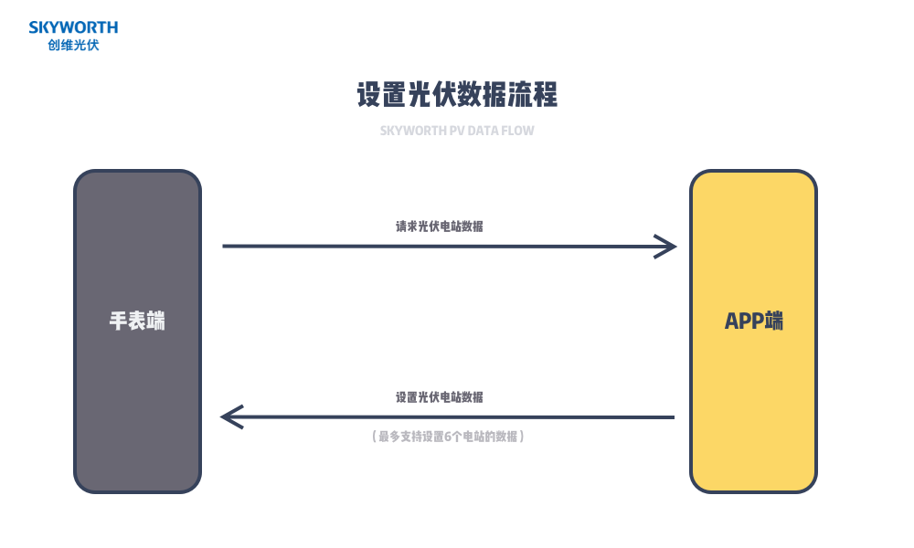

# 创维光伏对接文档



## 1. 实现代理


```objective-c
//oc
/**
 * @brief 手表请求创维光伏数据
 */
-(void) OnRequestSkyworthPV {
      XLOG_INFO(@"%@", APP_LOG_STRING(@"手表请求创维光伏数据..."));
      // build your stations data here
    [FitCloudKit sendSkyworthPVData:stations withBlock:^(BOOL succeed, NSError *error) {
        if(succeed)
        {
            XLOG_INFO(@"%@", APP_LOG_STRING(@"发送创维光伏数据到手表成功..."));
            return;
        }
        if([error isKindOfClass:[NSError class]])
        {
            XLOG_ERROR(@"%@", APP_LOG_STRING(@"发送创维光伏数据到手表失败：%@...", [error localizedDescription]));
        }
        else
        {
            XLOG_ERROR(@"%@", APP_LOG_STRING(@"发送创维光伏数据到手表失败, 未知错误..."));
        }
    }];
}

```

