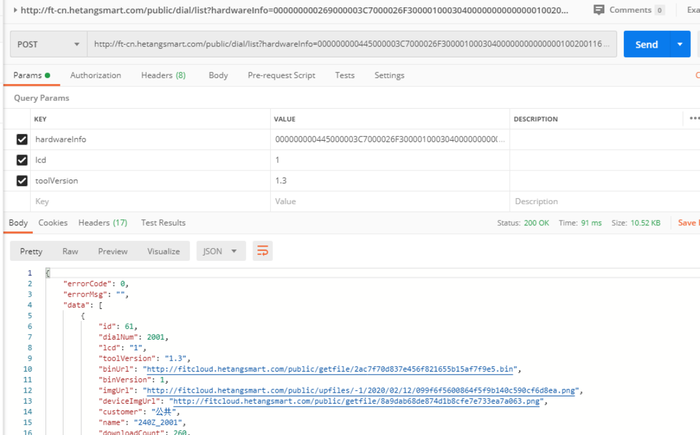
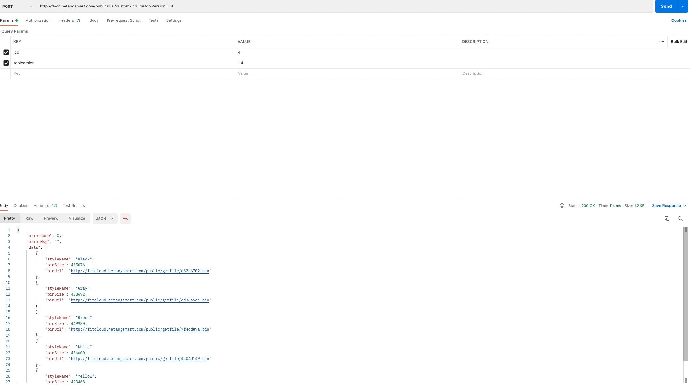
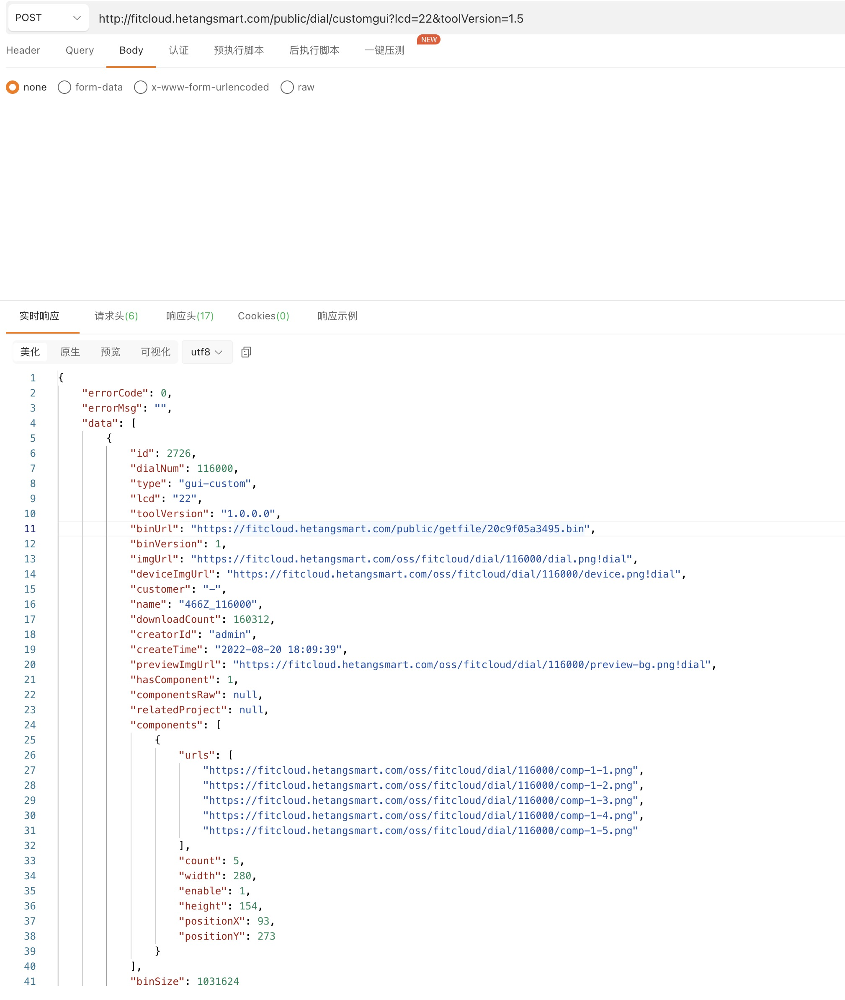
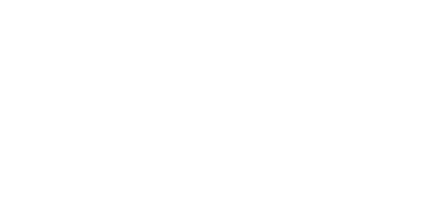
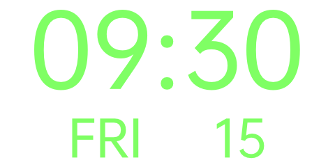
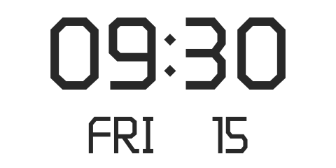

# Watchface Customize & Watchface DFU Upgrade iOS Development Guide

<p>
</p>

## 1. Watchface DFU Upgrade

The workflow of watchface DFU upgrade is similar to the firmware DFU upgrade. Push the watchface bin file to the watch by invoke FitCloudDFUKit. Before that, you need to obtain the watchface file, which can be stored on your own server or obtained from Hetang's server, depending on the cooperation mode agreed between you and Hetang.

### ❖ Common workflow

1. Download the watchface bin file from the server.

2. Push the watchface bin file to the watch by invoke FitCloudDFUKit.

### ❖ Implement watchface server by yourself

If you store the watchface bin file on your own server, you can implement it in the way as you like or familiar with, and you can deploy your watchface bin file at will also can obtain a better performance, which allows you to use the watchface generation tool to generate more personalized watchface for your customers and deploy it on your server, You only need to satisfy that the app client can obtain the watchface list matching the current watch.

How to obtain the matching watchface list according to the current watch, you can refer to our watchface server API parameters information.

### ❖ Connect to our watchface server

API：http://fitcloud.hetangsmart.com/public/dial/list  
Feature：Query the watchface list matching the current watch.  
Method：POST.  
Params：

| Param        | Type   | Requried | Description                |
| ------------ | ------ | -------- | -------------------------- |
| hardwareInfo | String | Y        | hardware string            |
| lcd          | int    | Y        | lcd screen resolution flag |
| toolVersion  | String | Y        | watchface tool version     |

Result：

| Field     | Type   | Description                         |
| --------- | ------ | ----------------------------------- |
| errorCode | int    | error code，0 success               |
| errorMsg  | String | error message.                      |
| data      | List   | Json Array of watchface information |

```
Watchface {
    int dialNum;
    int lcd;
    String toolVersion;
    String binUrl;
    long binSize;        // bin file size，unit: bytes
    int binVersion;
    String imgUrl;
    String deviceImgUrl;
    String name;
    int downloadCount;
    String type;          // basic: old version   gui: new gui version
    int hasComponent;     // 0 no components，1 has components
    String previewImgUrl; // preview image url
    List<Component> components;  //components
}

Component{
	int width;	//component width
	int height;	//component height
	int positionX;	//component coord x
	int positionY;	//component coord y
	List<String> urls;	//the preview images url options list
}

```

Example：


### ❖ Parameters required for docking to obtain our watchface server

If you are our business customers who allowed to connect our watchface server, you may need to obtain some parameters from the SDK and pass it to our server. Of course, to obtain this capability, you need to contact our business manager.

- hardwareInfo

```objc
FitCloudAllConfigObject *allConfig = [FitCloudKit allConfig];
FitCloudFirmwareVersionObject* firmware = allconfig.firmware;
NSString* hardwareInfo = [firmware description];
```

- lcd

```objc
[FitCloudKit getWatchfaceUIInformationWithBlock:^(BOOL succeed, FitCloudWatchfaceUIInfo* faceUI, NSError* error) {
    NSInteger lcd = faceUI.lcd;
}];
```

- toolVersion

```objc
[FitCloudKit getWatchfaceUIInformationWithBlock:^(BOOL succeed, FitCloudWatchfaceUIInfo* faceUI, NSError* error) {
    NSString* toolVersion = faceUI.toolVersion;
}];
```

### ❖ Invoke FitCloudDFUKit to push the watchface bin file to the watch

[Visit document for FitCloudDFUKit at Github](https://github.com/htangsmart/FitCloudPro-SDK-iOS/blob/master/FitCloudDFUKit/README_EN.md)

<br/>

## 2. Watchface customize

Custom watchface allows you to modify the background / preview / date position of the watchface base the existing watchface template file. For different date styles, if you integrate our watchface server, we provide you with five colors and font styles. Therefore, if you need to have more personalized styles or more date style types, You need to implement the watchface server yourself.

The watchface template file can be stored on your own server or obtained from Hetang's server, depending on the cooperation mode agreed between you and Hetang.

### ❖ Common workflow

1. Download the watchface template bin file from the server.

2. Invoke FitCloudWFKit to modify the background / preview / date position of the watchface bin file and generate a new one.

3. Invoke FitCloudDFUKit to push the new watchface bin file to the watch.

### ❖ Implement watchface template server by yourself

If you store the watchface template bin file on your own server, you can implement it in the way as you like or familiar with, and you can deploy your watchface template bin file at will also can obtain a better performance, which allows you to use the watchface generation tool to generate more personalized watchface template for your customers and deploy it on your server, You only need to satisfy that the app client can obtain the watchface template matching the current watch.

How to obtain the matching watchface template according to the current watch, you can refer to our watchface template server API parameters information.

### ❖ Connect to our watchface template server

1. Determine if the smartwatch using the new GUI architecture

```
BOOL isNextGUI = NO;
 FitCloudAllConfigObject *allConfig = [FitCloudKit allConfig];
if([allConfig isKindOfClass:[FitCloudAllConfigObject class]])
{
    isNextGUI = allConfig.firmware.isNewGUIArchitecture;
}
```

2. Query the matching watch face template for the current smartwatch based on isNextGUI.

- isNextGUI is false

API：http://fitcloud.hetangsmart.com/public/dial/custom  
Feature：Query the watchface template matching the current watch.  
Method：POST.  
Params：

| Param       | Type   | Requried | Description                |
| ----------- | ------ | -------- | -------------------------- |
| lcd         | int    | Y        | lcd screen resolution flag |
| toolVersion | String | Y        | watchface tool version     |

Result：

| Field     | Type   | Description                                                                                 |
| --------- | ------ | ------------------------------------------------------------------------------------------- |
| errorCode | int    | error code，0 success                                                                       |
| errorMsg  | String | error message.                                                                              |
| data      | List   | The JSON array of watchface template, contains template files of five different date styles |

```
WatchfaeTemplate {
    String binUrl;
    long binSize;  // bin file size，unit: bytes
    String styleName;  //style name, Black/Gray/Green/White/Yellow
}
```

Example：


- isNextGUI is true

API：http://fitcloud.hetangsmart.com/public/dial/customgui  
Feature：Query the watchface tempate matching the current watch.
Parameters：

| Param       | Type   | Requried | Description                |
| ----------- | ------ | -------- | -------------------------- |
| lcd         | int    | Y        | lcd screen resolution flag |
| toolVersion | String | Y        | watchface tool version     |

Result：

| Field     | Type   | Description                          |
| --------- | ------ | ------------------------------------ |
| errorCode | int    | error code，0 success                |
| errorMsg  | String | error message.                       |
| data      | List   | The JSON array of watchface template |

```
WatchfaeTemplate {
    String binUrl;
    long binSize;  // bin file size，unit: bytes
}
```

Example：


### ❖ Parameters required for docking to obtain our watchface template server

If you are our business customers who allowed to connect our watchface server, you may need to obtain some parameters from the SDK and pass it to our server. Of course, to obtain this capability, you need to contact our business manager.

- lcd

```objc
[FitCloudKit getWatchfaceUIInformationWithBlock:^(BOOL succeed, FitCloudWatchfaceUIInfo* faceUI, NSError* error) {
    NSInteger lcd = faceUI.lcd;
}];
```

- toolVersion

```objc
[FitCloudKit getWatchfaceUIInformationWithBlock:^(BOOL succeed, FitCloudWatchfaceUIInfo* faceUI, NSError* error) {
    NSString* toolVersion = faceUI.toolVersion;
}];
```

### ❖ Date styles

We provide you with five colors and font styles, which are fixed, so you can't change them at will. If this can't meet your needs, you can only implement the watchface template server yourself.

The styles we provide are as follows. You can download them to composite the watchface preview on the app client, which match to the five template files provided on our server one by one.

| White                              | Black                              | Yellow                             | Green                              | Gray                               |
| ---------------------------------- | ---------------------------------- | ---------------------------------- | ---------------------------------- | ---------------------------------- |
|  |  |  |  |  |

### ❖ Background & Preview

This needs to be generated by yourself base the size of the watch screen resolution. In particular, the aspect ratio must be consistent with the watch screen resolution and not less than the actual size of the screen resolution. The preview image needs to be composited base the background image and date style image. The advantage is that you can ensure your original style settings as much as possible.

### ❖ Invoke FitCloudWFKit to modify the background / preview / date position of the watchface bin file and generate a new one.

[Visit document for FitCloudWFKit at Github](https://github.com/htangsmart/FitCloudPro-SDK-iOS/blob/master/FitCloudWFKit/README_EN.md)

### ❖ Invoke FitCloudWFKit to modify the push position at the watch for the watchface bin file and generate a new one.（Optional）

If you would like to specify the push postion at the watch for the watchface bin file, you can invoke FitCloudWFKit again to modify it, otherwise, skip this step.

[Visit document for FitCloudWFKit at Github](https://github.com/htangsmart/FitCloudPro-SDK-iOS/blob/master/FitCloudWFKit/README_EN.md)

### ❖ Invoke FitCloudDFUKit to push the new watchface bin file to the watch.

[Visit document for FitCloudDFUKit at Github](https://github.com/htangsmart/FitCloudPro-SDK-iOS/blob/master/FitCloudDFUKit/README_EN.md)
