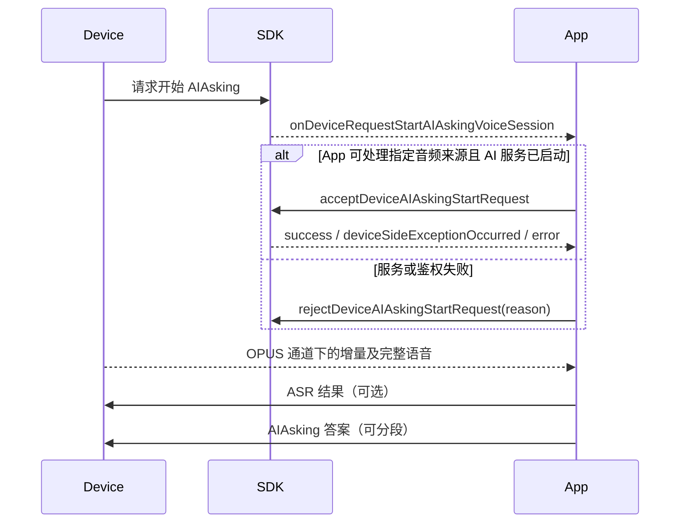

# AIAsking 编程指南

> 适用于 FitCloudKit iOS SDK。AIAsking 是“单次提问、单次回答”，不等同于连续多轮 AI Chat。

FitCloudKit 只为设备 OPUS 拾音协调本轮会话。App 主动使用 SCO 或手机 MIC 时完全自行管理，不调用 SDK start/cancel；只有设备发起回调会携带音频来源。

## 1. 三层状态

接入时必须分别管理三层状态：

| 状态 | 开始 | 结束 |
|---|---|---|
| 设备 AIAsking 场景 | `onDeviceDidEnterAIAsking` | `onDeviceDidExitAIAsking` |
| 单轮语音输入 | start/accept 成功 | 完整语音到达、cancel 或 exit |
| 答案内容发送 | 第一次 `sendAIAskingResult` | `isEnd=YES` |

设备仍停留在 AIAsking 页面，不代表 SDK 仍有活动语音会话；答案还在分段发送，也不代表语音会话仍然 active。

## 2. App 主动发起一轮提问

App 需要设备 OPUS 拾音时，先启动自己的 ASR/AI 服务，再调用 SDK start。若 App 使用 SCO 或手机 MIC，则不调用 SDK start/cancel。

```objc
[FitCloudKit startAIAskingVoiceSessionWithCompletion:^(BOOL success,
                                                           FitCloudAIDeviceSideStartFailureReason failureReason,
                                                           NSError *error) {
    if (!success) [self teardownAIAskingVoiceInput];
}];
```

start 只用于 App 主动请求设备 OPUS 拾音。失败时 `failureReason` 表示设备侧原因，`error` 表示 SDK 或通信错误。

## 3. 设备主动发起一轮提问



```objc
- (void)onDeviceRequestStartAIAskingVoiceSessionWithAudioSource:(FitCloudAIAudioSource)audioSource {
    FitCloudAIStartRejectionReason rejectionReason;
    if (![self startAIAskingServiceForAudioSource:audioSource rejectionReason:&rejectionReason]) {
        [FitCloudKit rejectDeviceAIAskingStartRequestWithReason:rejectionReason completion:nil];
        return;
    }

    [FitCloudKit acceptDeviceAIAskingStartRequestWithCompletion:
        ^(BOOL success, BOOL deviceSideExceptionOccurred, NSError *error) {
            if (!success) [self teardownAIAskingBusiness];
        }];
}
```

设备请求不超时。App 必须最终调用一次 accept 或 reject。AI 鉴权失败应使用 `FitCloudAIStartRejectionReasonAuthenticationFailed`。
当 `deviceSideExceptionOccurred=YES` 时，SDK 已结束失败的协调会话；App 只结束刚启动的本地业务，不再发送 cancel/reject。
若 `audioSource` 是 SCO 或手机 MIC，accept 成功只表示设备握手完成；SDK 随即释放状态，不产生音频回调，也不再调用 SDK cancel。

## 4. 语音输入与自然完成

```objc
- (void)onAIAskingDeltaOpusVoiceData:(NSData *)opusData
               decodedDeltaVoiceData:(NSData *)pcmData {
    [self.streamingASR appendAudioData:pcmData];
}

- (void)onAIAskingVoiceDataCompletedWithOpusVoiceData:(NSData *)opusData
                                      decodedVoiceData:(NSData *)pcmData {
    // 进入回调前，SDK 已释放本轮 AI 会话。
    [self requestAnswerForVoiceData:pcmData];
}
```

- Opus 通道由 SDK 提供音频数据。
- SCO 和手机 MIC 由 App 管理音频来源。
- 完整语音到达就是本轮语音会话结束，不需要调用 cancel。
- 下一次提问需要重新 start，或等待设备再次发起 start request。

## 5. Agent 选择

```objc
FitCloudAIAskingAgent agent = [FitCloudKit selectedAIAskingAgent];

- (void)onDeviceDidSelectAIAskingAgent:(FitCloudAIAskingAgent)agent {
    self.selectedAgent = agent;
}
```

- Agent 选择是持久设备状态，用于后续 AIAsking 请求。
- 单轮语音完成时不会清空 Agent。
- Agent 只服务 AIAsking，不控制 AI Chat。
- `onDeviceDidSelectAdFlashAIAgent:` 是独立的 AdFlash 业务选择事件，不要当作 AIAsking Agent。

## 6. ASR 确认与答案

部分设备支持接收 AIAsking ASR 结果：

```objc
[FitCloudKit sendAIAskingASRResult:recognizedText
                         errorCode:FitCloudASRErrorCodeSuccess
                        completion:nil];
```

调用前必须检查设备能力。随后可分段发送答案：

```objc
[FitCloudKit sendAIAskingResult:partialText
                          isEnd:NO
                     resultType:FitCloudAIAskingResultTypeResponseText
                     completion:nil];

[FitCloudKit sendAIAskingResult:finalText
                          isEnd:YES
                     resultType:FitCloudAIAskingResultTypeResponseText
                     completion:nil];
```

`isEnd` 只描述答案内容是否结束，不结束语音会话，也不退出 AIAsking 场景。

## 7. 设备场景事件

```objc
- (void)onDeviceDidEnterAIAsking;
- (void)onDeviceDidConfirmAIAsking;
- (void)onDeviceDidExitAIAsking;
```

这些是设备页面和交互状态事件，不是 voice start/cancel 回调。`onDeviceDidConfirmAIAsking` 表示设备确认当前输入，不代表答案发送完成。

## 8. 取消与功能退出

```objc
// App 只可在完整语音到达前取消本轮。
[FitCloudKit cancelAIAskingVoiceSessionWithCompletion:nil];

- (void)onDeviceDidCancelAIAskingVoiceSessionWithReason:(FitCloudAIDeviceInterruptionReason)reason {
    [self teardownAIAskingVoiceInput];
}

- (void)onDeviceRequestExitAIAskingVoiceSession {
    [self teardownAIAskingVoiceInput];
    [self exitAIAskingBusinessIfNeeded];
}
```

`onDeviceDidExitAIAsking` 是设备场景状态已经退出；`onDeviceRequestExitAIAskingVoiceSession` 是设备要求 App 退出相应功能处理。App 可以最终汇聚到相同清理逻辑，但不要把两者当成同一个协议事件。

## 9. Swift 示例

```swift
let agent = FitCloudKit.selectedAIAskingAgent()

FitCloudKit.startAIAskingVoiceSession {
    success, failureReason, error in
    if !success { self.teardownAIAskingVoiceInput() }
}

FitCloudKit.cancelAIAskingVoiceSession(completion: nil)
```

## 10. 接入检查表

- [ ] 不把 AIAsking 当作连续 AI Chat。
- [ ] 分开保存设备场景、当前语音和答案发送状态。
- [ ] device start 使用 accept/reject，并处理 accept 后设备异常。
- [ ] 完整语音回调后立即认为本轮语音结束。
- [ ] 不使用 `isEnd` 控制语音生命周期。
- [ ] Agent 只用于 AIAsking，并处理未选择状态。
- [ ] 区分 device cancel、功能 exit 和场景 didExit。
