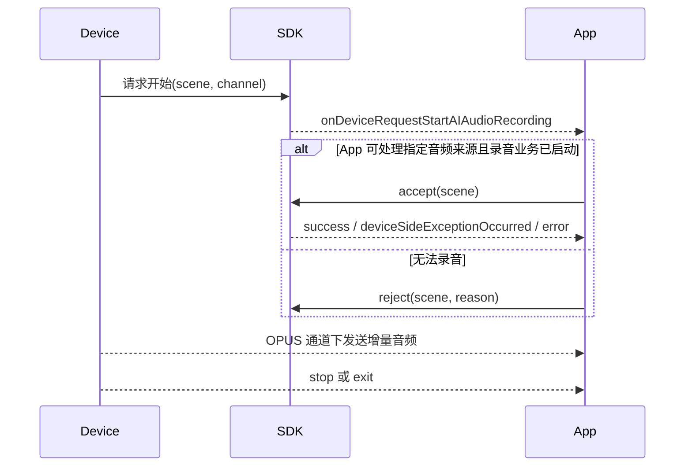

# AI 录音编程指南

> 适用于 FitCloudKit iOS SDK。AI 录音是持续型业务，包含现场录音和通话录音两个 scene。

## 1. 业务边界

```objc
FitCloudAIAudioRecordingSceneOnSite
FitCloudAIAudioRecordingSceneCall
```

- start 固定表示 App 请求设备 OPUS 拾音；成功后持续占用 SDK 会话，直到明确 stop 或 exit。
- App 主动使用 SCO/手机 MIC 时完全管理文件、采集、上传和转写，不调用 SDK start/stop。
- 设备发起时，accept/reject 的 scene 必须与回调完全一致。

## 2. App 主动发起

需要设备 OPUS 拾音时，先由 App 创建文件、启动转写等本地录音业务，再调用 SDK start。使用 SCO/手机 MIC 时不调用 SDK start/stop。

```objc
[FitCloudKit startAIAudioRecordingWithScene:FitCloudAIAudioRecordingSceneOnSite
                                completion:^(BOOL success,
                                               FitCloudAIDeviceSideStartFailureReason failureReason,
                                               NSError *error) {
    if (!success) [self discardPreparedRecordingResources];
}];

// 完成整个录音业务时调用。
[FitCloudKit stopAIAudioRecordingWithCompletion:nil];
```

## 3. 设备主动发起



```objc
- (void)onDeviceRequestStartAIAudioRecordingWithScene:(FitCloudAIAudioRecordingScene)scene
                                         audioSource:(FitCloudAIAudioSource)audioSource {
    if (![self startRecordingBusinessForScene:scene audioSource:audioSource]) {
        [FitCloudKit rejectDeviceAIAudioRecordingStartRequestForScene:scene
                                                                reason:FitCloudAIStartRejectionReasonServiceFailed
                                                            completion:nil];
        return;
    }
    [FitCloudKit acceptDeviceAIAudioRecordingStartRequestForScene:scene
                                                        completion:^(BOOL success,
                                                                     BOOL deviceSideExceptionOccurred,
                                                                     NSError *error) {
        if (!success) [self discardPreparedRecordingResources];
    }];
}
```

设备请求 SCO 或手机 MIC 时，accept 成功后 SDK 立即释放状态；后续录音完全由 App 管理，不调用 SDK stop。只有设备 OPUS 请求会进入持续媒体会话。

## 4. 音频处理

```objc
- (void)onAIAudioRecordingDeltaOpusVoiceData:(NSData *)opusData
                       decodedDeltaVoiceData:(NSData *)pcmData {
    [self.recorder appendPCMData:pcmData];
}
```

- Opus 通道会收到增量 Opus/PCM 数据，App 应自行累计、保存或转写。
- SCO 和手机 MIC 由 App 管理音频来源，不会自动获得相同的 Opus 数据回调。
- 当前没有“完整录音文件已生成”回调；不要假设 stop completion 会返回音频文件。

## 5. 停止与退出

```objc
- (void)onDeviceRequestStopAIAudioRecordingWithScene:(FitCloudAIAudioRecordingScene)scene
                                                reason:(FitCloudAIDeviceInterruptionReason)reason {
    [self finishRecordingForScene:scene];
}

- (void)onDeviceRequestExitAIAudioRecordingWithScene:(FitCloudAIAudioRecordingScene)scene {
    [self finishRecordingForScene:scene];
    [self dismissRecordingUIIfNeeded];
}
```

设备 stop/exit 不需要 App 再调用 stop。App 主动停止时，应等待 stop completion 后再启动新的 AI 业务。

## 6. 错误与互斥

- scene 非法、scene 与 pending 请求不一致或没有活动录音时，API 返回错误。
- `deviceSideExceptionOccurred=YES` 时，SDK 已结束协调会话；App 结束刚启动的录音业务并清理自身资源，不再发送 stop/reject。
- 所有 AI 业务全局互斥；现场录音和通话录音也不能并发。

## 7. Swift

```swift
FitCloudKit.startAIAudioRecording(with: .onSite) {
    success, failureReason, error in
    if !success { self.discardPreparedRecordingResources() }
}

FitCloudKit.stopAIAudioRecording(completion: nil)
```

## 8. 接入检查表

- [ ] 保存当前 scene，并在 accept/reject 时原样传回。
- [ ] App 主动需要设备 OPUS 时才调用 start；SCO/手机 MIC 不调用 SDK 会话 API。
- [ ] Opus 场景自行累计增量数据。
- [ ] App 主动结束调用 stop；设备 stop/exit 只做本地清理。
- [ ] 所有失败路径都关闭文件和音频资源。
