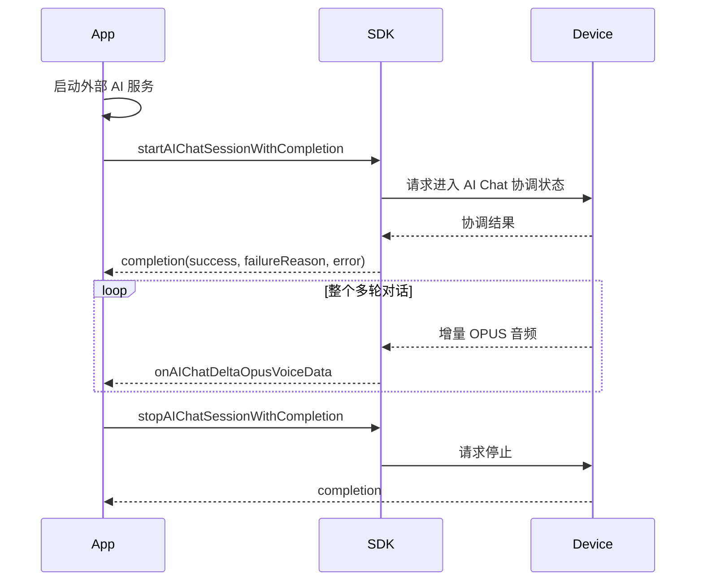
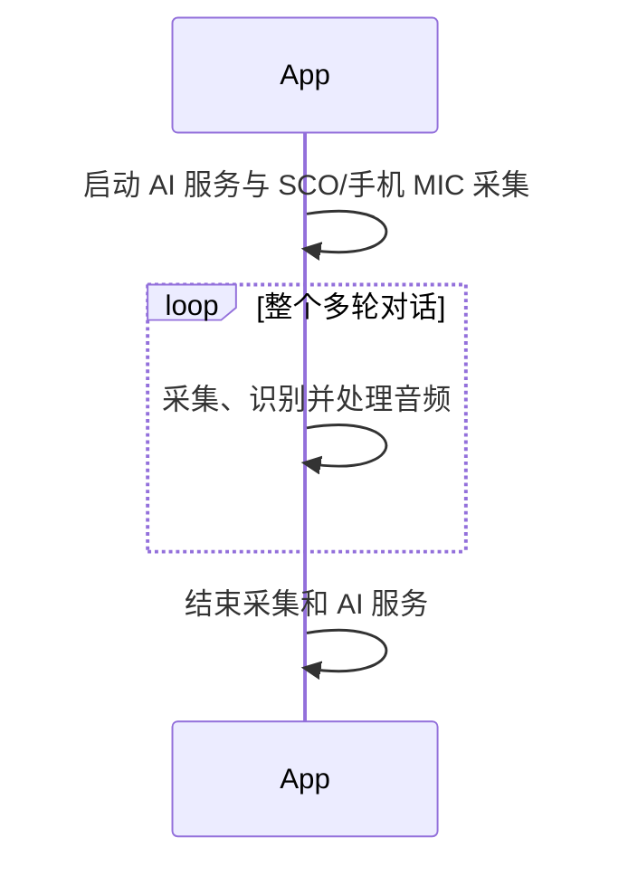
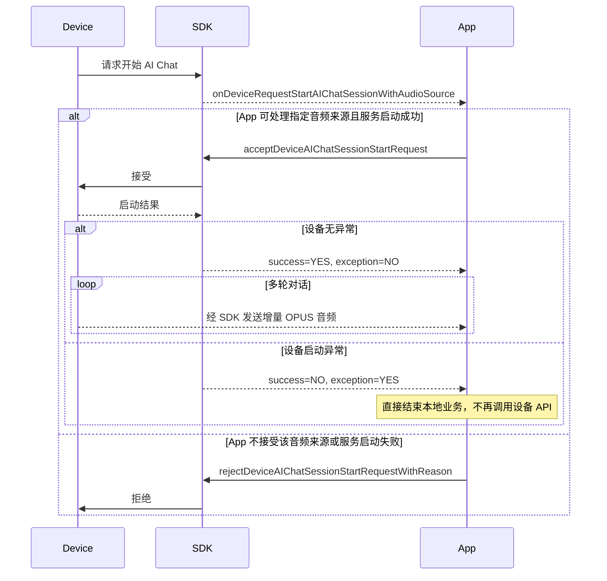
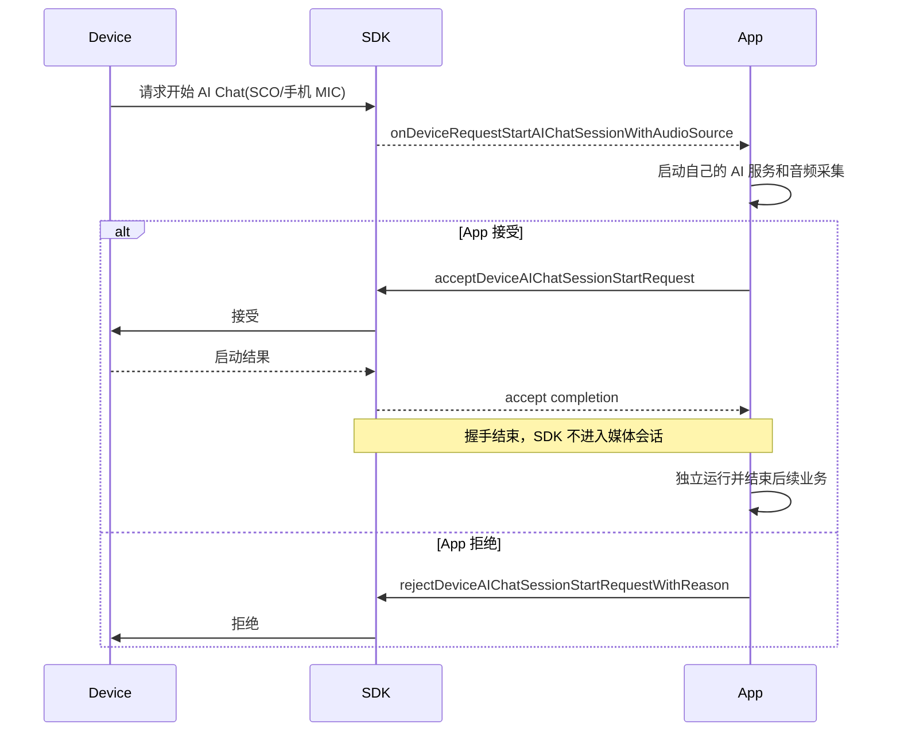

# AI Chat 编程指南

> 适用于 FitCloudKit iOS SDK。AI Chat 表示需要显式结束的连续多轮对话，不等同于单轮 AIAsking。

## 1. 业务边界

- 本文的 AI Chat session 是设备 OPUS 拾音的 SDK 协调会话，不代表外部 AI 服务生命周期。
- 一次成功的 start 或 accept 对应整个多轮对话，期间持续占用全局 AI 业务会话。
- OPUS 会话进入 active 后不再区分由哪一侧发起：App 可以主动 stop，设备也可以主动 stop/exit。
- App 主动结束使用 `stopAIChatSessionWithCompletion:`；设备主动结束后 SDK 回调 `onDeviceDidStopAIChatSessionWithReason:`，App 只结束本地业务，不再调用任何 API 告诉设备。
- App 负责启动和停止外部 AI 服务，并管理 ASR、SCO、手机 MIC 和页面流程；SDK 仅管理设备 OPUS 协议、会话互斥与回调时序。
- App 主动使用 SCO/手机 MIC 时不调用本节 start/stop；该流程完全不经过 SDK。

## 2. App 主动发起：OPUS



```objc
[FitCloudKit startAIChatSessionWithCompletion:^(BOOL success,
                                                   FitCloudAIDeviceSideStartFailureReason failureReason,
                                                   NSError *error) {
    if (!success) {
        [self teardownAIChatResources];
    }
}];

// 整个多轮对话结束时调用，不是每轮问答结束时调用。
[FitCloudKit stopAIChatSessionWithCompletion:nil];
```

### App 主动使用 SCO / 手机 MIC



该路径没有设备—SDK 音频交互，因此既不调用 `startAIChatSession...`，也不调用 `stopAIChatSession...`。

## 3. 设备主动发起：OPUS



```objc
- (void)onDeviceRequestStartAIChatSessionWithAudioSource:(FitCloudAIAudioSource)audioSource {
    if (![self startAIChatServiceForAudioSource:audioSource]) {
        [FitCloudKit rejectDeviceAIChatSessionStartRequestWithReason:FitCloudAIStartRejectionReasonServiceFailed
                                                          completion:nil];
        return;
    }

    [FitCloudKit acceptDeviceAIChatSessionStartRequestWithCompletion:
        ^(BOOL success, BOOL deviceSideExceptionOccurred, NSError *error) {
            if (deviceSideExceptionOccurred) {
                // 设备已经报告启动异常，SDK 也已结束本次会话。
                // 只结束 App 侧业务，不调用 stop 或 reject。
                [self teardownAIChatResources];
                return;
            }
            if (error) {
                [self handleAIChatAcceptCommandError:error];
                return;
            }
            // success=YES：两侧已进入协调状态；若为 OPUS，设备随后可发送增量音频。
        }];
}
```

### 设备主动发起：SCO / 手机 MIC



非 OPUS 的 accept 成功不代表 SDK 建立了持续会话，也不能再调用 SDK stop。设备后续若发送 stop/exit，SDK 仍会把它作为业务控制事件回调给 App。

设备开始请求没有 SDK 超时。App 收到回调后必须最终调用一次 accept 或 reject。

| success | deviceSideExceptionOccurred | error | SDK 状态与 App 动作 |
|---:|---:|---|---|
| YES | NO | nil | OPUS 进入 active；SCO/手机 MIC 只完成握手并释放 SDK 状态 |
| NO | YES | nil | 设备未能进入协调状态；SDK 已清除会话，App 结束本地业务且不再调用 stop/reject |
| NO | NO | 非 nil | accept 指令或响应异常；按 error 处理，不要误判为设备侧启动异常 |

## 4. 音频与多轮处理

```objc
- (void)onAIChatDeltaOpusVoiceData:(NSData *)opusData
             decodedDeltaVoiceData:(NSData *)pcmData {
    [self.streamingASR appendAudioData:pcmData];
}
```

| 通道 | App 处理方式 |
|---|---|
| Opus | SDK 回调增量 Opus 和 16 kHz、单声道、16-bit PCM |
| SCO | 仅设备发起请求时透传该来源；accept 后 App 独立管理，不存在 SDK start/stop |
| 手机 MIC | 仅设备发起请求时透传该来源；accept 后 App 独立管理权限、采集和生命周期 |

每次 `onAIChatDeltaOpusVoiceData...` 都只是当前连续 AI Chat 中的一段增量音频。不要把 `stopAIChatSession...` 当作提交某一轮音频的 API；它会结束整个 AI Chat 业务。

## 5. 任一侧主动结束

```objc
- (void)onDeviceDidStopAIChatSessionWithReason:(FitCloudAIDeviceInterruptionReason)reason {
    [self teardownAIChatResources];
}

- (void)onDeviceRequestExitAIChatSession {
    [self teardownAIChatResources];
    [self dismissAIChatUIIfNeeded];
}
```

- 只有 OPUS 会话可调用 `stopAIChatSessionWithCompletion:` 主动结束，无论它最初由 App 还是设备发起。
- 无论会话最初由哪一侧发起，设备都可以主动 stop；SDK 通过 `onDeviceDidStop...` 通知 App。
- 设备 exit 除结束会话外，还表示退出 AI Chat 场景。
- 收到设备 stop/exit 后只清理本地资源，不再调用 stop、reject 或其他结束 API。

## 6. 错误处理

- `start`：`failureReason` 表示设备侧无法启动；`error` 表示 SDK、状态或通信错误。
- `accept`：`deviceSideExceptionOccurred=YES` 表示 App 已接受，但设备启动异常；SDK 已结束会话，App 只回滚资源，不向设备补发命令。
- 已存在其他 pending/active AI 业务时，start 直接失败。
- 所有 SDK 回调按顺序派发，但业务层资源仍应在自己的串行上下文中管理。

## 7. Swift 对应调用

```swift
FitCloudKit.startAIChatSession { success, failureReason, error in
    if !success { self.teardownAIChatResources() }
}

FitCloudKit.stopAIChatSession(completion: nil)
```

## 8. 接入检查表

- [ ] 明确 AI Chat 是连续多轮，而不是单轮 AIAsking。
- [ ] App 发起使用 start；设备发起只使用 accept/reject。
- [ ] 区分设备启动异常与 SDK/通信 error；只有 `deviceSideExceptionOccurred=YES` 是明确的设备异常结果。
- [ ] 将增量音频作为连续多轮 AI Chat 的媒体数据处理，不用 stop 提交单轮。
- [ ] 只在整个 AI Chat 结束时调用 stop。
- [ ] 允许 App 和设备任一侧结束，并在设备 stop/exit 后避免重复发送结束命令。
