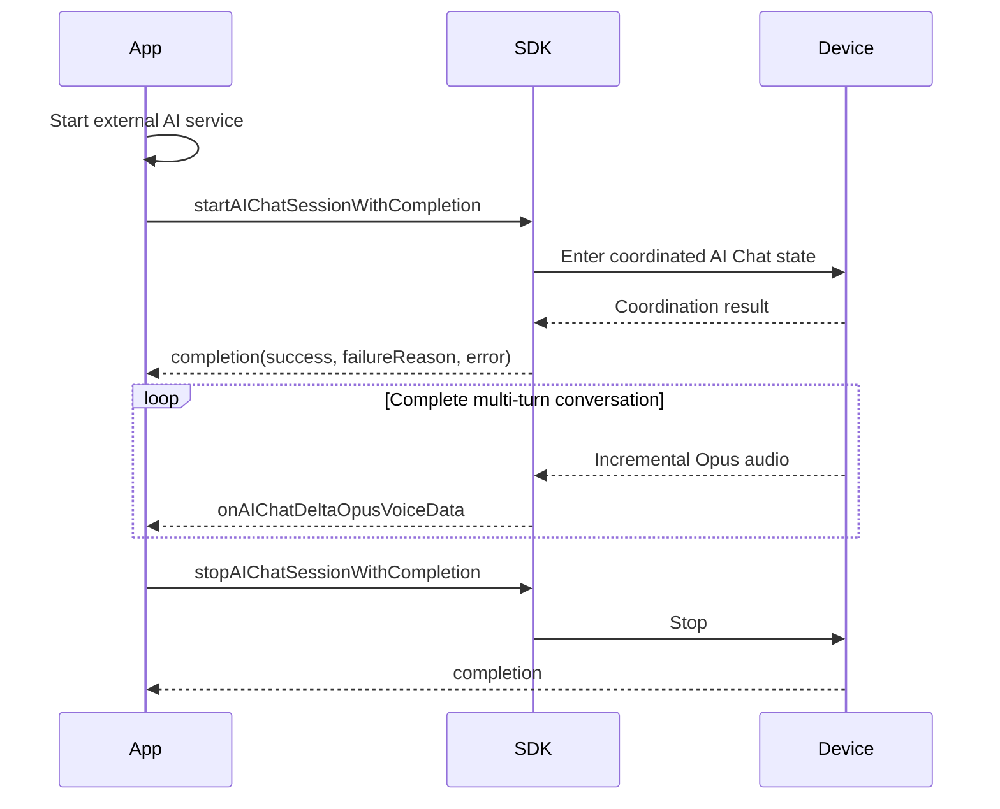
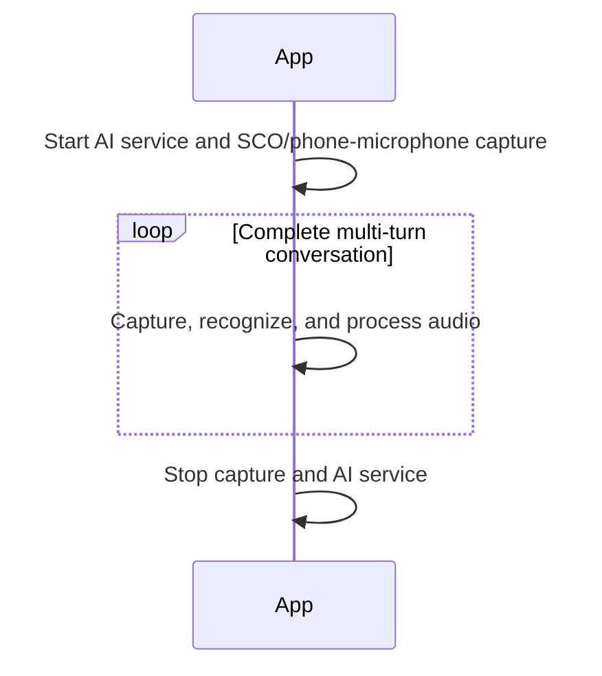

# AI Chat Programming Guide

> For FitCloudKit on iOS. AI Chat is a continuous multi-turn conversation that requires an explicit stop; it is distinct from single-turn AIAsking.

## 1. Scope

- An AI Chat session here coordinates device Opus capture; it is not the external AI-service lifetime.
- One successful start or accept owns the complete multi-turn conversation and occupies the global AI session until stop or exit.
- Once an Opus session is active, it no longer depends on its origin: the app may stop it, and the device may stop or exit it.
- Use `stopAIChatSessionWithCompletion:` for app termination. After device termination, `onDeviceDidStopAIChatSessionWithReason:` is a fact notification; clean up locally and send no additional device API.
- The app starts and stops its external AI service and owns ASR, SCO, phone-microphone audio, and UI. The SDK manages only device Opus protocol state, exclusivity, and callback ordering.
- An app-initiated SCO or phone-microphone flow does not call the SDK start/stop methods.

## 2. App-initiated flow: Opus



```objc
[FitCloudKit startAIChatSessionWithCompletion:^(BOOL success,
                                                   FitCloudAIDeviceSideStartFailureReason failureReason,
                                                   NSError *error) {
    if (!success) [self teardownAIChatResources];
}];

// Call once for the entire conversation, not after every turn.
[FitCloudKit stopAIChatSessionWithCompletion:nil];
```

### App-initiated SCO / phone microphone



This path has no device-to-SDK media interaction, so it calls neither `startAIChatSession...` nor `stopAIChatSession...`.

## 3. Device-initiated flow

```objc
- (void)onDeviceRequestStartAIChatSessionWithAudioSource:(FitCloudAIAudioSource)audioSource {
    if (![self startAIChatServiceForAudioSource:audioSource]) {
        [FitCloudKit rejectDeviceAIChatSessionStartRequestWithReason:FitCloudAIStartRejectionReasonServiceFailed
                                                          completion:nil];
        return;
    }
    [FitCloudKit acceptDeviceAIChatSessionStartRequestWithCompletion:
        ^(BOOL success, BOOL deviceSideExceptionOccurred, NSError *error) {
            if (deviceSideExceptionOccurred) {
                // The SDK has already ended this failed start. Clean up locally;
                // do not call stop or reject.
                [self teardownAIChatResources];
                return;
            }
            if (error) {
                [self handleAIChatAcceptCommandError:error];
                return;
            }
            // success=YES: both sides are coordinated; Opus may now deliver device audio.
        }];
}
```

A device start request has no SDK timeout. The app must eventually call exactly one matching accept or reject method.

| success | deviceSideExceptionOccurred | error | SDK state and app action |
|---:|---:|---|---|
| YES | NO | nil | Opus becomes active; SCO/phone microphone completes only the handshake and releases SDK state |
| NO | YES | nil | Device did not enter the coordinated state; SDK cleared the session, so stop the app service without stop/reject |
| NO | NO | non-nil | Accept command or response error; handle the error and do not classify it as a device start exception |

For an Opus request, successful accept enters the SDK media session and the device can stream audio. For an SCO or phone-microphone request, successful accept completes the handshake only: the app independently owns the remaining business, and must not call SDK stop. A later device stop/exit is still delivered as a business-control callback.

## 4. Audio and turns

```objc
- (void)onAIChatDeltaOpusVoiceData:(NSData *)opusData
             decodedDeltaVoiceData:(NSData *)pcmData {
    [self.streamingASR appendAudioData:pcmData];
}
```

| Channel | App responsibility |
|---|---|
| Opus | SDK delivers incremental Opus and 16 kHz mono 16-bit PCM |
| SCO | Device-request callback only; after accept, the app owns the flow and there is no SDK start/stop |
| Phone microphone | Device-request callback only; after accept, the app owns permission, capture, and lifecycle |

Each `onAIChatDeltaOpusVoiceData...` callback is one incremental segment within the continuous AI Chat. Do not use `stopAIChatSession...` to submit a turn; it ends the complete AI Chat business.

## 5. Either side may end the session

```objc
- (void)onDeviceDidStopAIChatSessionWithReason:(FitCloudAIDeviceInterruptionReason)reason {
    [self teardownAIChatResources];
}

- (void)onDeviceRequestExitAIChatSession {
    [self teardownAIChatResources];
    [self dismissAIChatUIIfNeeded];
}
```

- Only an Opus session may call `stopAIChatSessionWithCompletion:`, regardless of which side initiated it.
- The device may stop regardless of origin; the SDK reports the completed action through `onDeviceDidStop...`.
- Exit additionally means that the device leaves the AI Chat scene.
- Device stop/exit requires local cleanup only. Do not send stop, reject, or another termination API.

## 6. Error handling

- For app start, `failureReason` is a device-side refusal and `error` is an SDK, state, or transport failure.
- For accept, `deviceSideExceptionOccurred=YES` means the app service and channel were ready, but the device did not enter the coordinated state. The SDK has ended the session; stop the local service without sending another command.
- A new start fails while any AI business is pending or active.
- SDK callbacks are ordered; keep app resource mutations serialized as well.

## 7. Swift

```swift
FitCloudKit.startAIChatSession { success, failureReason, error in
    if !success { self.teardownAIChatResources() }
}
FitCloudKit.stopAIChatSession(completion: nil)
```

## 8. Integration checklist

- [ ] Treat AI Chat as continuous multi-turn interaction.
- [ ] Use start only for app initiation and accept/reject only for a device request.
- [ ] Distinguish a device exception from an SDK/transport error; only `deviceSideExceptionOccurred=YES` is a definitive device exception.
- [ ] Process incremental audio as continuous multi-turn media; never use stop to submit a turn.
- [ ] Call stop only when the complete chat ends.
- [ ] Allow either side to end and never send another termination command after device stop/exit.
