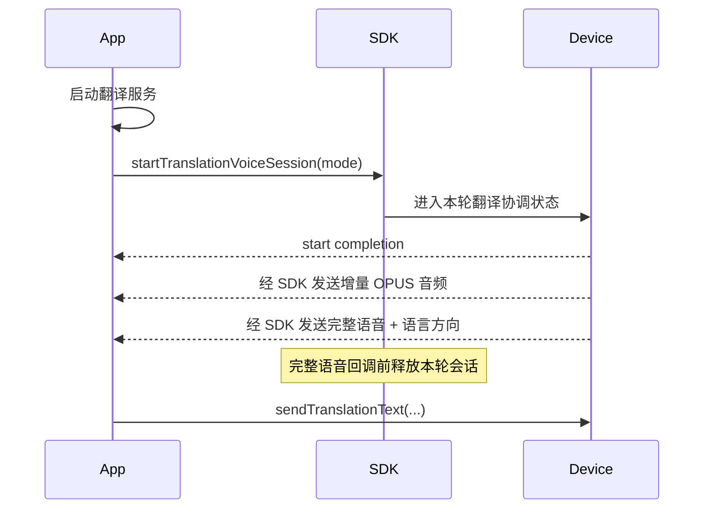

# AI 翻译编程指南

> 适用于 FitCloudKit iOS SDK。普通翻译和对话翻译都按单轮语音输入管理；对话翻译的每次发言是独立一轮。

这里的语音 session 仅表示设备 OPUS 拾音的单轮协调状态。App 自行启动翻译/ASR 服务；App 主动使用 SCO/手机 MIC 时不调用 SDK start/cancel。

## 1. 三种模式

| 模式 | 含义 | 生命周期 |
|---|---|---|
| `FitCloudAITranslationVoiceModeStandard` | 普通单向翻译 | 一次语音完成即结束 |
| `FitCloudAITranslationVoiceModeConversationSelf` | 对话翻译：自身发言 | 当次发言完成即结束 |
| `FitCloudAITranslationVoiceModeConversationOther` | 对话翻译：对方发言 | 当次发言完成即结束 |

设备页面可以持续停留在对话翻译场景，但 SDK 不会因此持续占用 AI 会话。下一次发言必须重新 start，或由设备重新发起 start request。

## 2. App 主动发起

需要设备 OPUS 拾音时，App 先启动自己的翻译/ASR 服务，再调用 SDK start。使用 SCO/手机 MIC 时由 App 独立完成整轮业务，不调用 SDK start/cancel。



```objc
[FitCloudKit startTranslationVoiceSessionWithMode:FitCloudAITranslationVoiceModeStandard
                                      completion:^(BOOL success,
                                                     FitCloudAIDeviceSideStartFailureReason failureReason,
                                                     NSError *error) {
    if (!success) [self teardownTranslationInput];
}];
```

## 3. 设备主动发起

```objc
- (void)onDeviceRequestStartTranslationVoiceSessionWithMode:(FitCloudAITranslationVoiceMode)mode
                                                audioSource:(FitCloudAIAudioSource)audioSource {
    if (![self startTranslationServiceForMode:mode audioSource:audioSource]) {
        [FitCloudKit rejectDeviceTranslationVoiceSessionStartRequestForMode:mode
                                                                      reason:FitCloudAIStartRejectionReasonServiceFailed
                                                                  completion:nil];
        return;
    }

    [FitCloudKit acceptDeviceTranslationVoiceSessionStartRequestForMode:mode
                                                              completion:^(BOOL success,
                                                                           BOOL deviceSideExceptionOccurred,
                                                                           NSError *error) {
        if (!success) [self teardownTranslationInput];
    }];
}
```

mode 必须原样用于 accept/reject。设备请求不超时，App 必须最终响应一次。
设备请求 SCO 或手机 MIC 时，accept 成功只完成握手并释放 SDK 状态；后续由 App 独立完成，不调用 SDK cancel。只有 OPUS 才产生本节音频回调。

## 4. 音频与自然完成

```objc
- (void)onTranslateDeltaOpusVoiceData:(NSData *)opusData
                decodedDeltaVoiceData:(NSData *)pcmData
                       sourceLanguage:(FITCLOUDLANGUAGE)sourceLanguage
                       targetLanguage:(FITCLOUDLANGUAGE)targetLanguage {
    [self.streamingASR appendAudioData:pcmData];
}

- (void)onTranslateVoiceStopWithOpusVoiceData:(NSData *)opusData
                              decodedVoiceData:(NSData *)pcmData
                                sourceLanguage:(FITCLOUDLANGUAGE)sourceLanguage
                                targetLanguage:(FITCLOUDLANGUAGE)targetLanguage {
    // 此回调表示本轮完整语音到达。进入回调前，SDK 已释放本轮 AI 会话。
    [self translateVoiceData:pcmData from:sourceLanguage to:targetLanguage];
}
```

`onTranslateVoiceStop...` 是历史命名，它表示语音传输完成，不要求 App 再调用 cancel。

| 通道 | 音频来源 |
|---|---|
| Opus | SDK 提供增量及完整 Opus/PCM 回调 |
| SCO | App 从 SCO 链路获取音频 |
| 手机 MIC | App 自行申请权限并采集；SDK 只透传选择 |

## 5. 发送翻译结果

```objc
[FitCloudKit sendTranslationText:translatedText
                           isEnd:YES
                      resultType:TRANSLATETEXTTYPE_TRANSLATION
                      completion:nil];
```

`isEnd` 表示本次文本结果是否发送完毕，不控制语音会话。语音会话已经在完整语音回调前结束。

## 6. 取消与退出

```objc
// 仅在语音传输完成前，由 App 主动放弃本轮。
[FitCloudKit cancelTranslationVoiceSessionWithCompletion:nil];

- (void)onDeviceDidCancelTranslationVoiceSessionWithMode:(FitCloudAITranslationVoiceMode)mode
                                                    reason:(FitCloudAIDeviceInterruptionReason)reason {
    [self teardownTranslationInput];
}

- (void)onDeviceRequestExitTranslationVoiceSessionWithMode:(FitCloudAITranslationVoiceMode)mode {
    [self teardownTranslationInput];
    [self dismissTranslationUIIfNeeded];
}
```

设备 cancel 已经发生，不需要 App 再调用 cancel。exit 表示退出相关功能或场景。

## 7. 对话翻译状态管理

```text
自身发言 start(Self) → 完整语音 → 释放
App 发送翻译结果
对方发言 start(Other) → 完整语音 → 释放
App 发送翻译结果
```

建议 App 保存当前 mode，直到完整语音、cancel、exit 或启动失败。当前完整语音回调不直接携带 mode，不要仅根据页面状态猜测发言方。

## 8. Swift 示例

```swift
FitCloudKit.startTranslationVoiceSession(
    with: .standard
) { success, failureReason, error in
    if !success { self.teardownTranslationInput() }
}

FitCloudKit.cancelTranslationVoiceSession(completion: nil)
```

## 9. 接入检查表

- [ ] 每次发言独立 start，不把对话翻译页面当成持续音频会话。
- [ ] device start 的 mode 在 accept/reject 时保持一致。
- [ ] 完整语音回调后不再调用 cancel。
- [ ] 保存当前 mode，正确区分 Self 和 Other。
- [ ] 将 `isEnd` 只用于文本结果，不用于会话管理。
- [ ] 处理 App cancel、设备 cancel 与场景 exit 三种不同路径。
