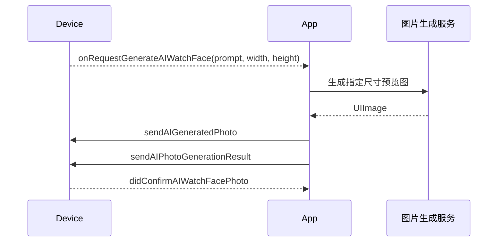

# AI 表盘编程指南

> 适用于 FitCloudKit iOS SDK。AI 表盘由单轮语音输入、提示词生成、图片生成和图片传输几个阶段组成。

FitCloudKit 只为设备 OPUS 拾音协调本轮会话。App 主动使用 SCO 或手机 MIC 时自行管理 ASR/采集，不调用 SDK start/cancel；只有设备发起回调会携带音频来源。

## 1. 生命周期边界

```text
协调会话：start/accept → 语音完成 → 自动释放
生成业务：ASR/提示词 → 图片生成 → 图片传输 → 设备确认
```

图片生成和传输不会继续占用全局 AI 音频会话。`cancelAIWatchFaceVoiceSession...` 只取消尚未完成的语音输入，不取消正在进行的图片生成或传输。

## 2. App 主动发起语音

需要设备 OPUS 拾音时，App 先启动自己的 ASR/AI 表盘服务，再调用 SDK start。使用 SCO/手机 MIC 时不调用 SDK start/cancel。

```objc
[FitCloudKit startAIWatchFaceVoiceSessionWithCompletion:^(BOOL success,
                                                             FitCloudAIDeviceSideStartFailureReason failureReason,
                                                             NSError *error) {
    if (!success) [self teardownWatchFaceVoiceInput];
}];
```

## 3. 设备主动发起语音

```objc
- (void)onDeviceRequestStartAIWatchFaceVoiceSessionWithAudioSource:(FitCloudAIAudioSource)audioSource {
    if (![self startAIWatchFaceServiceForAudioSource:audioSource]) {
        [FitCloudKit rejectDeviceAIWatchFaceStartRequestWithReason:FitCloudAIStartRejectionReasonServiceFailed
                                                         completion:nil];
        return;
    }
    [FitCloudKit acceptDeviceAIWatchFaceStartRequestWithCompletion:
        ^(BOOL success, BOOL deviceSideExceptionOccurred, NSError *error) {
            if (!success) [self teardownWatchFaceVoiceInput];
        }];
}
```

设备请求 SCO 或手机 MIC 时，accept 成功后 SDK 立即释放状态；后续语音和生成业务由 App 管理，不调用 SDK cancel。只有 OPUS 才进入媒体会话。

## 4. 音频输入

```objc
- (void)onAIWatchFaceDeltaOpusVoiceData:(NSData *)opusData
                  decodedDeltaVoiceData:(NSData *)pcmData {
    [self.streamingASR appendAudioData:pcmData];
}

- (void)onAIWatchFaceVoiceDataCompletedWithOpusVoiceData:(NSData *)opusData
                                         decodedVoiceData:(NSData *)pcmData {
    // 进入本回调前，SDK 已释放本轮 AI 会话。
    [self finishASRWithVoiceData:pcmData];
}
```

只有 Opus 通道由 SDK 提供上述数据。SCO 与手机 MIC 的音频采集由 App 负责。

## 5. 图片生成与传输



```objc
- (void)onRequestGenerateAIWatchFaceWithPrompt:(NSString *)prompt
                                  previewWidth:(NSInteger)width
                                 previewHeight:(NSInteger)height {
    [self.imageService generateWithPrompt:prompt
                                     size:CGSizeMake(width, height)
                               completion:^(UIImage *image, NSError *error) {
        if (image) {
            [FitCloudKit sendAIGeneratedPhoto:image progress:nil completion:nil];
        } else {
            [FitCloudKit sendAIPhotoGenerationResult:FITCLOUDAIPHOTOGENRESULT_UNKNOWN_ERROR completion:nil];
        }
    }];
}
```

图片结果枚举的具体可选值以 `FITCLOUDAIPHOTOGENRESULT` 定义为准。

## 6. 取消与退出

```objc
[FitCloudKit cancelAIWatchFaceVoiceSessionWithCompletion:nil];

- (void)onDeviceDidCancelAIWatchFaceVoiceSessionWithReason:(FitCloudAIDeviceInterruptionReason)reason {
    [self teardownWatchFaceVoiceInput];
}

- (void)onDeviceRequestExitAIWatchFaceVoiceSession {
    [self teardownWatchFaceVoiceInput];
    [self dismissAIWatchFaceUIIfNeeded];
}
```

- App cancel：只在语音完成前使用。
- device cancel：设备已取消，App 只清理，不再发送 cancel。
- exit：退出整个 AI 表盘业务场景。

## 7. 错误处理

- start 失败时清理语音资源，不进入生成阶段。
- accept 返回 `deviceSideExceptionOccurred=YES` 时，SDK 已结束协调会话；App 结束刚启动的本地业务，不再发送 cancel/reject。
- 图片生成失败时向设备报告失败结果。
- 图片传输失败由传输 completion 处理，不应重新占用 AI 语音会话。

## 8. Swift 示例

```swift
FitCloudKit.startAIWatchFaceVoiceSession {
    success, failureReason, error in
    if !success { self.teardownWatchFaceVoiceInput() }
}

FitCloudKit.cancelAIWatchFaceVoiceSession(completion: nil)
```

## 9. 接入检查表

- [ ] 区分语音会话与图片生成/传输生命周期。
- [ ] device start 使用 accept/reject，不调用 start。
- [ ] 完整语音回调后不再调用 cancel。
- [ ] 按设备给出的预览尺寸生成图片。
- [ ] 同时处理图片生成结果、传输结果和设备确认结果。
