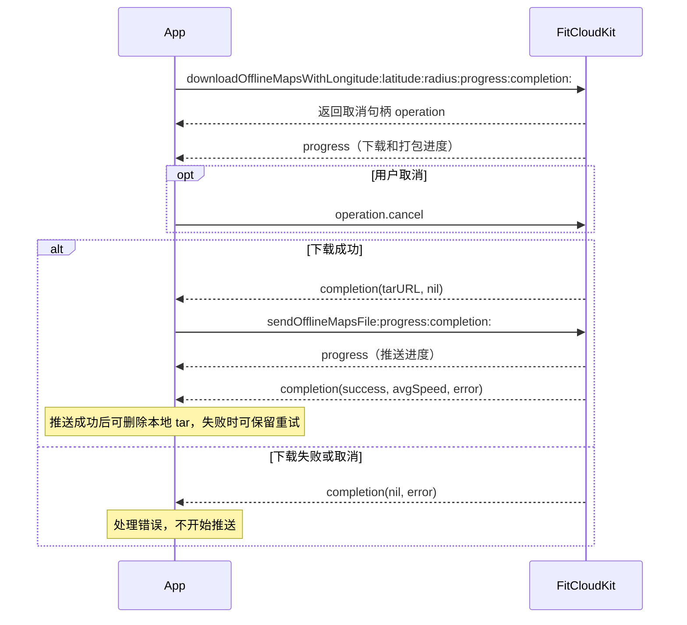

# 离线地图编程指南

[English](OFFLINE_MAPS_EN.md) · [编程指南目录](../README.md)

> 适用于 iOS 12 及以上、Objective-C，以及支持离线地图的手表。

## 1. 准备工作

集成 `FitCloudKit` 和 `FitCloudOfflineMaps`，并在 App target 的 **Other Linker Flags** 中添加 `-ObjC`（保留已有的 `$(inherited)`）。无需手动注册插件。

```objc
#import <FitCloudKit/FitCloudKit.h>
```

如果收到插件不可用错误，请检查 `FitCloudOfflineMaps` 是否已链接，以及 App target 是否配置了 `-ObjC`。

设备须先连接并完成初始化。SDK 会自动处理设备授权，App 无需查询、传入或保存授权凭据。

### 联网与 HTTP 配置

下载地图需要联网。若系统询问是否允许 App 使用网络，需允许；若已禁用，请在系统设置中恢复该 App 的联网权限。

下载过程中可能使用来自多个动态域名的 HTTP 地址，包括地图文件及重定向地址。需要在 **App target 的 `Info.plist`** 中配置 ATS，不能只放行单个服务域名，也不能通过修改 SDK 的 plist 配置。

无法预先列全所有 HTTP 域名时，可使用以下配置；ATS 配置不会替代用户的联网设置：

```xml
<key>NSAppTransportSecurity</key>
<dict>
    <key>NSAllowsArbitraryLoads</key>
    <true/>
</dict>
```

该配置会放宽 App 的整体 ATS 限制；已有 `NSExceptionDomains` 条目仍按各自配置处理。若已知全部 HTTP 域名，可使用域名例外限定范围。请合并到 App 现有 ATS 字典中，并在发布时按 Apple 要求说明 HTTP 使用理由。

如果 ATS 字典中还包含 `NSAllowsArbitraryLoadsForMedia`、`NSAllowsArbitraryLoadsInWebContent` 或 `NSAllowsLocalNetworking`，`NSAllowsArbitraryLoads` 会被忽略；这类 App 请按实际域名配置例外。参见 Apple 的 [ATS 配置说明](https://developer.apple.com/library/archive/documentation/General/Reference/InfoPlistKeyReference/Articles/CocoaKeys.html)。

## 2. 接入流程



下载成功后，由 App 单独调用推送 API；下载与推送分别报告进度和结果。

## 3. 一次调用下载并打包 tar

```objc
id<FitCloudCancellable> operation =
    [FitCloudKit downloadOfflineMapsWithLongitude:113.7
                                       latitude:22.6
                                         radius:3
                                       progress:^(double progress) {
        // 主队列：更新下载和打包进度，范围 0.0～1.0。
    } completion:^(NSURL *tarURL, NSError *error) {
        if (error) {
            // 展示错误；NSURLErrorDomain / NSURLErrorCancelled 表示已取消。
            return;
        }
        // 使用 tarURL.path 调用下一节的推送 API。
    }];
// 需要取消时，将 operation 保存为页面或业务对象的属性。
// [operation cancel];
```

| 参数 | 约束 |
|---|---|
| `longitude` / `latitude` | 有限值，经度 −180～180、纬度 −90～90；SDK 不转换坐标系。 |
| `radius` | 2～25 公里的整数；地图实际覆盖范围可能超出请求圆形。 |

- 进度与完成回调均在主队列，完成回调只调用一次。
- `progress` 表示下载与打包进度，不是字节百分比；操作开始后可能暂时没有进度更新。
- 释放句柄不会取消操作；调用 `cancel` 取消尚未完成的下载操作，并通过原完成回调返回 `NSURLErrorDomain / NSURLErrorCancelled`。操作完成后调用 `cancel` 不影响已返回的结果。
- 设备未提供有效下载授权或必要地图配置时，下载返回错误，App 应展示错误并停止后续推送。
- 需要重试时重新调用下载 API；如果错误提示需要重连，请先重连手表再试。

## 4. 推送到手表

此处 `tarURL` 是上一步成功回调返回的 URL。推送时设备须保持连接并支持离线地图。

```objc
[FitCloudKit sendOfflineMapsFile:tarURL.path
                      progress:^(CGFloat progress) {
    // 蓝牙推送进度，独立于下载打包进度。UI 更新请切到主队列。
} completion:^(BOOL success, CGFloat avgSpeed, NSError *error) {
    // 完成回调中的 UI 更新也请切到主队列。
    if (!success) {
        // 处理推送失败；如需重试，可保留本地 tar。
        return;
    }
    // avgSpeed 单位为 kB/s。确认不再使用后删除本地 tar。
    NSError *cleanupError = nil;
    [[NSFileManager defaultManager] removeItemAtURL:tarURL error:&cleanupError];
    // 如 cleanupError 非空，按 App 的文件清理策略处理。
}];
```

下载成功不等于手表已接收地图。`operation.cancel` 只取消本次下载操作，不用于取消已经开始的 FitCloudKit 蓝牙推送。

## 5. 本地文件生命周期

成功回调中的 `tarURL` 指向本地临时文件，可直接用于推送或重试。App 使用后负责删除；需要长期保存时复制到持久目录。不要依赖临时文件长期存在。

## 6. 管理手表上的地图

以下接口用于查询和删除手表上的地图，调用前需要连接并初始化设备。它们不会删除手机上的临时 tar 文件，也不需要重新下载地图。

```objc
[FitCloudKit fetchOfflineMapsFileListWithCompletion:
    ^(BOOL success, NSArray<FitCloudFileInfoModel *> *files, NSError *error) {
        // 成功时读取 files 中每项的 fileName、fileSize（字节）。
    }];

// fileName 使用设备列表返回的名称，不用手机生成的 tar 名称代替。
[FitCloudKit fetchOfflineMapsFileDetailWithName:fileName
                                   completion:
    ^(BOOL success, FitCloudFileDetailsInfoModel *detail, NSError *error) {
        // success 为 YES 但 detail 为 nil 时，文件不存在或已被删除。
    }];

[FitCloudKit deleteOfflineMapsFileWithName:fileName
                              completion:^(BOOL success, NSError *error) {
    // 单个删除结束后，可重新查询设备列表。
}];

[FitCloudKit deleteAllOfflineMapsFilesWithCompletion:
    ^(BOOL success, NSError *error) {
        // 仅在用户明确选择删除全部设备地图时调用。
    }];
```

## 7. 日志排查

插件沿用 `FitCloudOption` 的日志配置，无需另设日志接口。`debugMode = YES` 时输出到控制台；否则通过 `FitCloudCallback` 的 `onLogMessage:level:subsystem:category:` 回调接收，按 `logLevel` 过滤。离线地图日志的 category 为 `FitCloudOfflineMaps`。

- INFO：任务进展、HTTP 状态、耗时和结果。
- DEBUG：地图文件的完整原始 URL 和重定向 URL，保留协议、路径和签名参数；通过任务 ID 和文件索引定位。
- WARN / ERROR：取消、超时、网络和文件处理失败，记录错误 domain/code。

需要追踪地图 URL 时，将 `logLevel` 设为 `FITCLOUDKITLOGLEVEL_DEBUG`，或启用调试模式。完整地图 URL 可能包含临时签名；这些离线地图阶段日志不输出授权请求内容或授权凭据。
