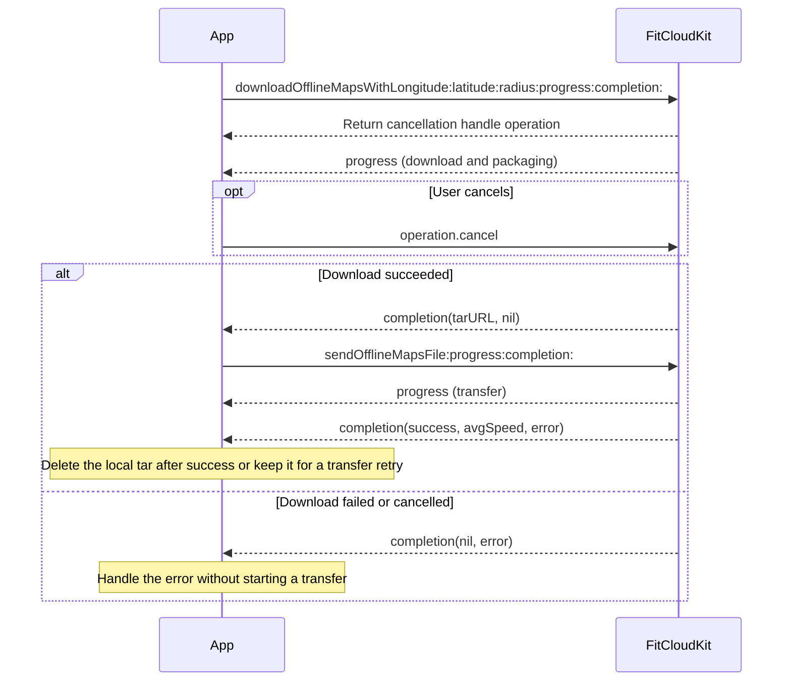

# Offline Maps Programming Guide

[简体中文](OFFLINE_MAPS_CN.md) · [Programming Guide](../README.md)

> For Objective-C, iOS 12 or later, and watches supporting offline maps.

## 1. Setup

Integrate `FitCloudKit` and `FitCloudOfflineMaps`. Add `-ObjC` to the App target’s **Other Linker Flags**, preserving `$(inherited)`. No manual plugin registration is required.

```objc
#import <FitCloudKit/FitCloudKit.h>
```

If a plugin-unavailable error occurs, check that `FitCloudOfflineMaps` is linked and that the App target includes `-ObjC`.

Connect and initialize the watch first. The SDK handles watch authorization automatically; the App does not query, pass or store authorization credentials.

### Network access and HTTP configuration

Downloading maps requires network access. Allow access if prompted by the system. If access was disabled, restore the App’s network access in Settings.

Downloading may involve HTTP addresses across multiple dynamic domains, including map files and redirects. Configure ATS in the **App target’s `Info.plist`**. Allowing only one service domain is insufficient, and editing the SDK’s plist does not configure the App.

When all HTTP domains cannot be listed in advance, use the following configuration. ATS does not override the user’s network settings:

```xml
<key>NSAppTransportSecurity</key>
<dict>
    <key>NSAllowsArbitraryLoads</key>
    <true/>
</dict>
```

This setting relaxes ATS restrictions across the App; existing `NSExceptionDomains` entries retain their own settings. If all HTTP domains are known, use domain exceptions to limit the scope. Merge the configuration into the App’s existing ATS dictionary and provide the HTTP justification required by Apple when distributing the App.

The presence of `NSAllowsArbitraryLoadsForMedia`, `NSAllowsArbitraryLoadsInWebContent`, or `NSAllowsLocalNetworking` causes `NSAllowsArbitraryLoads` to be ignored. Use domain-specific exceptions in those Apps. See Apple’s [ATS configuration reference](https://developer.apple.com/library/archive/documentation/General/Reference/InfoPlistKeyReference/Articles/CocoaKeys.html).

## 2. Integration flow



After download succeeds, the App calls the transfer API separately. Download and transfer report separate progress and results.

## 3. Download and package in one call

```objc
id<FitCloudCancellable> operation =
    [FitCloudKit downloadOfflineMapsWithLongitude:113.7
                                       latitude:22.6
                                         radius:3
                                       progress:^(double progress) {
        // Main queue: update download and packaging progress, from 0.0 to 1.0.
    } completion:^(NSURL *tarURL, NSError *error) {
        if (error) {
            // Handle errors. NSURLErrorDomain / NSURLErrorCancelled means cancelled.
            return;
        }
        // Pass tarURL.path to the transfer API in the next section.
    }];
// Store operation on your screen or business object if cancellation is needed.
// [operation cancel];
```

| Parameter | Constraints |
|---|---|
| `longitude` / `latitude` | Finite values, longitude −180...180 and latitude −90...90. The SDK does not convert coordinates. |
| `radius` | Integer kilometers from 2 to 25. Actual coverage may exceed the requested circle. |

- Progress and completion run on the main queue. Completion is called once.
- Progress covers download and packaging, not a byte percentage. Updates may not begin immediately after the operation starts.
- Releasing the handle does not cancel the operation. Call `cancel` to cancel an unfinished download operation. The original completion receives `NSURLErrorDomain / NSURLErrorCancelled`. Calling `cancel` after completion does not change the result.
- If the watch does not provide valid download authorization or required map configuration, the operation returns an error. Display the error and do not start a transfer.
- To retry, call the download API again. If the error asks for reconnection, reconnect the watch before retrying.

## 4. Transfer to the watch

Here, `tarURL` is returned by the successful download callback. Keep a watch supporting offline maps connected during transfer.

```objc
[FitCloudKit sendOfflineMapsFile:tarURL.path
                      progress:^(CGFloat progress) {
    // Bluetooth transfer progress, separate from download progress. Dispatch UI updates to the main queue.
} completion:^(BOOL success, CGFloat avgSpeed, NSError *error) {
    // Dispatch UI updates in this completion to the main queue as well.
    if (!success) {
        // Handle transfer failure; retain the local tar if a retry is needed.
        return;
    }
    // avgSpeed is in kB/s. Delete the local tar when no longer needed.
    NSError *cleanupError = nil;
    [[NSFileManager defaultManager] removeItemAtURL:tarURL error:&cleanupError];
    // Handle cleanupError according to the App file cleanup policy.
}];
```

A successful download does not mean the watch has received the map. `operation.cancel` cancels this download operation, not an already-started FitCloudKit Bluetooth transfer.

## 5. Local file lifecycle

The successful callback returns a local temporary file through `tarURL`, ready for transfer or retry. The App is responsible for deleting it after use. Copy it to persistent storage if needed; do not rely on long-term temporary file retention.

## 6. Manage maps on the watch

These APIs query and delete maps on the watch. Connect and initialize the watch before calling them. They neither delete the phone’s temporary tar files nor require another map download.

```objc
[FitCloudKit fetchOfflineMapsFileListWithCompletion:
    ^(BOOL success, NSArray<FitCloudFileInfoModel *> *files, NSError *error) {
        // On success, read fileName and fileSize (bytes) from each item.
    }];

// Use fileName returned by the device list, not the generated phone-side tar name.
[FitCloudKit fetchOfflineMapsFileDetailWithName:fileName
                                   completion:
    ^(BOOL success, FitCloudFileDetailsInfoModel *detail, NSError *error) {
        // If success is YES and detail is nil, the file is missing or has been deleted.
    }];

[FitCloudKit deleteOfflineMapsFileWithName:fileName
                              completion:^(BOOL success, NSError *error) {
    // Refresh the device list after deletion if needed.
}];

[FitCloudKit deleteAllOfflineMapsFilesWithCompletion:
    ^(BOOL success, NSError *error) {
        // Call only when the user explicitly chooses to delete all device maps.
    }];
```

## 7. Diagnostic logs

The plugin uses the existing `FitCloudOption` logging settings. No separate logging API is required. With `debugMode = YES`, logs go to the console. Otherwise, receive them through `FitCloudCallback`’s `onLogMessage:level:subsystem:category:` callback, filtered by `logLevel`. Offline map logs use category `FitCloudOfflineMaps`.

- INFO: Task progress, HTTP status, elapsed time and results.
- DEBUG: Full original map file URLs and redirect URLs, including schemes, paths and signature parameters, identified by task ID and file index.
- WARN / ERROR: Cancellation, timeouts, network and file errors, with error domain/code.

To trace map URLs, set `logLevel` to `FITCLOUDKITLOGLEVEL_DEBUG` or enable debug mode. Full map URLs may contain temporary signatures. These offline map stage logs do not expose authorization request contents or authorization credentials.
