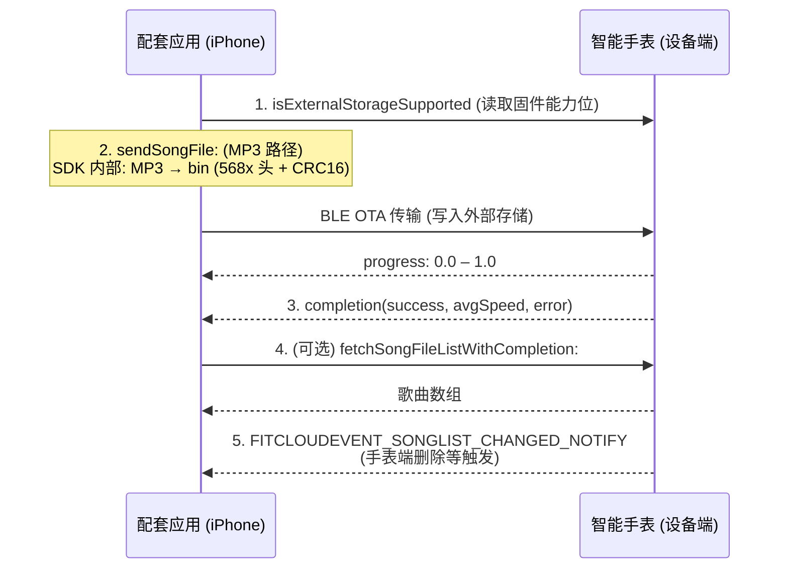

# 歌曲推送编程指南

> **适用平台**：本文档仅适用于 **iOS** 平台。所描述的 API 基于 Objective-C 语言和 FitCloudKit iOS SDK。

## 概述

歌曲推送功能允许用户将本地的 MP3 音乐文件通过蓝牙传输到智能手表的外部存储中。传输完成后，歌曲将保存在设备上，可由手表自带的音乐播放器播放。FitCloudKit 还支持查询设备上的歌曲列表、删除单个或全部歌曲文件，以及监听设备端歌曲列表变化通知。

## 架构

歌曲推送流程涉及两个主要参与方：

1. **智能手表（设备端）**：通过 BLE OTA 接收歌曲文件，写入外部存储，提供播放能力；并在歌曲列表发生变化（例如用户在手表端删除歌曲）时主动通知应用。
2. **配套应用（iPhone）**：将 MP3 文件转换为设备所需的二进制格式（568x 头 + MP3 数据 + CRC16 校验），通过 NewOTA 通道传输，并管理歌曲列表的查询与删除。

## 工作流程



### 步骤流程

1. **能力检查** → 调用 `isExternalStorageSupported` 或 `[FitCloudKit isDeviceSupportFeature:FITCLOUDDEVICEFEATURE_MUSICOTA]` 确认设备支持外部存储与歌曲推送。
2. **（可选）查询存储信息** → 调用 `fetchDeviceStorageInfoWithCompletion:` 获取剩余空间与歌曲数量，避免空间不足。
3. **推送歌曲文件** → 调用 `sendSongFile:progress:completion:`，SDK 内部完成 MP3→bin 转换与 BLE OTA 传输。
4. **进度回调** → 通过 `progressHandler` 接收 0.0–1.0 的进度更新以驱动 UI。
5. **传输完成** → `completionHandler` 返回 `success`、平均速度 `avgSpeed`（kB/s）及错误信息。
6. **（可选）取消传输** → 调用 `cancelSendSongFileIfNeededWithCompletion:` 中止进行中的传输。
7. **列表管理** → 调用 `fetchSongFileListWithCompletion:` 查询，`deleteSongFileAtIndex:completion:` 删除单个，`deleteAllSongFilesWithCompletion:` 删除全部。
8. **监听变化** → 监听 `FITCLOUDEVENT_SONGLIST_CHANGED_NOTIFY` 通知，当手表端歌曲列表变化时刷新本地缓存。

---

## API 参考

### 1. 能力与存储

#### 1.1 检查外部存储支持

返回设备是否支持外部存储（歌曲/录音文件存储）。所有歌曲推送与列表管理 API 在调用前都应先检查此能力。

```objc
+ (BOOL)isExternalStorageSupported;
```

**讨论：**

- 该方法读取 `FitCloudFirmwareVersionObject.withExternalStorage` 固件能力位。
- 等价的能力判断也可通过 `[FitCloudKit isDeviceSupportFeature:FITCLOUDDEVICEFEATURE_MUSICOTA]` 完成（其底层读取 `allowMusicPush`）。
- 若返回 `NO`，本节所有 API 将直接在 completion 中返回 `FITCLOUDKITERROR_DEVICENOTSUPPORT`（20024）。

---

#### 1.2 查询设备存储信息

获取设备存储类型、总空间、剩余空间以及歌曲/录音数量。

```objc
+ (void)fetchDeviceStorageInfoWithCompletion:(void (^_Nullable)(BOOL success,
                                                                FitCloudStorageInfoModel *_Nullable storageInfo,
                                                                NSError *_Nullable error))completion;
```

**参数：**
| 参数 | 类型 | 说明 |
|---|---|---|
| `completion` | `block` | 操作完成回调，包含存储信息或错误 |
| `success` | `BOOL` | 操作是否成功 |
| `storageInfo` | `FitCloudStorageInfoModel *` | 设备存储信息 |
| `error` | `NSError *` | 错误信息 |

**`FitCloudStorageInfoModel` 属性：**
| 属性 | 类型 | 说明 |
|---|---|---|
| `storageType` | `FitCloudDeviceStorageType` | 存储类型（内置 Flash 或 SD 卡） |
| `totalSpace` | `NSInteger` | 总空间（字节） |
| `remainingSpace` | `NSInteger` | 剩余空间（字节） |
| `songCount` | `NSInteger` | 设备上歌曲数量 |
| `recordingCount` | `NSInteger` | 设备上录音数量 |

---

### 2. 歌曲文件列表

#### 2.1 查询歌曲文件列表

查询设备上存储的全部歌曲文件。响应采用多包传输，SDK 会在内部累积所有分包后通过 completion 一次性返回完整数组。

```objc
+ (void)fetchSongFileListWithCompletion:(void (^_Nullable)(BOOL success,
                                                           NSArray<FitCloudFileInfoModel *> *_Nullable songFileArray,
                                                           NSError *_Nullable error))completion;
```

**参数：**
| 参数 | 类型 | 说明 |
|---|---|---|
| `completion` | `block` | 操作完成回调 |
| `success` | `BOOL` | 操作是否成功 |
| `songFileArray` | `NSArray<FitCloudFileInfoModel *> *` | 歌曲文件信息数组，索引从 0 起 |
| `error` | `NSError *` | 错误信息 |

**讨论：**

- 返回的数组顺序即为设备上的文件索引顺序，索引可用于删除操作。
- 该方法内部调用 `fetchFileListWithFileType:`（文件类型 `FitCloudFileTypeSong = 0`），通过 `FileListFetchCommand` / `FileListFetchRspCommand` 多包协议完成。
- 若传输过程中任一分包出错，completion 会立即返回错误，已累积结果将被丢弃。

---

#### 2.2 `FitCloudFileInfoModel` 文件信息模型

| 属性       | 类型         | 说明                   |
| ---------- | ------------ | ---------------------- |
| `fileName` | `NSString *` | 文件名（只读）         |
| `fileSize` | `NSInteger`  | 文件大小（字节，只读） |

> 注意：`init` / `new` 不可用，实例仅由 SDK 通过查询接口构造返回。

---

### 3. 删除歌曲文件

#### 3.1 删除指定索引的歌曲

删除设备上指定索引处的歌曲文件。

```objc
+ (void)deleteSongFileAtIndex:(NSInteger)fileIndex
                   completion:(FitCloudCompletionHandler _Nullable)completion;
```

**参数：**
| 参数 | 类型 | 说明 |
|---|---|---|
| `fileIndex` | `NSInteger` | 待删除歌曲的索引，从 0 开始（应来自 `fetchSongFileListWithCompletion:` 的结果） |
| `completion` | `FitCloudCompletionHandler` | 操作完成回调 |

**讨论：**

- 删除成功后，建议重新调用 `fetchSongFileListWithCompletion:` 刷新本地缓存，因为删除后索引会重排。
- completion 中的 `success` 综合了链路成功与设备返回结果（`FileDeleteResultCommand.success`）。

---

#### 3.2 删除全部歌曲

删除设备上存储的全部歌曲文件。

```objc
+ (void)deleteAllSongFilesWithCompletion:(FitCloudCompletionHandler _Nullable)completion;
```

**参数：**
| 参数 | 类型 | 说明 |
|---|---|---|
| `completion` | `FitCloudCompletionHandler` | 操作完成回调 |

**讨论：**

- 该方法发送"全删"指令（仅 2 字节载荷：类型 + 模式），与单删（4 字节载荷，含 2 字节大端索引）不同。
- 删除操作不可恢复，调用前应给出用户确认。

---

### 4. 推送歌曲文件

#### 4.1 发送歌曲文件

将本地 MP3 文件推送到智能手表。建议在后台线程调用。

```objc
+ (void)sendSongFile:(NSString *_Nonnull)filePath
             progress:(void (^_Nullable)(CGFloat progress))progressHandler
           completion:(void (^_Nullable)(BOOL success, CGFloat avgSpeed, NSError *_Nullable error))completionHandler;
```

**参数：**
| 参数 | 类型 | 说明 |
|---|---|---|
| `filePath` | `NSString *` | 待推送的 MP3 文件路径（必须以 `.mp3` 结尾） |
| `progressHandler` | `block` | 传输进度回调 |
| `progress` | `CGFloat` | 进度值，范围 0.0–1.0 |
| `completionHandler` | `block` | 传输完成回调 |
| `success` | `BOOL` | 是否推送成功 |
| `avgSpeed` | `CGFloat` | 平均传输速度（kB/s） |
| `error` | `NSError *` | 错误信息 |

**讨论：**

- 调用前会进行两项校验：
  1. 设备不支持外部存储 → 立即回调 `FITCLOUDKITERROR_DEVICENOTSUPPORT`。
  2. 文件后缀非 `.mp3` → 立即回调参数错误。
- 通过后，SDK 内部依次完成：
  1. `FitCloudSongFileBinCreateUtils createSongFileBin:` 将 MP3 转换为设备二进制格式（568x 头部 + MP3 数据 + CRC16 校验，写入临时文件）。
  2. `sendNewOTA:startResult:progress:completion:` 通过 BLE NewOTA 通道传输生成的 bin 文件。
- `startResult` 失败（如设备未就绪、不支持 NewOTA）会立即回调 completion；`progress` 透传给调用方；`completion` 透传 `success`/`avgSpeed`/`error`。
- 由于传输基于 BLE，速度与文件大小、信号强度有关，`avgSpeed` 单位为 kB/s。

---

#### 4.2 取消正在进行的传输

取消进行中的歌曲文件传输。

```objc
+ (void)cancelSendSongFileIfNeededWithCompletion:(void (^_Nullable)(BOOL success, NSError *_Nullable error))completion;
```

**参数：**
| 参数 | 类型 | 说明 |
|---|---|---|
| `completion` | `block` | 取消完成回调 |
| `success` | `BOOL` | 取消是否成功 |
| `error` | `NSError *` | 错误信息 |

**讨论：**

- 若设备不支持外部存储，立即回调 `FITCLOUDKITERROR_DEVICENOTSUPPORT`。
- 内部委托 `cancelSendTheNewOTAIfNeededWithCompletion:`，无进行中的传输时也会安全返回。
- 取消后，原 `sendSongFile:progress:completion:` 的 completion 会被以失败/中断形式触发，调用方应妥善处理。

---

### 5. 设备端变化通知

#### 5.1 歌曲列表变化通知

当设备端歌曲列表发生变化（例如用户在手表端删除歌曲、固件刷新列表）时，SDK 会发出此通知。

```objc
extern NSString *const FITCLOUDEVENT_SONGLIST_CHANGED_NOTIFY;
```

**讨论：**

- 该通知通过 `NSNotificationCenter` 投递，使用 `[FitCloudKit sendNotifyWithName:object:userInfo:]`，`object` 与 `userInfo` 均为 `nil`。
- 收到通知后，建议重新调用 `fetchSongFileListWithCompletion:` 获取最新列表，避免本地索引与设备不同步。
- 该事件**不**通过 `FitCloudCallback` 协议投递，仅以 `NSNotification` 形式分发。

---

## 实现示例

### Objective-C

```objc
// MARK: - 能力检查与存储查询

- (void)checkDeviceAndFetchStorage {
    if (![FitCloudKit isExternalStorageSupported]) {
        NSLog(@"当前手表不支持歌曲推送");
        return;
    }

    [FitCloudKit fetchDeviceStorageInfoWithCompletion:^(BOOL success,
                                                       FitCloudStorageInfoModel *storageInfo,
                                                       NSError *error) {
        if (success) {
            NSLog(@"剩余空间：%lld 字节，歌曲数：%lld",
                  (long long)storageInfo.remainingSpace,
                  (long long)storageInfo.songCount);
        }
    }];
}

// MARK: - 查询歌曲列表

- (void)refreshSongList {
    [FitCloudKit fetchSongFileListWithCompletion:^(BOOL success,
                                                   NSArray<FitCloudFileInfoModel *> *songFileArray,
                                                   NSError *error) {
        if (success) {
            self.songFiles = songFileArray;
            [self reloadUI];
        } else {
            NSLog(@"查询歌曲列表失败：%@", error);
        }
    }];
}

// MARK: - 推送歌曲文件

- (void)sendSongAtPath:(NSString *)mp3Path {
    [FitCloudKit sendSongFile:mp3Path
                     progress:^(CGFloat progress) {
        NSLog(@"推送进度：%.1f%%", progress * 100);
        dispatch_async(dispatch_get_main_queue(), ^{
            [self.progressView setProgress:progress animated:YES];
        });
    } completion:^(BOOL success, CGFloat avgSpeed, NSError *error) {
        if (success) {
            NSLog(@"推送成功，平均速度 %.1f kB/s", avgSpeed);
            [self refreshSongList]; // 推送后刷新列表
        } else {
            NSLog(@"推送失败：%@", error);
        }
    }];
}

// MARK: - 取消传输

- (void)cancelCurrentTransfer {
    [FitCloudKit cancelSendSongFileIfNeededWithCompletion:^(BOOL success, NSError *error) {
        NSLog(success ? @"已取消传输" : @"取消失败：%@", error);
    }];
}

// MARK: - 删除歌曲

- (void)deleteSongAtIndex:(NSInteger)index {
    [FitCloudKit deleteSongFileAtIndex:index completion:^(BOOL success, NSError *error) {
        if (success) {
            [self refreshSongList]; // 索引重排，必须刷新
        }
    }];
}

- (void)deleteAllSongs {
    [FitCloudKit deleteAllSongFilesWithCompletion:^(BOOL success, NSError *error) {
        if (success) {
            [self refreshSongList];
        }
    }];
}

// MARK: - 监听设备端列表变化

- (void)startObservingSongListChanged {
    [[NSNotificationCenter defaultCenter] addObserver:self
                                             selector:@selector(onSongListChanged)
                                                 name:FITCLOUDEVENT_SONGLIST_CHANGED_NOTIFY
                                               object:nil];
}

- (void)onSongListChanged {
    NSLog(@"手表端通知歌曲列表发生变化");
    [self refreshSongList];
}
```

### Swift

```swift
// MARK: - 能力检查与存储查询

func checkDeviceAndFetchStorage() {
    guard FitCloudKit.isExternalStorageSupported() else {
        print("当前手表不支持歌曲推送")
        return
    }

    FitCloudKit.fetchDeviceStorageInfo { success, storageInfo, error in
        if success, let info = storageInfo {
            print("剩余空间：\(info.remainingSpace) 字节，歌曲数：\(info.songCount)")
        }
    }
}

// MARK: - 查询歌曲列表

func refreshSongList() {
    FitCloudKit.fetchSongFileList { success, songFileArray, error in
        if success {
            self.songFiles = songFileArray ?? []
            self.reloadUI()
        } else {
            print("查询歌曲列表失败：\(String(describing: error))")
        }
    }
}

// MARK: - 推送歌曲文件

func sendSong(at mp3Path: String) {
    FitCloudKit.sendSongFile(mp3Path,
                             progress: { progress in
        print(String(format: "推送进度：%.1f%%", progress * 100))
        DispatchQueue.main.async {
            self.progressView.setProgress(Float(progress), animated: true)
        }
    }) { success, avgSpeed, error in
        if success {
            print(String(format: "推送成功，平均速度 %.1f kB/s", avgSpeed))
            self.refreshSongList() // 推送后刷新列表
        } else {
            print("推送失败：\(String(describing: error))")
        }
    }
}

// MARK: - 取消传输

func cancelCurrentTransfer() {
    FitCloudKit.cancelSendSongFileIfNeeded { success, error in
        print(success ? "已取消传输" : "取消失败：\(String(describing: error))")
    }
}

// MARK: - 删除歌曲

func deleteSong(at index: Int) {
    FitCloudKit.deleteSongFile(at: index) { success, error in
        if success {
            self.refreshSongList() // 索引重排，必须刷新
        }
    }
}

func deleteAllSongs() {
    FitCloudKit.deleteAllSongFiles { success, error in
        if success {
            self.refreshSongList()
        }
    }
}

// MARK: - 监听设备端列表变化

func startObservingSongListChanged() {
    NotificationCenter.default.addObserver(
        self,
        selector: #selector(onSongListChanged),
        name: NSNotification.Name(rawValue: FITCLOUDEVENT_SONGLIST_CHANGED_NOTIFY),
        object: nil
    )
}

@objc func onSongListChanged() {
    print("手表端通知歌曲列表发生变化")
    refreshSongList()
}
```

---

## 最佳实践

### 能力检查

- 在任何歌曲相关 API 调用前，先调用 `isExternalStorageSupported`（或 `isDeviceSupportFeature:` 检查 `FITCLOUDDEVICEFEATURE_MUSICOTA`）。设备不支持时所有方法都会立即失败并返回 `FITCLOUDKITERROR_DEVICENOTSUPPORT`。

### 空间预检

- 推送大文件前调用 `fetchDeviceStorageInfoWithCompletion:` 检查 `remainingSpace` 是否足够，避免传输中途因空间不足失败。
- 注意 bin 文件比 MP3 略大（多出 1024 字节 568x 头部），建议预留至少 2 倍 MP3 大小的余量。

### 文件格式

- `sendSongFile:progress:completion:` 仅接受 `.mp3` 后缀文件，其他格式会立即返回参数错误。
- 建议在调用前用 `NSFileManager` 校验文件存在性，避免读取失败。

### 线程与进度

- 该方法涉及文件 IO 与 BLE 传输，建议在后台线程调用，进度回调可能在非主线程，更新 UI 需切回主队列。
- 进度回调范围 0.0–1.0，建议驱动 `UIProgressView` 提供实时反馈。

### 索引一致性

- 删除操作会导致设备端索引重排。删除成功后务必重新调用 `fetchSongFileListWithCompletion:` 刷新缓存，切勿继续使用旧索引删除下一个文件。
- 监听 `FITCLOUDEVENT_SONGLIST_CHANGED_NOTIFY` 通知并在收到后刷新列表，以同步手表端的删除操作。

### 取消与重试

- 用户主动取消传输时调用 `cancelSendSongFileIfNeededWithCompletion:`，无进行中传输时也会安全返回。
- 对临时性故障（如 BLE 超时）可实现有限次重试；连续失败应提示用户检查连接与电量。

### 错误处理

- 检查每个 completion 中的 `success` 与 `error`。
- 常见错误码：
  - `FITCLOUDKITERROR_DEVICENOTSUPPORT`（20024）：设备不支持外部存储。
  - `FITCLOUDKITERROR_NOTCONNECTED`（20020）/`FITCLOUDKITERROR_DEVICEDISCONNECTED`（20025）：连接异常。
  - `FITCLOUDKITERROR_CMDEXECTIMEOUT`（20004）：命令执行超时。
  - `FITCLOUDKITERROR_BLOCKBYOTAINPROGRESS`（40010）：已有 OTA 进行中，请稍后再试。

## 要求

- **FitCloudKit**：支持歌曲推送与外部存储的最低版本。
- **设备固件**：必须支持外部存储（`withExternalStorage`）与音乐推送（`allowMusicPush`），可通过 `[FitCloudKit isDeviceSupportFeature:FITCLOUDDEVICEFEATURE_MUSICOTA]` 判断。
- **音频格式**：仅接受 MP3 文件（`.mp3` 后缀）。
- **蓝牙连接**：设备需已连接并完成初始化，且支持 NewOTA 特征。

## 相关文档

- `FitCloudKit.h` — 主 SDK 入口，包含 `Song File` 分类与设备存储接口
- `FitCloudKitDefines.h` — 设备能力枚举 `FITCLOUDDEVICEFEATURE_MUSICOTA` 与错误码
- `FitCloudFileInfoModel.h` — 歌曲文件信息模型
- `FitCloudStorageInfoModel.h` — 设备存储信息模型
- `FitCloudEvent.h` — `FITCLOUDEVENT_SONGLIST_CHANGED_NOTIFY` 通知常量
