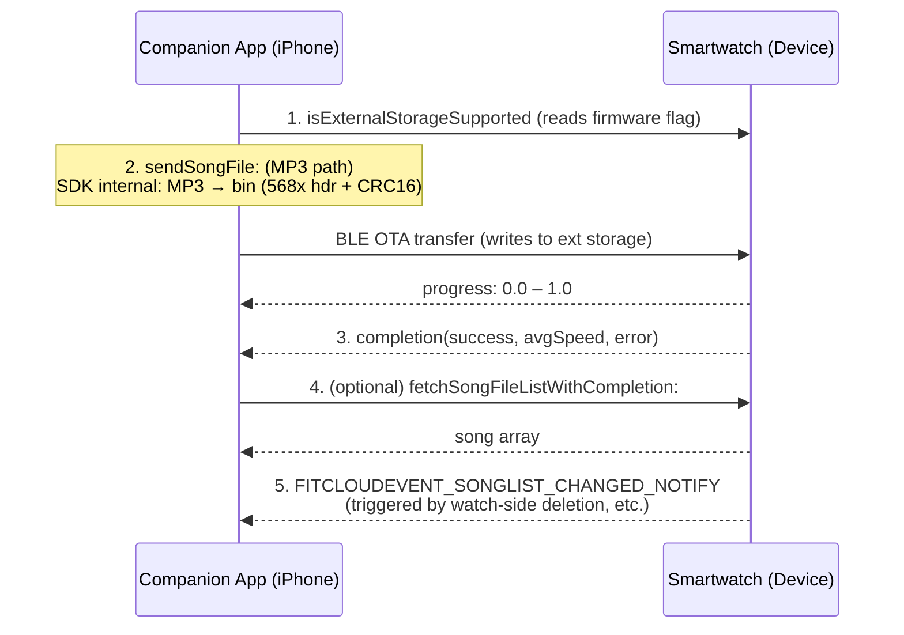

# Song File Sending Programming Guide

> **Platform**: This guide is for **iOS** only. The APIs described herein are based on Objective-C and the FitCloudKit iOS SDK.

## Overview

The Song File Sending feature allows users to transfer local MP3 music files to the smartwatch's external storage over Bluetooth. After the transfer completes, songs are persisted on the device and can be played back by the watch's built-in music player. FitCloudKit also supports listing the songs stored on the device, deleting a single or all song files, and observing a notification fired by the device whenever its song list changes.

## Architecture

The song sending flow involves two main parties:

1. **Smartwatch (Device)**: Receives song files over BLE OTA, writes them to external storage, provides playback, and proactively notifies the app when the song list changes (for example, when the user deletes a song on the watch).
2. **Companion App (iPhone)**: Converts the MP3 file to the binary format expected by the device (568x header + MP3 data + CRC16 checksum), transfers it over the NewOTA channel, and manages the list (query/delete).

## Workflow



### Step-by-Step Flow

1. **Capability check** → Call `isExternalStorageSupported` or `[FitCloudKit isDeviceSupportFeature:FITCLOUDDEVICEFEATURE_MUSICOTA]` to confirm the device supports external storage and song push.
2. **(Optional) Fetch storage info** → Call `fetchDeviceStorageInfoWithCompletion:` to read remaining space and song count before pushing.
3. **Push the song file** → Call `sendSongFile:progress:completion:`. The SDK performs the MP3→bin conversion and the BLE OTA transfer internally.
4. **Progress callback** → Use `progressHandler` to receive 0.0–1.0 progress updates to drive your UI.
5. **Transfer completes** → `completionHandler` returns `success`, average speed `avgSpeed` (kB/s), and an optional error.
6. **(Optional) Cancel** → Call `cancelSendSongFileIfNeededWithCompletion:` to abort an in-flight transfer.
7. **List management** → Use `fetchSongFileListWithCompletion:` to query, `deleteSongFileAtIndex:completion:` for single deletion, and `deleteAllSongFilesWithCompletion:` to wipe all songs.
8. **Observe changes** → Listen for `FITCLOUDEVENT_SONGLIST_CHANGED_NOTIFY` and refresh your local cache when the watch-side list changes.

---

## API Reference

### 1. Capability & Storage

#### 1.1 Check External Storage Support

Returns whether the device supports external storage (song/recording file storage). All song push and list-management APIs should be guarded by this check.

```objc
+ (BOOL)isExternalStorageSupported;
```

**Discussion:**

- Reads the `FitCloudFirmwareVersionObject.withExternalStorage` firmware flag.
- An equivalent capability check is `[FitCloudKit isDeviceSupportFeature:FITCLOUDDEVICEFEATURE_MUSICOTA]` (which reads `allowMusicPush` under the hood).
- When it returns `NO`, every API in this section immediately returns `FITCLOUDKITERROR_DEVICENOTSUPPORT` (20024) via its completion.

---

#### 1.2 Fetch Device Storage Info

Retrieves the storage type, total space, remaining space, and the number of songs and audio recordings on the device.

```objc
+ (void)fetchDeviceStorageInfoWithCompletion:(void (^_Nullable)(BOOL success,
                                                                FitCloudStorageInfoModel *_Nullable storageInfo,
                                                                NSError *_Nullable error))completion;
```

**Parameters:**
| Parameter | Type | Description |
|---|---|---|
| `completion` | `block` | Operation completion handler with storage info or error |
| `success` | `BOOL` | Whether the operation succeeded |
| `storageInfo` | `FitCloudStorageInfoModel *` | Device storage information |
| `error` | `NSError *` | Error information |

**`FitCloudStorageInfoModel` Properties:**
| Property | Type | Description |
|---|---|---|
| `storageType` | `FitCloudDeviceStorageType` | Storage type (internal flash or SD card) |
| `totalSpace` | `NSInteger` | Total space in bytes |
| `remainingSpace` | `NSInteger` | Remaining space in bytes |
| `songCount` | `NSInteger` | Number of songs on the device |
| `recordingCount` | `NSInteger` | Number of audio recordings on the device |

---

### 2. Song File List

#### 2.1 Fetch Song File List

Retrieves all song files stored on the device. The response is delivered in multiple packets; the SDK accumulates them internally and returns the full array through the completion handler in a single call.

```objc
+ (void)fetchSongFileListWithCompletion:(void (^_Nullable)(BOOL success,
                                                           NSArray<FitCloudFileInfoModel *> *_Nullable songFileArray,
                                                           NSError *_Nullable error))completion;
```

**Parameters:**
| Parameter | Type | Description |
|---|---|---|
| `completion` | `block` | Operation completion handler |
| `success` | `BOOL` | Whether the operation succeeded |
| `songFileArray` | `NSArray<FitCloudFileInfoModel *> *` | Song file info array, indexed from 0 |
| `error` | `NSError *` | Error information |

**Discussion:**

- The order of the returned array matches the on-device file index order, which can be used for deletion.
- Internally delegates to `fetchFileListWithFileType:` (with `FitCloudFileTypeSong = 0`) using the multi-packet `FileListFetchCommand` / `FileListFetchRspCommand` protocol.
- If any packet fails, the completion is invoked immediately with an error and the partial result is discarded.

---

#### 2.2 `FitCloudFileInfoModel` File Info Model

| Property   | Type         | Description                   |
| ---------- | ------------ | ----------------------------- |
| `fileName` | `NSString *` | File name (readonly)          |
| `fileSize` | `NSInteger`  | File size in bytes (readonly) |

> Note: `init` / `new` are unavailable; instances are constructed only by the SDK and returned from query APIs.

---

### 3. Deleting Song Files

#### 3.1 Delete a Song by Index

Deletes the song file at the given index on the device.

```objc
+ (void)deleteSongFileAtIndex:(NSInteger)fileIndex
                   completion:(FitCloudCompletionHandler _Nullable)completion;
```

**Parameters:**
| Parameter | Type | Description |
|---|---|---|
| `fileIndex` | `NSInteger` | Index of the song to delete, starting from 0 (obtained from `fetchSongFileListWithCompletion:`) |
| `completion` | `FitCloudCompletionHandler` | Operation completion handler |

**Discussion:**

- After a successful deletion, call `fetchSongFileListWithCompletion:` again to refresh your cache, because indices are renumbered on the device.
- The completion's `success` combines link-level success and the device-returned result (`FileDeleteResultCommand.success`).

---

#### 3.2 Delete All Songs

Deletes every song file stored on the device.

```objc
+ (void)deleteAllSongFilesWithCompletion:(FitCloudCompletionHandler _Nullable)completion;
```

**Parameters:**
| Parameter | Type | Description |
|---|---|---|
| `completion` | `FitCloudCompletionHandler` | Operation completion handler |

**Discussion:**

- Sends an "delete all" command (only a 2-byte payload: type + mode), distinct from the single-delete command (4-byte payload with a 2-byte big-endian index).
- Deletion is irreversible; surface a user confirmation before calling.

---

### 4. Pushing Song Files

#### 4.1 Send a Song File

Pushes a local MP3 file to the smartwatch. Should be called on a background thread if possible.

```objc
+ (void)sendSongFile:(NSString *_Nonnull)filePath
             progress:(void (^_Nullable)(CGFloat progress))progressHandler
           completion:(void (^_Nullable)(BOOL success, CGFloat avgSpeed, NSError *_Nullable error))completionHandler;
```

**Parameters:**
| Parameter | Type | Description |
|---|---|---|
| `filePath` | `NSString *` | Path to the MP3 file (must end with `.mp3`) |
| `progressHandler` | `block` | Transfer progress callback |
| `progress` | `CGFloat` | Progress value, range 0.0–1.0 |
| `completionHandler` | `block` | Transfer completion handler |
| `success` | `BOOL` | Whether the upload succeeded |
| `avgSpeed` | `CGFloat` | Average transfer speed (kB/s) |
| `error` | `NSError *` | Error information |

**Discussion:**

- Two pre-checks run before transfer:
  1. Device does not support external storage → completion is called immediately with `FITCLOUDKITERROR_DEVICENOTSUPPORT`.
  2. File suffix is not `.mp3` → completion is called immediately with an invalid-parameter error.
- On success the SDK internally:
  1. Calls `FitCloudSongFileBinCreateUtils createSongFileBin:` to convert the MP3 into the device binary format (568x header + MP3 data + CRC16 checksum) and writes it to a temporary file.
  2. Calls `sendNewOTA:startResult:progress:completion:` to transfer the generated bin over the BLE NewOTA channel.
- A `startResult` failure (e.g., device not ready, NewOTA unsupported) triggers the completion immediately; `progress` is forwarded to the caller; `completion` forwards `success` / `avgSpeed` / `error`.
- Because transfer is over BLE, throughput depends on file size and signal strength. `avgSpeed` is reported in kB/s.

---

#### 4.2 Cancel an In-Flight Transfer

Cancels an ongoing song file transfer.

```objc
+ (void)cancelSendSongFileIfNeededWithCompletion:(void (^_Nullable)(BOOL success, NSError *_Nullable error))completion;
```

**Parameters:**
| Parameter | Type | Description |
|---|---|---|
| `completion` | `block` | Cancellation completion handler |
| `success` | `BOOL` | Whether the cancellation succeeded |
| `error` | `NSError *` | Error information |

**Discussion:**

- If the device does not support external storage, completion is called immediately with `FITCLOUDKITERROR_DEVICENOTSUPPORT`.
- Delegates to `cancelSendTheNewOTAIfNeededWithCompletion:`; safe to call even when no transfer is in flight.
- After cancellation, the original `sendSongFile:progress:completion:` completion will fire as a failure/abort — handle it gracefully.

---

### 5. Device-Side Change Notification

#### 5.1 Song List Changed Notification

Fired by the SDK whenever the on-device song list changes (for example, when the user deletes a song on the watch, or firmware refreshes the list).

```objc
extern NSString *const FITCLOUDEVENT_SONGLIST_CHANGED_NOTIFY;
```

**Discussion:**

- Delivered via `NSNotificationCenter` through `[FitCloudKit sendNotifyWithName:object:userInfo:]`; both `object` and `userInfo` are `nil`.
- On receiving this notification, call `fetchSongFileListWithCompletion:` again to obtain the latest list and keep your local indices in sync.
- This event is **not** delivered via the `FitCloudCallback` protocol — it is dispatched solely as an `NSNotification`.

---

## Implementation Example

### Objective-C

```objc
// MARK: - Capability check & storage query

- (void)checkDeviceAndFetchStorage {
    if (![FitCloudKit isExternalStorageSupported]) {
        NSLog(@"Song push is not supported on this watch");
        return;
    }

    [FitCloudKit fetchDeviceStorageInfoWithCompletion:^(BOOL success,
                                                       FitCloudStorageInfoModel *storageInfo,
                                                       NSError *error) {
        if (success) {
            NSLog(@"Remaining space: %lld bytes, songs: %lld",
                  (long long)storageInfo.remainingSpace,
                  (long long)storageInfo.songCount);
        }
    }];
}

// MARK: - Fetch the song list

- (void)refreshSongList {
    [FitCloudKit fetchSongFileListWithCompletion:^(BOOL success,
                                                   NSArray<FitCloudFileInfoModel *> *songFileArray,
                                                   NSError *error) {
        if (success) {
            self.songFiles = songFileArray;
            [self reloadUI];
        } else {
            NSLog(@"Failed to fetch song list: %@", error);
        }
    }];
}

// MARK: - Push a song file

- (void)sendSongAtPath:(NSString *)mp3Path {
    [FitCloudKit sendSongFile:mp3Path
                     progress:^(CGFloat progress) {
        NSLog(@"Upload progress: %.1f%%", progress * 100);
        dispatch_async(dispatch_get_main_queue(), ^{
            [self.progressView setProgress:progress animated:YES];
        });
    } completion:^(BOOL success, CGFloat avgSpeed, NSError *error) {
        if (success) {
            NSLog(@"Upload succeeded, avg speed %.1f kB/s", avgSpeed);
            [self refreshSongList]; // refresh after push
        } else {
            NSLog(@"Upload failed: %@", error);
        }
    }];
}

// MARK: - Cancel the transfer

- (void)cancelCurrentTransfer {
    [FitCloudKit cancelSendSongFileIfNeededWithCompletion:^(BOOL success, NSError *error) {
        NSLog(success ? @"Transfer cancelled" : @"Cancel failed: %@", error);
    }];
}

// MARK: - Delete songs

- (void)deleteSongAtIndex:(NSInteger)index {
    [FitCloudKit deleteSongFileAtIndex:index completion:^(BOOL success, NSError *error) {
        if (success) {
            [self refreshSongList]; // indices renumber — must refresh
        }
    }];
}

- (void)deleteAllSongs {
    [FitCloudKit deleteAllSongFilesWithCompletion:^(BOOL success, NSError *error) {
        if (success) {
            [self refreshSongList];
        }
    }];
}

// MARK: - Observe device-side list changes

- (void)startObservingSongListChanged {
    [[NSNotificationCenter defaultCenter] addObserver:self
                                             selector:@selector(onSongListChanged)
                                                 name:FITCLOUDEVENT_SONGLIST_CHANGED_NOTIFY
                                               object:nil];
}

- (void)onSongListChanged {
    NSLog(@"Watch notified that the song list changed");
    [self refreshSongList];
}
```

### Swift

```swift
// MARK: - Capability check & storage query

func checkDeviceAndFetchStorage() {
    guard FitCloudKit.isExternalStorageSupported() else {
        print("Song push is not supported on this watch")
        return
    }

    FitCloudKit.fetchDeviceStorageInfo { success, storageInfo, error in
        if success, let info = storageInfo {
            print("Remaining space: \(info.remainingSpace) bytes, songs: \(info.songCount)")
        }
    }
}

// MARK: - Fetch the song list

func refreshSongList() {
    FitCloudKit.fetchSongFileList { success, songFileArray, error in
        if success {
            self.songFiles = songFileArray ?? []
            self.reloadUI()
        } else {
            print("Failed to fetch song list: \(String(describing: error))")
        }
    }
}

// MARK: - Push a song file

func sendSong(at mp3Path: String) {
    FitCloudKit.sendSongFile(mp3Path,
                             progress: { progress in
        print(String(format: "Upload progress: %.1f%%", progress * 100))
        DispatchQueue.main.async {
            self.progressView.setProgress(Float(progress), animated: true)
        }
    }) { success, avgSpeed, error in
        if success {
            print(String(format: "Upload succeeded, avg speed %.1f kB/s", avgSpeed))
            self.refreshSongList() // refresh after push
        } else {
            print("Upload failed: \(String(describing: error))")
        }
    }
}

// MARK: - Cancel the transfer

func cancelCurrentTransfer() {
    FitCloudKit.cancelSendSongFileIfNeeded { success, error in
        print(success ? "Transfer cancelled" : "Cancel failed: \(String(describing: error))")
    }
}

// MARK: - Delete songs

func deleteSong(at index: Int) {
    FitCloudKit.deleteSongFile(at: index) { success, error in
        if success {
            self.refreshSongList() // indices renumber — must refresh
        }
    }
}

func deleteAllSongs() {
    FitCloudKit.deleteAllSongFiles { success, error in
        if success {
            self.refreshSongList()
        }
    }
}

// MARK: - Observe device-side list changes

func startObservingSongListChanged() {
    NotificationCenter.default.addObserver(
        self,
        selector: #selector(onSongListChanged),
        name: NSNotification.Name(rawValue: FITCLOUDEVENT_SONGLIST_CHANGED_NOTIFY),
        object: nil
    )
}

@objc func onSongListChanged() {
    print("Watch notified that the song list changed")
    refreshSongList()
}
```

---

## Best Practices

### Capability Check

- Before invoking any song-related API, call `isExternalStorageSupported` (or `isDeviceSupportFeature:` with `FITCLOUDDEVICEFEATURE_MUSICOTA`). When the device is unsupported, every method fails immediately with `FITCLOUDKITERROR_DEVICENOTSUPPORT`.

### Space Pre-check

- Before pushing large files, call `fetchDeviceStorageInfoWithCompletion:` and check `remainingSpace` to avoid failing mid-transfer due to insufficient space.
- The bin file is slightly larger than the MP3 (a 1024-byte 568x header is prepended); reserve at least ~2x the MP3 size as headroom.

### File Format

- `sendSongFile:progress:completion:` accepts only `.mp3` files; other formats fail immediately with an invalid-parameter error.
- Validate file existence with `NSFileManager` before calling to avoid read failures.

### Threading & Progress

- The method involves file IO and BLE transfer; call it on a background thread. Progress callbacks may arrive on a non-main thread, so dispatch UI updates back to the main queue.
- Progress is in the 0.0–1.0 range and is ideal for driving a `UIProgressView`.

### Index Consistency

- Deletion renumbers on-device indices. Always call `fetchSongFileListWithCompletion:` after a successful delete to refresh your cache; do not continue deleting with stale indices.
- Listen for `FITCLOUDEVENT_SONGLIST_CHANGED_NOTIFY` and refresh the list on arrival to stay in sync with watch-side deletions.

### Cancellation & Retry

- Call `cancelSendSongFileIfNeededWithCompletion:` when the user explicitly cancels; it is safe to invoke even when no transfer is in flight.
- Implement limited retry for transient failures (e.g., BLE timeout); for repeated failures, prompt the user to check the connection and battery.

### Error Handling

- Inspect `success` and `error` in every completion handler.
- Common error codes:
  - `FITCLOUDKITERROR_DEVICENOTSUPPORT` (20024): device does not support external storage.
  - `FITCLOUDKITERROR_NOTCONNECTED` (20020) / `FITCLOUDKITERROR_DEVICEDISCONNECTED` (20025): connection issues.
  - `FITCLOUDKITERROR_CMDEXECTIMEOUT` (20004): command execution timeout.
  - `FITCLOUDKITERROR_BLOCKBYOTAINPROGRESS` (40010): another OTA is in progress, try again later.

## Requirements

- **FitCloudKit**: Minimum version with song push and external storage support.
- **Device Firmware**: Must support external storage (`withExternalStorage`) and music push (`allowMusicPush`); check via `[FitCloudKit isDeviceSupportFeature:FITCLOUDDEVICEFEATURE_MUSICOTA]`.
- **Audio Format**: Only MP3 files (`.mp3` suffix) are accepted.
- **Bluetooth Connection**: The device must be connected and initialized, and the NewOTA characteristic must be available.

## See Also

- `FitCloudKit.h` — Main SDK entry, including the `Song File` category and device-storage APIs
- `FitCloudKitDefines.h` — Device feature enum `FITCLOUDDEVICEFEATURE_MUSICOTA` and error codes
- `FitCloudFileInfoModel.h` — Song file info model
- `FitCloudStorageInfoModel.h` — Device storage info model
- `FitCloudEvent.h` — `FITCLOUDEVENT_SONGLIST_CHANGED_NOTIFY` notification constant
