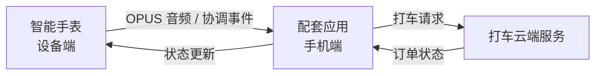
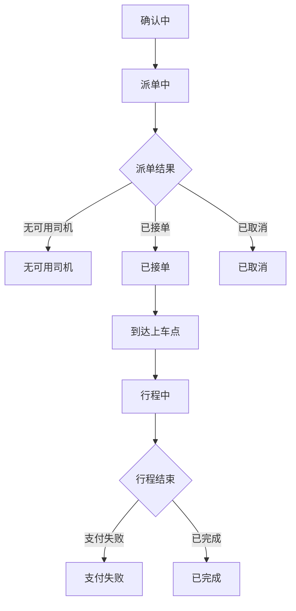

# 语音打车编程指南

> **适用平台**：本文档仅适用于 **iOS** 平台。所描述的 API 基于 Objective-C 语言和 FitCloudKit iOS SDK。

## 概述

语音打车功能允许用户通过智能手表或 App 发起打车语音。SDK session 仅用于设备 OPUS 拾音，不是打车服务或订单的生命周期。App 主动使用 SCO/手机 MIC 时不调用 SDK start/cancel；设备发起时，SDK 才通过回调透传 `audioSource` 并等待 accept/reject。

## 架构

语音打车流程涉及三个主要参与方：

1. **智能手表（设备端）**：可发起协调请求；在 OPUS 通道负责拾音和发送音频，并显示订单状态更新。
2. **配套应用（iPhone）**：启动 ASR 与打车服务；需要设备 OPUS 时使用 SDK 会话，在 SCO/手机 MIC 下完全自行管理音频，并向设备端发送订单状态指令。
3. **打车云端服务**：处理打车请求，调度司机，返回订单状态更新。

## 工作流程



### 步骤流程

1. **用户在手表上触发语音打车** → SDK 回调 `onDeviceRequestStartVoiceRideHailingWithAudioSource:`
2. **应用端启动业务并响应** → 判断是否处理设备指定的音频来源并启动打车/ASR 服务；成功调用 `acceptDeviceVoiceRideHailingStartRequestWithCompletion:`，失败调用 `rejectDeviceVoiceRideHailingStartRequestWithReason:completion:`
3. **按音频来源处理语音** → OPUS 通过 SDK 回调数据；设备请求 SCO/手机 MIC 并被 accept 后，SDK 握手结束，App 独立处理
4. **应用端执行 ASR** → 将语音转换为文本，提取打车意图（上车地点、目的地、车型）
5. **应用端调用打车云端服务** → 发送打车请求
6. **云端返回确认信息** → 上车地点、目的地、车型、预估价格、等待时间
7. **应用端向设备发送确认信息** → 设备显示确认界面
8. **云端调度司机** → 派单中 → 已接单 / 无可用司机
9. **应用端向设备发送状态更新** → 设备实时跟踪订单进度
10. **司机到达并完成行程** → 设备显示到达信息及最终费用

---

## API 参考

### 1. 设备端回调

#### 1.1 语音打车开始

通知应用端手表请求建立语音打车协调会话。应用端判断能否处理回调指定的音频来源并启动自己的打车/ASR 服务，再明确 accept 或 reject；不存在统一的音频通道配置步骤，收到回调本身也不表示两侧已进入协调状态。

```objc
- (void)onDeviceRequestStartVoiceRideHailingWithAudioSource:(FitCloudAIAudioSource)audioSource;
```

**讨论：**

- `audioSource` 表示设备请求的音频通道；OPUS 由设备经 SDK 传输，SCO 与手机 MIC 的音频由应用管理。
- 应用端能够处理指定音频来源且服务启动成功后，调用 `acceptDeviceVoiceRideHailingStartRequestWithCompletion:`。
- 如果业务服务启动失败、AI 鉴权失败或发生其他错误，调用 reject API 并传入对应的 `FitCloudAIStartRejectionReason`。
- accept completion 返回 `deviceSideExceptionOccurred=YES` 时，SDK 已结束失败的协调会话；应用结束刚启动的本地业务，不再发送 cancel/reject。

#### 1.2 设备取消本轮输入

```objc
- (void)onDeviceDidCancelVoiceRideHailingWithReason:(FitCloudAIDeviceInterruptionReason)reason;
```

设备已取消当前单轮语音打车输入。应用应按 `reason` 清理 ASR、音频和当前业务资源，不要再次调用 cancel API 回应这次设备主动取消。

#### 1.3 设备请求退出

```objc
- (void)onDeviceRequestExitVoiceRideHailing;
```

设备请求退出语音打车场景。应用应结束当前页面或业务状态，并清理相关资源。

#### 1.4 增量语音数据（Delta）

通知应用端已接收到语音打车的增量语音数据。该方法在录制过程中会被多次调用，支持流式 ASR 处理。

> 只有 OPUS 音频通道会触发本节和下一节的 Opus/PCM 数据回调。

```objc
- (void)onReceivedVoiceRideHailingDeltaOpusVoiceData:(NSData *_Nullable)deltaOpusVoiceData
                               decodedDeltaVoiceData:(NSData *_Nullable)deltaVoiceData;
```

**参数：**
| 参数 | 类型 | 说明 |
|---|---|---|
| `deltaOpusVoiceData` | `NSData *` | Opus 格式的增量语音数据 |
| `deltaVoiceData` | `NSData *` | 解码后的 PCM 格式增量语音数据（16000Hz 采样率，单声道，16-bit） |

**讨论：**

- 在语音录制会话期间被多次调用。
- 适用于支持实时识别的流式 ASR 服务。
- 直接使用 PCM 数据进行 ASR，或在 ASR 服务需要编码格式时解码 Opus 数据。

#### 1.5 最终语音数据

通知应用端语音打车录制已完成，最终语音数据可用。

```objc
- (void)onReceivedVoiceRideHailingOpusVoiceData:(NSData *_Nullable)opusVoiceData
                              decodedVoiceData:(NSData *_Nullable)voiceData;
```

**参数：**
| 参数 | 类型 | 说明 |
|---|---|---|
| `opusVoiceData` | `NSData *` | Opus 格式的最终语音数据 |
| `voiceData` | `NSData *` | 解码后的 PCM 格式语音数据（16000Hz 采样率，单声道，16-bit） |

**讨论：**

- 在语音录制会话结束时调用一次。
- 包含完整的语音数据用于最终的 ASR 处理。
- 如果使用非流式 ASR 服务，仅使用此方法即可。

---

### 2. 会话控制 API

以下 API 只负责设备 OPUS 拾音会话，不会启动 ASR、打车服务或页面流程。App 主动使用 SCO/手机 MIC 时不调用这些 start/cancel API。设备请求非 OPUS 时仍需 accept/reject，但 accept 成功即完成握手并释放 SDK 状态。所有 SDK 会话互斥；语音传输完成后，后续订单处理不继续占用会话。

| 音频通道 | App 侧处理 |
|---|---|
| `FitCloudAIAudioSourceDeviceOpus` | SDK 回调 Opus 及解码后 PCM 数据，适合流式 ASR |
| `FitCloudAIAudioSourceBluetoothSCO` | 仅设备发起回调使用；accept 后由 App 独立处理 |
| `FitCloudAIAudioSourcePhoneMicrophone` | 仅设备发起回调使用；accept 后权限、采集和生命周期由 App 管理 |

```objc
// App 主动请求设备 OPUS 拾音
+ (void)startVoiceRideHailingVoiceSessionWithCompletion:(FitCloudAIStartCompletion _Nullable)completion;

// App 在语音传输完成前主动取消本轮输入
+ (void)cancelVoiceRideHailingVoiceSessionWithCompletion:(FitCloudCompletionHandler _Nullable)completion;

// 响应设备 start request：App 可处理指定音频来源且服务已启动
+ (void)acceptDeviceVoiceRideHailingStartRequestWithCompletion:
    (void (^_Nullable)(BOOL success,
                       BOOL deviceSideExceptionOccurred,
                       NSError *_Nullable error))completion;

// 响应设备 start request：App 不接受该音频来源或服务启动失败
+ (void)rejectDeviceVoiceRideHailingStartRequestWithReason:(FitCloudAIStartRejectionReason)reason
                                                 completion:(FitCloudCompletionHandler _Nullable)completion;
```

> `cancelVoiceRideHailingVoiceSession...` 只取消尚未完成的语音输入；`sendVoiceRideHailingStatusCanceled...` 表示打车订单已经取消。两者属于不同生命周期，不能互相替代。

`start...` 仅用于 App 主动请求设备 OPUS 拾音。App 主动使用 SCO/手机 MIC 时不调用 start/cancel。设备发起时必须从 start request 回调进入 accept/reject 流程。

App 主动 start 的 completion 中，设备业务拒绝通过 `FitCloudAIDeviceSideStartFailureReason` 表达，SDK/通信错误通过 `error` 表达。reject 可使用 `ServiceFailed`、`AuthenticationFailed` 或 `Other`；这些均是业务语义，不需要了解底层协议数值。

| success | deviceSideExceptionOccurred | error | 含义 |
|---:|---:|---|---|
| YES | NO | nil | OPUS 进入媒体会话；SCO/手机 MIC 只完成握手，SDK 随即释放状态 |
| NO | YES | nil | App 已接受，但设备未能进入协调状态；SDK 已结束会话，App 停止本地服务 |
| NO | NO | 非 nil | SDK 状态、通信或响应校验失败 |

### 3. 订单状态 API

以下 API 用于将订单状态从应用端发送到设备端，实现智能手表上的实时跟踪显示。

#### 3.1 发送确认信息

在应用端收到云端服务的初始报价后，向设备端发送打车确认信息。

```objc
+ (void)sendVoiceRideHailingConfirmInfo:(FitCloudVoiceRideHailingConfirmModel *)confirmModel
                              completion:(FitCloudCompletionHandler _Nullable)completion;
```

**参数：**
| 参数 | 类型 | 说明 |
|---|---|---|
| `confirmModel` | `FitCloudVoiceRideHailingConfirmModel *` | 确认模型，包含上车地点、目的地、车型、预估价格和等待时间 |
| `completion` | `FitCloudCompletionHandler` | 操作完成时调用的回调 |

**`FitCloudVoiceRideHailingConfirmModel` 属性：**
| 属性 | 类型 | 最大长度 | 说明 |
|---|---|---|---|
| `pickup` | `NSString *` | 128 字节 | 上车地点（如 "123 Main St, Anytown, USA"） |
| `destination` | `NSString *` | 128 字节 | 目的地（如 "456 Elm St, Anytown, USA"） |
| `vehicleType` | `NSString *` | 32 字节 | 车型（如 "Fast car"） |
| `estimatedPrice` | `NSString *` | 12 字节 | 预估价格（如 "$13.45"） |
| `estimatedWaitTime` | `NSString *` | 12 字节 | 预估等待时间（如 "5 minutes"） |

**注意：** 发送前请确保模型通过 `isValid` 校验。

---

#### 3.2 发送派单中状态

向设备端发送"派单中"状态，表示打车请求正在处理。

```objc
+ (void)sendVoiceRideHailingStatusOrderingWithCompletion:(FitCloudCompletionHandler _Nullable)completion;
```

**参数：**
| 参数 | 类型 | 说明 |
|---|---|---|
| `completion` | `FitCloudCompletionHandler` | 操作完成时调用的回调 |

---

#### 3.3 发送无可用司机状态

向设备端发送"无可用司机"状态，表示当前没有可用司机。

```objc
+ (void)sendVoiceRideHailingStatusNoDriverWithCompletion:(FitCloudCompletionHandler _Nullable)completion;
```

**参数：**
| 参数 | 类型 | 说明 |
|---|---|---|
| `completion` | `FitCloudCompletionHandler` | 操作完成时调用的回调 |

---

#### 3.4 发送已接单信息

向设备端发送司机已接单的信息。

```objc
+ (void)sendVoiceRideHailingAcceptedInfo:(FitCloudVoiceRideHailingAcceptedModel *)acceptedModel
                              completion:(FitCloudCompletionHandler _Nullable)completion;
```

**参数：**
| 参数 | 类型 | 说明 |
|---|---|---|
| `acceptedModel` | `FitCloudVoiceRideHailingAcceptedModel *` | 接单模型，包含车辆、司机和上车地点详情 |
| `completion` | `FitCloudCompletionHandler` | 操作完成时调用的回调 |

**`FitCloudVoiceRideHailingAcceptedModel` 属性：**
| 属性 | 类型 | 最大长度 | 说明 |
|---|---|---|---|
| `vehicleModel` | `NSString *` | 64 字节 | 车型（如 "Tesla Model S (White)"） |
| `plateNumber` | `NSString *` | 12 字节 | 车牌号（如 "CA12345"） |
| `driverName` | `NSString *` | 32 字节 | 司机姓名（如 "John Doe"） |
| `driverPhoneNumber` | `NSString *` | 16 字节 | 司机电话（如 "+1234567890"） |
| `pickup` | `NSString *` | 128 字节 | 上车地点 |
| `distanceToPickup` | `NSString *` | 12 字节 | 距上车点距离（如 "0.5km"） |
| `estimatedPickupTimeSinceNow` | `NSString *` | 12 字节 | 预计上车时间（如 "5 minutes"） |

---

#### 3.5 发送已取消状态

向设备端发送"已取消"状态，表示订单已被取消。

```objc
+ (void)sendVoiceRideHailingStatusCanceledWithCompletion:(FitCloudCompletionHandler _Nullable)completion;
```

**参数：**
| 参数 | 类型 | 说明 |
|---|---|---|
| `completion` | `FitCloudCompletionHandler` | 操作完成时调用的回调 |

---

#### 3.6 发送已到达上车点信息

向设备端发送车辆已到达上车点的信息。

```objc
+ (void)sendVoiceRideHailingArrivedAtPickupInfo:(FitCloudVoiceRideHailingArrivedAtPickupModel *)arrivedModel
                                     completion:(FitCloudCompletionHandler _Nullable)completion;
```

**参数：**
| 参数 | 类型 | 说明 |
|---|---|---|
| `arrivedModel` | `FitCloudVoiceRideHailingArrivedAtPickupModel *` | 到达模型，包含车辆、司机和免费等待时间详情 |
| `completion` | `FitCloudCompletionHandler` | 操作完成时调用的回调 |

**`FitCloudVoiceRideHailingArrivedAtPickupModel` 属性：**
| 属性 | 类型 | 最大长度 | 说明 |
|---|---|---|---|
| `vehicleModel` | `NSString *` | 64 字节 | 车型（如 "Tesla Model S (White)"） |
| `plateNumber` | `NSString *` | 12 字节 | 车牌号（如 "CA12345"） |
| `driverName` | `NSString *` | 32 字节 | 司机姓名（如 "John Doe"） |
| `driverPhoneNumber` | `NSString *` | 16 字节 | 司机电话（如 "+1234567890"） |
| `pickup` | `NSString *` | 128 字节 | 上车地点 |
| `freeWaitTime` | `NSString *` | 12 字节 | 免费等待时间（秒数，如 "300"） |

---

#### 3.7 发送行程中信息

向设备端发送"行程中"信息，用于实时行程跟踪。

```objc
+ (void)sendVoiceRideHailingOnTripInfo:(FitCloudVoiceRideHailingOnTripModel *)onTripModel
                           completion:(FitCloudCompletionHandler _Nullable)completion;
```

**参数：**
| 参数 | 类型 | 说明 |
|---|---|---|
| `onTripModel` | `FitCloudVoiceRideHailingOnTripModel *` | 行程中模型，包含剩余距离、预计到达时间和预估价格 |
| `completion` | `FitCloudCompletionHandler` | 操作完成时调用的回调 |

**`FitCloudVoiceRideHailingOnTripModel` 属性：**
| 属性 | 类型 | 最大长度 | 说明 |
|---|---|---|---|
| `remainingDistance` | `NSString *` | 12 字节 | 剩余距离（如 "2.5km"） |
| `estimatedTimeToDestination` | `NSString *` | 12 字节 | 预计到达目的地时间（如 "15 minutes"） |
| `estimatedTotalPrice` | `NSString *` | 12 字节 | 预估总价格（如 "$15.75"） |

---

#### 3.8 发送支付失败状态

向设备端发送"支付失败"状态。

```objc
+ (void)sendVoiceRideHailingStatusPaymentFailedWithCompletion:(FitCloudCompletionHandler _Nullable)completion;
```

**参数：**
| 参数 | 类型 | 说明 |
|---|---|---|
| `completion` | `FitCloudCompletionHandler` | 操作完成时调用的回调 |

---

#### 3.9 发送行程完成信息

向设备端发送行程完成信息。

```objc
+ (void)sendVoiceRideHailingFinishedInfo:(FitCloudVoiceRideHailingFinishedModel *)finishedModel
                              completion:(FitCloudCompletionHandler _Nullable)completion;
```

**参数：**
| 参数 | 类型 | 说明 |
|---|---|---|
| `finishedModel` | `FitCloudVoiceRideHailingFinishedModel *` | 完成模型，包含总费用 |
| `completion` | `FitCloudCompletionHandler` | 操作完成时调用的回调 |

**`FitCloudVoiceRideHailingFinishedModel` 属性：**
| 属性 | 类型 | 最大长度 | 说明 |
|---|---|---|---|
| `totalPrice` | `NSString *` | 12 字节 | 总费用（如 "$15.75"） |

---

## 订单状态流转

下图展示了语音打车订单的可能状态流转：



### 状态说明

| 状态       | API                                                      | 说明                                       |
| ---------- | -------------------------------------------------------- | ------------------------------------------ |
| 确认中     | `sendVoiceRideHailingConfirmInfo:completion:`            | 初始报价：上车地点、目的地、车型、预估价格 |
| 派单中     | `sendVoiceRideHailingStatusOrderingWithCompletion:`      | 打车请求处理中                             |
| 无可用司机 | `sendVoiceRideHailingStatusNoDriverWithCompletion:`      | 无可用司机                                 |
| 已接单     | `sendVoiceRideHailingAcceptedInfo:completion:`           | 司机已接单                                 |
| 已取消     | `sendVoiceRideHailingStatusCanceledWithCompletion:`      | 订单已取消                                 |
| 到达上车点 | `sendVoiceRideHailingArrivedAtPickupInfo:completion:`    | 司机已到达上车点                           |
| 行程中     | `sendVoiceRideHailingOnTripInfo:completion:`             | 行程进行中                                 |
| 支付失败   | `sendVoiceRideHailingStatusPaymentFailedWithCompletion:` | 支付失败                                   |
| 已完成     | `sendVoiceRideHailingFinishedInfo:completion:`           | 行程已完成                                 |

---

## 实现示例

### Objective-C

```objc
#pragma mark - FitCloudCallback

- (void)onDeviceRequestStartVoiceRideHailingWithAudioSource:(FitCloudAIAudioSource)audioSource {
    // 判断音频来源并启动 App 侧 ASR/打车服务，然后接受设备请求
    if (![self startVoiceRideHailingServicesForAudioSource:audioSource]) {
        [FitCloudKit rejectDeviceVoiceRideHailingStartRequestWithReason:FitCloudAIStartRejectionReasonServiceFailed
                                                             completion:nil];
        return;
    }
    [FitCloudKit acceptDeviceVoiceRideHailingStartRequestWithCompletion:
        ^(BOOL success, BOOL deviceSideExceptionOccurred, NSError *error) {
            if (!success) {
                // 设备侧异常或 SDK 错误时，结束本地业务
                [self teardownVoiceRideHailing];
            }
        }];
}

- (void)onDeviceDidCancelVoiceRideHailingWithReason:(FitCloudAIDeviceInterruptionReason)reason {
    [self teardownVoiceRideHailing];
}

- (void)onDeviceRequestExitVoiceRideHailing {
    [self teardownVoiceRideHailing];
}

- (void)onReceivedVoiceRideHailingDeltaOpusVoiceData:(NSData *)deltaOpusVoiceData
                               decodedDeltaVoiceData:(NSData *)deltaVoiceData {
    // 将增量 PCM 数据输入流式 ASR 服务进行实时识别
    // 在录制过程中会被多次调用
    [self.streamingASR appendAudioData:deltaVoiceData];
}

- (void)onReceivedVoiceRideHailingOpusVoiceData:(NSData *)opusVoiceData
                              decodedVoiceData:(NSData *)voiceData {
    // 使用最终语音数据进行 ASR 识别
    [self runASRWithAudioData:voiceData completion:^(NSString *text, NSError *error) {
        if (error) {
            // 处理 ASR 错误
            return;
        }
        // 提取打车意图并调用打车云端服务
        [self requestRideWithText:text];
    }];
}

#pragma mark - 打车流程

- (void)requestRideWithText:(NSString *)text {
    // 解析文本，提取上车地点、目的地、车型
    // 调用打车云端服务

    // 收到云端确认响应后：
    FitCloudVoiceRideHailingConfirmModel *confirmModel = [[FitCloudVoiceRideHailingConfirmModel alloc] init];
    confirmModel.pickup = @"123 Main St";
    confirmModel.destination = @"456 Elm St";
    confirmModel.vehicleType = @"Fast car";
    confirmModel.estimatedPrice = @"$13.45";
    confirmModel.estimatedWaitTime = @"5 minutes";

    if ([confirmModel isValid]) {
        [FitCloudKit sendVoiceRideHailingConfirmInfo:confirmModel
                                         completion:^(BOOL success, NSError *error) {
            if (success) {
                // 确认信息已成功发送到设备端
            }
        }];
    }

    // 发送派单中状态
    [FitCloudKit sendVoiceRideHailingStatusOrderingWithCompletion:^(BOOL success, NSError *error) {
        // ...
    }];
}

- (void)onDriverAccepted {
    FitCloudVoiceRideHailingAcceptedModel *acceptedModel = [[FitCloudVoiceRideHailingAcceptedModel alloc] init];
    acceptedModel.vehicleModel = @"Tesla Model S (White)";
    acceptedModel.plateNumber = @"CA12345";
    acceptedModel.driverName = @"John Doe";
    acceptedModel.driverPhoneNumber = @"+1234567890";
    acceptedModel.pickup = @"123 Main St";
    acceptedModel.distanceToPickup = @"0.5km";
    acceptedModel.estimatedPickupTimeSinceNow = @"5 minutes";

    [FitCloudKit sendVoiceRideHailingAcceptedInfo:acceptedModel
                                      completion:^(BOOL success, NSError *error) {
        // ...
    }];
}

- (void)onDriverArrived {
    FitCloudVoiceRideHailingArrivedAtPickupModel *arrivedModel = [[FitCloudVoiceRideHailingArrivedAtPickupModel alloc] init];
    arrivedModel.vehicleModel = @"Tesla Model S (White)";
    arrivedModel.plateNumber = @"CA12345";
    arrivedModel.driverName = @"John Doe";
    arrivedModel.driverPhoneNumber = @"+1234567890";
    arrivedModel.pickup = @"123 Main St";
    arrivedModel.freeWaitTime = @"300";

    [FitCloudKit sendVoiceRideHailingArrivedAtPickupInfo:arrivedModel
                                              completion:^(BOOL success, NSError *error) {
        // ...
    }];
}

- (void)onTripUpdate {
    FitCloudVoiceRideHailingOnTripModel *onTripModel = [[FitCloudVoiceRideHailingOnTripModel alloc] init];
    onTripModel.remainingDistance = @"2.5km";
    onTripModel.estimatedTimeToDestination = @"15 minutes";
    onTripModel.estimatedTotalPrice = @"$15.75";

    [FitCloudKit sendVoiceRideHailingOnTripInfo:onTripModel
                                     completion:^(BOOL success, NSError *error) {
        // ...
    }];
}

- (void)onTripFinished {
    FitCloudVoiceRideHailingFinishedModel *finishedModel = [[FitCloudVoiceRideHailingFinishedModel alloc] init];
    finishedModel.totalPrice = @"$15.75";

    [FitCloudKit sendVoiceRideHailingFinishedInfo:finishedModel
                                      completion:^(BOOL success, NSError *error) {
        // ...
    }];
}
```

### Swift

```swift
// MARK: - FitCloudCallback

func onDeviceRequestStartVoiceRideHailing(withAudioSource audioSource: FitCloudAIAudioSource) {
    guard startVoiceRideHailingServices(forAudioSource: audioSource) else {
        FitCloudKit.rejectDeviceVoiceRideHailingStartRequest(
            with: .serviceFailed,
            completion: nil
        )
        return
    }
    FitCloudKit.acceptDeviceVoiceRideHailingStartRequest { [weak self] success, deviceSideExceptionOccurred, error in
        if !success {
            // 设备侧异常或 SDK 错误时，结束本地业务
            self?.teardownVoiceRideHailing()
        }
    }
}

func onDeviceDidCancelVoiceRideHailing(with reason: FitCloudAIDeviceInterruptionReason) {
    teardownVoiceRideHailing()
}

func onDeviceRequestExitVoiceRideHailing() {
    teardownVoiceRideHailing()
}

func onReceivedVoiceRideHailingDeltaOpusVoiceData(_ deltaOpusVoiceData: Data?,
                                                   decodedDeltaVoiceData deltaVoiceData: Data?) {
    // 将增量 PCM 数据输入流式 ASR 服务进行实时识别
    // 在录制过程中会被多次调用
    streamingASR?.appendAudioData(deltaVoiceData)
}

func onReceivedVoiceRideHailingOpusVoiceData(_ opusVoiceData: Data?,
                                                decodedVoiceData voiceData: Data?) {
    // 使用最终语音数据进行 ASR 识别
    runASR(withAudioData: voiceData) { [weak self] text, error in
        if let error = error {
            // 处理 ASR 错误
            return
        }
        // 提取打车意图并调用打车云端服务
        self?.requestRide(withText: text)
    }
}

// MARK: - 打车流程

func requestRide(withText text: String) {
    // 解析文本，提取上车地点、目的地、车型
    // 调用打车云端服务

    // 收到云端确认响应后：
    let confirmModel = FitCloudVoiceRideHailingConfirmModel()
    confirmModel.pickup = "123 Main St"
    confirmModel.destination = "456 Elm St"
    confirmModel.vehicleType = "Fast car"
    confirmModel.estimatedPrice = "$13.45"
    confirmModel.estimatedWaitTime = "5 minutes"

    if confirmModel.isValid() {
        FitCloudKit.sendVoiceRideHailingConfirmInfo(confirmModel) { success, error in
            if success {
                // 确认信息已成功发送到设备端
            }
        }
    }

    // 发送派单中状态
    FitCloudKit.sendVoiceRideHailingStatusOrdering { success, error in
        // ...
    }
}

func onDriverAccepted() {
    let acceptedModel = FitCloudVoiceRideHailingAcceptedModel()
    acceptedModel.vehicleModel = "Tesla Model S (White)"
    acceptedModel.plateNumber = "CA12345"
    acceptedModel.driverName = "John Doe"
    acceptedModel.driverPhoneNumber = "+1234567890"
    acceptedModel.pickup = "123 Main St"
    acceptedModel.distanceToPickup = "0.5km"
    acceptedModel.estimatedPickupTimeSinceNow = "5 minutes"

    FitCloudKit.sendVoiceRideHailingAcceptedInfo(acceptedModel) { success, error in
        // ...
    }
}

func onDriverArrived() {
    let arrivedModel = FitCloudVoiceRideHailingArrivedAtPickupModel()
    arrivedModel.vehicleModel = "Tesla Model S (White)"
    arrivedModel.plateNumber = "CA12345"
    arrivedModel.driverName = "John Doe"
    arrivedModel.driverPhoneNumber = "+1234567890"
    arrivedModel.pickup = "123 Main St"
    arrivedModel.freeWaitTime = "300"

    FitCloudKit.sendVoiceRideHailingArrivedAtPickupInfo(arrivedModel) { success, error in
        // ...
    }
}

func onTripUpdate() {
    let onTripModel = FitCloudVoiceRideHailingOnTripModel()
    onTripModel.remainingDistance = "2.5km"
    onTripModel.estimatedTimeToDestination = "15 minutes"
    onTripModel.estimatedTotalPrice = "$15.75"

    FitCloudKit.sendVoiceRideHailingOnTripInfo(onTripModel) { success, error in
        // ...
    }
}

func onTripFinished() {
    let finishedModel = FitCloudVoiceRideHailingFinishedModel()
    finishedModel.totalPrice = "$15.75"

    FitCloudKit.sendVoiceRideHailingFinishedInfo(finishedModel) { success, error in
        // ...
    }
}
```

---

## 最佳实践

### ASR 策略

- **使用流式 ASR 服务时**：使用 `onReceivedVoiceRideHailingDeltaOpusVoiceData:decodedDeltaVoiceData:` 将增量 PCM 数据输入进行实时识别，然后使用 `onReceivedVoiceRideHailingOpusVoiceData:decodedVoiceData:` 中的最终结果作为最终 ASR 调用。
- **使用非流式 ASR 服务时**：仅实现 `onReceivedVoiceRideHailingOpusVoiceData:decodedVoiceData:` 方法，一次性处理完整音频数据。

### 模型校验

- 发送前务必调用 `isValid` 方法校验模型，确保所有必填字段已填写且未超过长度限制。
- 截断超出最大长度的字符串，以避免意外行为。

### 错误处理

- 检查发送到设备的每个指令回调中的 `success` 标志和 `error` 信息。
- 对临时性故障实现重试逻辑。
- 发送指令前监控设备连接状态。

### 语音数据处理

- PCM 数据格式：16000Hz 采样率，单声道，16-bit 有符号整数，为 ASR 处理的最佳格式。
- 同时提供 Opus 数据作为备选格式，如 ASR 服务需要编码音频请进行解码。

## 要求

- **FitCloudKit**：支持语音打车功能的最低版本
- **设备固件**：必须支持语音打车功能（通过 `[FitCloudKit isDeviceSupportFeature:FITCLOUDDEVICEFEATURE_VOICERIDEHAILING]` 判断）
- **ASR 服务**：任何支持 PCM 音频输入的 ASR 服务（流式或批量）
- **打车后端**：与打车服务提供商的对接

## 相关文档

- `FitCloudCallback.h` — 设备端回调协议
- `FitCloudKit.h` — 主 SDK 入口，包含语音打车分类接口
