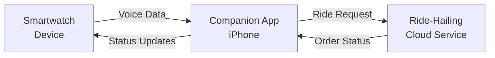
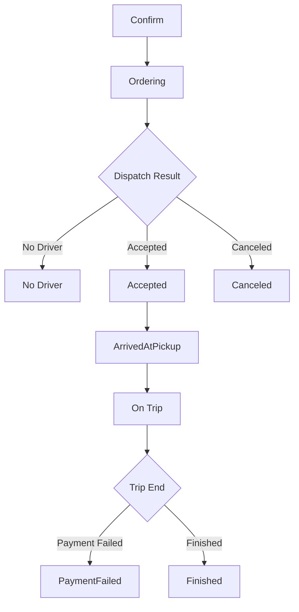

# Voice Ride Hailing Programming Guide

> **Platform**: This guide is for **iOS** only. The APIs described herein are based on Objective-C and the FitCloudKit iOS SDK.

## Overview

Voice Ride Hailing enables users to initiate a ride-hailing request directly from their smartwatch via voice. The wearable device captures the user's voice, streams it to the companion app, and the app processes the voice to extract ride intent, communicates with the ride-hailing cloud service, and synchronizes the order status back to the device for real-time display.

## Architecture

The voice ride hailing flow involves three main parties:

1. **Smartwatch (Device)**: Initiates the voice recording, captures and streams voice data, and displays order status updates.
2. **Companion App (iPhone)**: Receives voice data from the device, performs ASR (Automatic Speech Recognition) to extract ride intent, interacts with the ride-hailing backend service, and sends status commands back to the device.
3. **Ride-Hailing Cloud Service**: Processes the ride request, dispatches drivers, and returns order status updates.

## Workflow



### Step-by-Step Flow

1. **User triggers voice ride hailing on the watch** → Device calls `onVoiceRideHailingBegin`
2. **Device streams voice data to the app** → Incremental delta voice data + final voice data
3. **App performs ASR** → Converts voice to text, extracts ride intent (pickup location, destination, vehicle type)
4. **App calls ride-hailing cloud service** → Sends the ride request
5. **Cloud returns confirm info** → Pickup, destination, vehicle type, estimated price, wait time
6. **App sends confirm info to device** → Device displays confirm screen
7. **Cloud dispatches driver** → Ordering → Accepted / No Driver
8. **App sends status updates to device** → Device tracks order progress
9. **Driver arrives** → Device shows arrival info
10. **Trip completes** → Device shows final price

---

## API Reference

### 1. Device Callbacks

#### 1.1 Voice Ride Hailing Start

Notifies that the watch requests to start voice ride hailing. The device will begin capturing and transmitting voice data to the app. The app should prepare to receive voice data and initialize the ASR pipeline.

```objc
- (void)onVoiceRideHailingBegin;
```

**Discussion:**

- Called when the user initiates a voice ride hailing request on the device.
- Voice data is captured by the device and transmitted to the app. The app does NOT need to record or transmit voice data.
- The app should initialize its ASR pipeline upon receiving this callback to prepare for subsequent incremental and final voice data.

#### 1.2 Incremental Voice Data (Delta)

Notifies that incremental voice ride hailing voice data has been received. This method is called multiple times during the recording process, allowing for streaming ASR.

```objc
- (void)onReceivedVoiceRideHailingDeltaOpusVoiceData:(NSData *_Nullable)deltaOpusVoiceData
                               decodedDeltaVoiceData:(NSData *_Nullable)deltaVoiceData;
```

**Parameters:**
| Parameter | Type | Description |
|---|---|---|
| `deltaOpusVoiceData` | `NSData *` | Incremental voice data in Opus format |
| `deltaVoiceData` | `NSData *` | Decoded incremental voice data in PCM format (16000Hz, mono, 16-bit) |

**Discussion:**

- Called multiple times during the voice recording session.
- Suitable for streaming ASR services that support real-time recognition.
- Use the PCM data directly for ASR, or decode the Opus data if your ASR service prefers encoded formats.

#### 1.3 Final Voice Data

Notifies that voice ride hailing recording has completed and the final voice data is available.

```objc
- (void)onReceivedVoiceRideHailingOpusVoiceData:(NSData *_Nullable)opusVoiceData
                              decodedVoiceData:(NSData *_Nullable)voiceData;
```

**Parameters:**
| Parameter | Type | Description |
|---|---|---|
| `opusVoiceData` | `NSData *` | Final voice data in Opus format |
| `voiceData` | `NSData *` | Decoded voice data in PCM format (16000Hz, mono, 16-bit) |

**Discussion:**

- Called once at the end of the voice recording session.
- Contains the complete voice data for final ASR processing.
- If your ASR service does not support streaming, use this method exclusively.

---

### 2. Device Command APIs

The following APIs are used to send order status updates from the app to the device, enabling real-time tracking display on the smartwatch.

#### 2.1 Send Confirm Info

Sends ride hailing confirm information to the device after the app receives the initial quote from the cloud service.

```objc
+ (void)sendVoiceRideHailingConfirmInfo:(FitCloudVoiceRideHailingConfirmModel *)confirmModel
                              completion:(FitCloudCompletionHandler _Nullable)completion;
```

**Parameters:**
| Parameter | Type | Description |
|---|---|---|
| `confirmModel` | `FitCloudVoiceRideHailingConfirmModel *` | Confirm model with pickup, destination, vehicle type, estimated price, and wait time |
| `completion` | `FitCloudCompletionHandler` | Completion handler called when the operation completes |

**`FitCloudVoiceRideHailingConfirmModel` Properties:**
| Property | Type | Max Length | Description |
|---|---|---|---|
| `pickup` | `NSString *` | 128 bytes | Pickup location (e.g., "123 Main St, Anytown, USA") |
| `destination` | `NSString *` | 128 bytes | Destination (e.g., "456 Elm St, Anytown, USA") |
| `vehicleType` | `NSString *` | 32 bytes | Vehicle type (e.g., "Fast car") |
| `estimatedPrice` | `NSString *` | 12 bytes | Estimated price (e.g., "$13.45") |
| `estimatedWaitTime` | `NSString *` | 12 bytes | Estimated wait time (e.g., "5 minutes") |

**Note:** Ensure the model passes `isValid` before sending.

---

#### 2.2 Send Ordering Status

Sends the "ordering" status to the device, indicating that the ride request is being processed.

```objc
+ (void)sendVoiceRideHailingStatusOrderingWithCompletion:(FitCloudCompletionHandler _Nullable)completion;
```

**Parameters:**
| Parameter | Type | Description |
|---|---|---|
| `completion` | `FitCloudCompletionHandler` | Completion handler called when the operation completes |

---

#### 2.3 Send No Driver Status

Sends the "no driver" status to the device, indicating that no driver is available.

```objc
+ (void)sendVoiceRideHailingStatusNoDriverWithCompletion:(FitCloudCompletionHandler _Nullable)completion;
```

**Parameters:**
| Parameter | Type | Description |
|---|---|---|
| `completion` | `FitCloudCompletionHandler` | Completion handler called when the operation completes |

---

#### 2.4 Send Accepted Info

Sends the driver acceptance information to the device.

```objc
+ (void)sendVoiceRideHailingAcceptedInfo:(FitCloudVoiceRideHailingAcceptedModel *)acceptedModel
                              completion:(FitCloudCompletionHandler _Nullable)completion;
```

**Parameters:**
| Parameter | Type | Description |
|---|---|---|
| `acceptedModel` | `FitCloudVoiceRideHailingAcceptedModel *` | Accepted model with vehicle, driver, and pickup details |
| `completion` | `FitCloudCompletionHandler` | Completion handler called when the operation completes |

**`FitCloudVoiceRideHailingAcceptedModel` Properties:**
| Property | Type | Max Length | Description |
|---|---|---|---|
| `vehicleModel` | `NSString *` | 64 bytes | Vehicle model (e.g., "Tesla Model S (White)") |
| `plateNumber` | `NSString *` | 12 bytes | License plate number (e.g., "CA12345") |
| `driverName` | `NSString *` | 32 bytes | Driver name (e.g., "John Doe") |
| `driverPhoneNumber` | `NSString *` | 16 bytes | Driver phone number (e.g., "+1234567890") |
| `pickup` | `NSString *` | 128 bytes | Pickup location |
| `distanceToPickup` | `NSString *` | 12 bytes | Distance to pickup (e.g., "0.5km") |
| `estimatedPickupTimeSinceNow` | `NSString *` | 12 bytes | Estimated pickup time (e.g., "5 minutes") |

---

#### 2.5 Send Canceled Status

Sends the "canceled" status to the device, indicating that the order has been canceled.

```objc
+ (void)sendVoiceRideHailingStatusCanceledWithCompletion:(FitCloudCompletionHandler _Nullable)completion;
```

**Parameters:**
| Parameter | Type | Description |
|---|---|---|
| `completion` | `FitCloudCompletionHandler` | Completion handler called when the operation completes |

---

#### 2.6 Send Arrived at Pickup Info

Sends the arrival at pickup point information to the device.

```objc
+ (void)sendVoiceRideHailingArrivedAtPickupInfo:(FitCloudVoiceRideHailingArrivedAtPickupModel *)arrivedModel
                                     completion:(FitCloudCompletionHandler _Nullable)completion;
```

**Parameters:**
| Parameter | Type | Description |
|---|---|---|
| `arrivedModel` | `FitCloudVoiceRideHailingArrivedAtPickupModel *` | Arrival model with vehicle, driver, and free wait time details |
| `completion` | `FitCloudCompletionHandler` | Completion handler called when the operation completes |

**`FitCloudVoiceRideHailingArrivedAtPickupModel` Properties:**
| Property | Type | Max Length | Description |
|---|---|---|---|
| `vehicleModel` | `NSString *` | 64 bytes | Vehicle model (e.g., "Tesla Model S (White)") |
| `plateNumber` | `NSString *` | 12 bytes | License plate number (e.g., "CA12345") |
| `driverName` | `NSString *` | 32 bytes | Driver name (e.g., "John Doe") |
| `driverPhoneNumber` | `NSString *` | 16 bytes | Driver phone number (e.g., "+1234567890") |
| `pickup` | `NSString *` | 128 bytes | Pickup location |
| `freeWaitTime` | `NSString *` | 12 bytes | Free wait time in seconds (e.g., "300") |

---

#### 2.7 Send On Trip Info

Sends the "on trip" information to the device for real-time trip tracking.

```objc
+ (void)sendVoiceRideHailingOnTripInfo:(FitCloudVoiceRideHailingOnTripModel *)onTripModel
                           completion:(FitCloudCompletionHandler _Nullable)completion;
```

**Parameters:**
| Parameter | Type | Description |
|---|---|---|
| `onTripModel` | `FitCloudVoiceRideHailingOnTripModel *` | On-trip model with remaining distance, ETA, and estimated price |
| `completion` | `FitCloudCompletionHandler` | Completion handler called when the operation completes |

**`FitCloudVoiceRideHailingOnTripModel` Properties:**
| Property | Type | Max Length | Description |
|---|---|---|---|
| `remainingDistance` | `NSString *` | 12 bytes | Remaining distance (e.g., "2.5km") |
| `estimatedTimeToDestination` | `NSString *` | 12 bytes | ETA to destination (e.g., "15 minutes") |
| `estimatedTotalPrice` | `NSString *` | 12 bytes | Estimated total price (e.g., "$15.75") |

---

#### 2.8 Send Payment Failed Status

Sends the "payment failed" status to the device.

```objc
+ (void)sendVoiceRideHailingStatusPaymentFailedWithCompletion:(FitCloudCompletionHandler _Nullable)completion;
```

**Parameters:**
| Parameter | Type | Description |
|---|---|---|
| `completion` | `FitCloudCompletionHandler` | Completion handler called when the operation completes |

---

#### 2.9 Send Finished Info

Sends the trip completion information to the device.

```objc
+ (void)sendVoiceRideHailingFinishedInfo:(FitCloudVoiceRideHailingFinishedModel *)finishedModel
                              completion:(FitCloudCompletionHandler _Nullable)completion;
```

**Parameters:**
| Parameter | Type | Description |
|---|---|---|
| `finishedModel` | `FitCloudVoiceRideHailingFinishedModel *` | Finished model with total price |
| `completion` | `FitCloudCompletionHandler` | Completion handler called when the operation completes |

**`FitCloudVoiceRideHailingFinishedModel` Properties:**
| Property | Type | Max Length | Description |
|---|---|---|---|
| `totalPrice` | `NSString *` | 12 bytes | Total price (e.g., "$15.75") |

---

## Order Status Flow

The following diagram illustrates the possible state transitions for a voice ride hailing order:



### Status Description

| Status                    | API                                                      | Description                                                  |
| ------------------------- | -------------------------------------------------------- | ------------------------------------------------------------ |
| Confirm                   | `sendVoiceRideHailingConfirmInfo:completion:`            | Initial quote: pickup, destination, vehicle, estimated price |
| Ordering                  | `sendVoiceRideHailingStatusOrderingWithCompletion:`      | Ride request is being processed                              |
| No Driver                 | `sendVoiceRideHailingStatusNoDriverWithCompletion:`      | No driver available                                          |
| Accepted                  | `sendVoiceRideHailingAcceptedInfo:completion:`           | Driver accepted the order                                    |
| Canceled                  | `sendVoiceRideHailingStatusCanceledWithCompletion:`      | Order canceled                                               |
| Vehicle Arrived at Pickup | `sendVoiceRideHailingArrivedAtPickupInfo:completion:`    | Driver arrived at pickup point                               |
| On Trip                   | `sendVoiceRideHailingOnTripInfo:completion:`             | Trip in progress                                             |
| Payment Failed            | `sendVoiceRideHailingStatusPaymentFailedWithCompletion:` | Payment failed                                               |
| Finished                  | `sendVoiceRideHailingFinishedInfo:completion:`           | Trip completed                                               |

---

## Implementation Example

### Objective-C

```objc
#pragma mark - FitCloudCallback

- (void)onVoiceRideHailingBegin {
    NSLog(@"Voice ride hailing started on device");
    // Initialize ASR session, e.g., start streaming to your ASR service
}

- (void)onReceivedVoiceRideHailingDeltaOpusVoiceData:(NSData *)deltaOpusVoiceData
                               decodedDeltaVoiceData:(NSData *)deltaVoiceData {
    // Feed incremental PCM data to streaming ASR service for real-time recognition
    // This is called multiple times during recording
    [self.streamingASR appendAudioData:deltaVoiceData];
}

- (void)onReceivedVoiceRideHailingOpusVoiceData:(NSData *)opusVoiceData
                              decodedVoiceData:(NSData *)voiceData {
    // Process final voice data with ASR
    [self runASRWithAudioData:voiceData completion:^(NSString *text, NSError *error) {
        if (error) {
            // Handle ASR error
            return;
        }
        // Extract ride intent and call cloud ride hailing service
        [self requestRideWithText:text];
    }];
}

#pragma mark - Ride Hailing Flow

- (void)requestRideWithText:(NSString *)text {
    // Parse text to extract pickup, destination, vehicle type
    // Call your ride hailing cloud service

    // After receiving confirm response from cloud:
    FitCloudVoiceRideHailingConfirmModel *confirmModel = [[FitCloudVoiceRideHailingConfirmModel alloc] init];
    confirmModel.pickup = @"123 Main St";
    confirmModel.destination = @"456 Elm St";
    confirmModel.vehicleType = @"Fast car";
    confirmModel.estimatedPrice = @"$13.45";
    confirmModel.estimatedWaitTime = @"5 minutes";

    if ([confirmModel isValid]) {
        [FitCloudKit sendVoiceRideHailingConfirmInfo:confirmModel
                                         completion:^(BOOL success, NSError *error) {
            if (success) {
                // Confirm info sent successfully to device
            }
        }];
    }

    // Send ordering status
    [FitCloudKit sendVoiceRideHailingStatusOrderingWithCompletion:^(BOOL success, NSError *error) {
        // ...
    }];
}

- (void)onDriverAccepted {
    FitCloudVoiceRideHailingAcceptedModel *acceptedModel = [[FitCloudVoiceRideHailingAcceptedModel alloc] init];
    acceptedModel.vehicleModel = @"Tesla Model S (White)";
    acceptedModel.plateNumber = @"CA12345";
    acceptedModel.driverName = @"John Doe";
    acceptedModel.driverPhoneNumber = @"+1234567890";
    acceptedModel.pickup = @"123 Main St";
    acceptedModel.distanceToPickup = @"0.5km";
    acceptedModel.estimatedPickupTimeSinceNow = @"5 minutes";

    [FitCloudKit sendVoiceRideHailingAcceptedInfo:acceptedModel
                                      completion:^(BOOL success, NSError *error) {
        // ...
    }];
}

- (void)onDriverArrived {
    FitCloudVoiceRideHailingArrivedAtPickupModel *arrivedModel = [[FitCloudVoiceRideHailingArrivedAtPickupModel alloc] init];
    arrivedModel.vehicleModel = @"Tesla Model S (White)";
    arrivedModel.plateNumber = @"CA12345";
    arrivedModel.driverName = @"John Doe";
    arrivedModel.driverPhoneNumber = @"+1234567890";
    arrivedModel.pickup = @"123 Main St";
    arrivedModel.freeWaitTime = @"300";

    [FitCloudKit sendVoiceRideHailingArrivedAtPickupInfo:arrivedModel
                                              completion:^(BOOL success, NSError *error) {
        // ...
    }];
}

- (void)onTripUpdate {
    FitCloudVoiceRideHailingOnTripModel *onTripModel = [[FitCloudVoiceRideHailingOnTripModel alloc] init];
    onTripModel.remainingDistance = @"2.5km";
    onTripModel.estimatedTimeToDestination = @"15 minutes";
    onTripModel.estimatedTotalPrice = @"$15.75";

    [FitCloudKit sendVoiceRideHailingOnTripInfo:onTripModel
                                     completion:^(BOOL success, NSError *error) {
        // ...
    }];
}

- (void)onTripFinished {
    FitCloudVoiceRideHailingFinishedModel *finishedModel = [[FitCloudVoiceRideHailingFinishedModel alloc] init];
    finishedModel.totalPrice = @"$15.75";

    [FitCloudKit sendVoiceRideHailingFinishedInfo:finishedModel
                                      completion:^(BOOL success, NSError *error) {
        // ...
    }];
}
```

### Swift

```swift
// MARK: - FitCloudCallback

func onVoiceRideHailingBegin() {
    print("Voice ride hailing started on device")
    // Initialize ASR session, e.g., start streaming to your ASR service
}

func onReceivedVoiceRideHailingDeltaOpusVoiceData(_ deltaOpusVoiceData: Data?,
                                                   decodedDeltaVoiceData deltaVoiceData: Data?) {
    // Feed incremental PCM data to streaming ASR service for real-time recognition
    // This is called multiple times during recording
    streamingASR?.appendAudioData(deltaVoiceData)
}

func onReceivedVoiceRideHailingOpusVoiceData(_ opusVoiceData: Data?,
                                                decodedVoiceData voiceData: Data?) {
    // Process final voice data with ASR
    runASR(withAudioData: voiceData) { [weak self] text, error in
        if let error = error {
            // Handle ASR error
            return
        }
        // Extract ride intent and call cloud ride hailing service
        self?.requestRide(withText: text)
    }
}

// MARK: - Ride Hailing Flow

func requestRide(withText text: String) {
    // Parse text to extract pickup, destination, vehicle type
    // Call your ride hailing cloud service

    // After receiving confirm response from cloud:
    let confirmModel = FitCloudVoiceRideHailingConfirmModel()
    confirmModel.pickup = "123 Main St"
    confirmModel.destination = "456 Elm St"
    confirmModel.vehicleType = "Fast car"
    confirmModel.estimatedPrice = "$13.45"
    confirmModel.estimatedWaitTime = "5 minutes"

    if confirmModel.isValid() {
        FitCloudKit.sendVoiceRideHailingConfirmInfo(confirmModel) { success, error in
            if success {
                // Confirm info sent successfully to device
            }
        }
    }

    // Send ordering status
    FitCloudKit.sendVoiceRideHailingStatusOrdering { success, error in
        // ...
    }
}

func onDriverAccepted() {
    let acceptedModel = FitCloudVoiceRideHailingAcceptedModel()
    acceptedModel.vehicleModel = "Tesla Model S (White)"
    acceptedModel.plateNumber = "CA12345"
    acceptedModel.driverName = "John Doe"
    acceptedModel.driverPhoneNumber = "+1234567890"
    acceptedModel.pickup = "123 Main St"
    acceptedModel.distanceToPickup = "0.5km"
    acceptedModel.estimatedPickupTimeSinceNow = "5 minutes"

    FitCloudKit.sendVoiceRideHailingAcceptedInfo(acceptedModel) { success, error in
        // ...
    }
}

func onDriverArrived() {
    let arrivedModel = FitCloudVoiceRideHailingArrivedAtPickupModel()
    arrivedModel.vehicleModel = "Tesla Model S (White)"
    arrivedModel.plateNumber = "CA12345"
    arrivedModel.driverName = "John Doe"
    arrivedModel.driverPhoneNumber = "+1234567890"
    arrivedModel.pickup = "123 Main St"
    arrivedModel.freeWaitTime = "300"

    FitCloudKit.sendVoiceRideHailingArrivedAtPickupInfo(arrivedModel) { success, error in
        // ...
    }
}

func onTripUpdate() {
    let onTripModel = FitCloudVoiceRideHailingOnTripModel()
    onTripModel.remainingDistance = "2.5km"
    onTripModel.estimatedTimeToDestination = "15 minutes"
    onTripModel.estimatedTotalPrice = "$15.75"

    FitCloudKit.sendVoiceRideHailingOnTripInfo(onTripModel) { success, error in
        // ...
    }
}

func onTripFinished() {
    let finishedModel = FitCloudVoiceRideHailingFinishedModel()
    finishedModel.totalPrice = "$15.75"

    FitCloudKit.sendVoiceRideHailingFinishedInfo(finishedModel) { success, error in
        // ...
    }
}
```

---

## Best Practices

### ASR Strategy

- **For streaming ASR services**: Use `onReceivedVoiceRideHailingDeltaOpusVoiceData:decodedDeltaVoiceData:` to feed incremental PCM data for real-time recognition, then use the final result from `onReceivedVoiceRideHailingOpusVoiceData:decodedVoiceData:` for the final ASR call.
- **For non-streaming ASR services**: Only implement `onReceivedVoiceRideHailingOpusVoiceData:decodedVoiceData:` and process the complete audio data at once.

### Model Validation

- Always call `isValid` on the model before sending to ensure all required fields are present and within length limits.
- Truncate strings that exceed the maximum length to avoid unexpected behavior.

### Error Handling

- Check the `success` flag and `error` in the completion handler for every command sent to the device.
- Implement retry logic for transient failures.
- Monitor device connection status before sending commands.

### Voice Data Handling

- PCM data format: 16000Hz sample rate, mono channel, 16-bit signed integers, which is optimal for ASR processing.
- Opus data is provided as an alternative; decode it if your ASR service requires encoded audio.

## Requirements

- **FitCloudKit**: Minimum version with Voice Ride Hailing feature
- **Device Firmware**: Must support Voice Ride Hailing feature (check via `[FitCloudKit isDeviceSupportFeature:FITCLOUDDEVICEFEATURE_VOICERIDEHAILING]`)
- **ASR Service**: Any ASR service (streaming or batch) that supports PCM audio input
- **Ride Hailing Backend**: Integration with a ride-hailing service provider

## See Also

- `FitCloudCallback.h` — Device callback protocol
- `FitCloudKit.h` — Main SDK entry point with Voice Ride Hailing category
