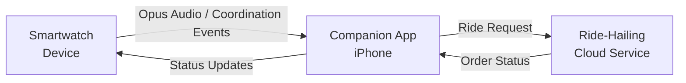
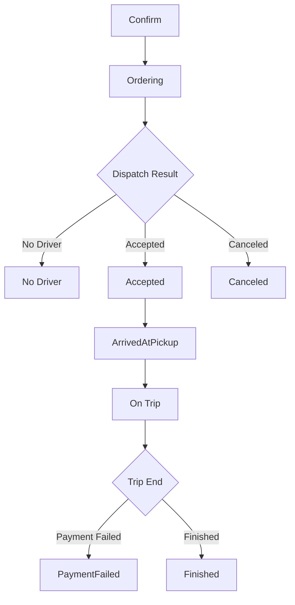

# Voice Ride Hailing Programming Guide

> **Platform**: This guide is for **iOS** only. The APIs described herein are based on Objective-C and the FitCloudKit iOS SDK.

## Overview

Voice Ride Hailing can originate on the watch or in the app. An SDK session exists only for device Opus capture and is not the ride-service or order lifetime. App-initiated SCO/phone-microphone work calls no SDK start/cancel method; only device-originated requests carry `audioSource` and require accept/reject.

## Architecture

The voice ride hailing flow involves three main parties:

1. **Smartwatch (Device)**: Can request coordination, captures and sends audio for Opus, and displays order status updates.
2. **Companion App (iPhone)**: Starts ASR and ride services; uses an SDK session for device Opus, owns SCO/phone-microphone audio entirely, and sends order-status updates to the watch.
3. **Ride-Hailing Cloud Service**: Processes the ride request, dispatches drivers, and returns order status updates.

## Workflow



### Step-by-Step Flow

1. **User triggers voice ride hailing on the watch** → SDK calls `onDeviceRequestStartVoiceRideHailingWithAudioSource:`
2. **App starts its services and answers** → Decide whether to handle the requested audio source and start ASR/ride services; call `acceptDeviceVoiceRideHailingStartRequestWithCompletion:` on success, or `rejectDeviceVoiceRideHailingStartRequestWithReason:completion:` on failure
3. **Handle the audio source** → Opus arrives through SDK callbacks; after accepting a device SCO/phone-microphone request, the SDK handshake ends and the app proceeds independently
4. **App performs ASR** → Converts voice to text and extracts ride intent
5. **App calls ride-hailing cloud service** → Sends the ride request
6. **Cloud returns confirm info** → Pickup, destination, vehicle type, estimated price, wait time
7. **App sends confirm info to device** → Device displays confirm screen
8. **Cloud dispatches driver** → Ordering → Accepted / No Driver
9. **App sends status updates to device** → Device tracks order progress
10. **Driver arrives and the trip completes** → Device shows arrival info and final price

---

## API Reference

### 1. Device Callbacks

#### 1.1 Voice Ride Hailing Start

Notifies the app that the watch requests a voice ride-hailing coordination session. The app decides whether it can handle the requested audio source and starts its ride/ASR services, then explicitly accepts or rejects. There is no common audio-channel configuration step, and receiving this callback does not mean both sides entered the coordinated state.

```objc
- (void)onDeviceRequestStartVoiceRideHailingWithAudioSource:(FitCloudAIAudioSource)audioSource;
```

**Discussion:**

- `audioSource` is the channel requested by the device. Opus comes from the device through the SDK; the app owns SCO and phone-microphone audio.
- Call `acceptDeviceVoiceRideHailingStartRequestWithCompletion:` after the app accepts the audio source and its service starts.
- If the business service, AI authorization, or another app-side prerequisite fails, call the reject API with the matching `FitCloudAIStartRejectionReason`.
- If accept completes with `deviceSideExceptionOccurred=YES`, the SDK has ended the failed coordination session. End the newly started app business and do not send cancel/reject.

#### 1.2 Device Cancels Current Input

```objc
- (void)onDeviceDidCancelVoiceRideHailingWithReason:(FitCloudAIDeviceInterruptionReason)reason;
```

The device has canceled the current single-turn voice ride-hailing input. Tear down ASR, audio, and business resources according to `reason`. Do not call the cancel API again in response to this device-initiated cancellation.

#### 1.3 Device Requests Exit

```objc
- (void)onDeviceRequestExitVoiceRideHailing;
```

The device requests the app to leave the voice ride-hailing scene. End the related UI or business state and release its resources.

#### 1.4 Incremental Voice Data (Delta)

Notifies that incremental voice ride hailing voice data has been received. This method is called multiple times during the recording process, allowing for streaming ASR.

> Only the Opus audio source produces the Opus/PCM callbacks in this section and the following section.

```objc
- (void)onReceivedVoiceRideHailingDeltaOpusVoiceData:(NSData *_Nullable)deltaOpusVoiceData
                               decodedDeltaVoiceData:(NSData *_Nullable)deltaVoiceData;
```

**Parameters:**
| Parameter | Type | Description |
|---|---|---|
| `deltaOpusVoiceData` | `NSData *` | Incremental voice data in Opus format |
| `deltaVoiceData` | `NSData *` | Decoded incremental voice data in PCM format (16000Hz, mono, 16-bit) |

**Discussion:**

- Called multiple times during the voice recording session.
- Suitable for streaming ASR services that support real-time recognition.
- Use the PCM data directly for ASR, or decode the Opus data if your ASR service prefers encoded formats.

#### 1.5 Final Voice Data

Notifies that voice ride hailing recording has completed and the final voice data is available.

```objc
- (void)onReceivedVoiceRideHailingOpusVoiceData:(NSData *_Nullable)opusVoiceData
                              decodedVoiceData:(NSData *_Nullable)voiceData;
```

**Parameters:**
| Parameter | Type | Description |
|---|---|---|
| `opusVoiceData` | `NSData *` | Final voice data in Opus format |
| `voiceData` | `NSData *` | Decoded voice data in PCM format (16000Hz, mono, 16-bit) |

**Discussion:**

- Called once at the end of the voice recording session.
- Contains the complete voice data for final ASR processing.
- If your ASR service does not support streaming, use this method exclusively.

---

### 2. Session Control APIs

These APIs manage only device Opus capture. They do not start ASR, ride services, or UI. App-initiated SCO/phone microphone uses none of these start/cancel APIs. A device non-Opus request still requires accept/reject, but successful accept completes the handshake and releases SDK state. SDK sessions are mutually exclusive and end when voice transfer completes.

| Audio channel | App-side handling |
|---|---|
| `FitCloudAIAudioSourceDeviceOpus` | SDK callbacks provide Opus and decoded PCM data for streaming ASR |
| `FitCloudAIAudioSourceBluetoothSCO` | Device-request callback only; after accept, the app owns the flow |
| `FitCloudAIAudioSourcePhoneMicrophone` | Device-request callback only; after accept, the app owns permission, capture, and lifecycle |

```objc
// App requests device Opus capture
+ (void)startVoiceRideHailingVoiceSessionWithCompletion:(FitCloudAIStartCompletion _Nullable)completion;

// App cancels the current input before voice transmission completes
+ (void)cancelVoiceRideHailingVoiceSessionWithCompletion:(FitCloudCompletionHandler _Nullable)completion;

// Answer after the app accepts the audio source and its services have started
+ (void)acceptDeviceVoiceRideHailingStartRequestWithCompletion:
    (void (^_Nullable)(BOOL success,
                       BOOL deviceSideExceptionOccurred,
                       NSError *_Nullable error))completion;

// Answer when app service startup or channel configuration fails
+ (void)rejectDeviceVoiceRideHailingStartRequestWithReason:(FitCloudAIStartRejectionReason)reason
                                                 completion:(FitCloudCompletionHandler _Nullable)completion;
```

> `cancelVoiceRideHailingVoiceSession...` cancels only incomplete voice input. `sendVoiceRideHailingStatusCanceled...` reports that the ride order itself was canceled. They belong to different lifetimes and are not interchangeable.

Use `start...` only when the app requests device Opus capture. App-initiated SCO/phone microphone calls neither start nor cancel. A device-originated request follows the callback and accept/reject path.

For an app-initiated start, `FitCloudAIDeviceSideStartFailureReason` reports a device-side business rejection and `error` reports an SDK or communication failure. Reject accepts the semantic reasons `ServiceFailed`, `AuthenticationFailed`, and `Other`; callers do not need to know their protocol representation.

| success | deviceSideExceptionOccurred | error | Meaning |
|---:|---:|---|---|
| YES | NO | nil | Opus enters a media session; SCO/phone microphone completes only the handshake and releases SDK state |
| NO | YES | nil | The app accepted, but the device did not enter the coordinated state; SDK ended the session, so stop local services |
| NO | NO | non-nil | SDK state, communication, or response validation failed |

### 3. Order Status APIs

The following APIs are used to send order status updates from the app to the device, enabling real-time tracking display on the smartwatch.

#### 3.1 Send Confirm Info

Sends ride hailing confirm information to the device after the app receives the initial quote from the cloud service.

```objc
+ (void)sendVoiceRideHailingConfirmInfo:(FitCloudVoiceRideHailingConfirmModel *)confirmModel
                              completion:(FitCloudCompletionHandler _Nullable)completion;
```

**Parameters:**
| Parameter | Type | Description |
|---|---|---|
| `confirmModel` | `FitCloudVoiceRideHailingConfirmModel *` | Confirm model with pickup, destination, vehicle type, estimated price, and wait time |
| `completion` | `FitCloudCompletionHandler` | Completion handler called when the operation completes |

**`FitCloudVoiceRideHailingConfirmModel` Properties:**
| Property | Type | Max Length | Description |
|---|---|---|---|
| `pickup` | `NSString *` | 128 bytes | Pickup location (e.g., "123 Main St, Anytown, USA") |
| `destination` | `NSString *` | 128 bytes | Destination (e.g., "456 Elm St, Anytown, USA") |
| `vehicleType` | `NSString *` | 32 bytes | Vehicle type (e.g., "Fast car") |
| `estimatedPrice` | `NSString *` | 12 bytes | Estimated price (e.g., "$13.45") |
| `estimatedWaitTime` | `NSString *` | 12 bytes | Estimated wait time (e.g., "5 minutes") |

**Note:** Ensure the model passes `isValid` before sending.

---

#### 3.2 Send Ordering Status

Sends the "ordering" status to the device, indicating that the ride request is being processed.

```objc
+ (void)sendVoiceRideHailingStatusOrderingWithCompletion:(FitCloudCompletionHandler _Nullable)completion;
```

**Parameters:**
| Parameter | Type | Description |
|---|---|---|
| `completion` | `FitCloudCompletionHandler` | Completion handler called when the operation completes |

---

#### 3.3 Send No Driver Status

Sends the "no driver" status to the device, indicating that no driver is available.

```objc
+ (void)sendVoiceRideHailingStatusNoDriverWithCompletion:(FitCloudCompletionHandler _Nullable)completion;
```

**Parameters:**
| Parameter | Type | Description |
|---|---|---|
| `completion` | `FitCloudCompletionHandler` | Completion handler called when the operation completes |

---

#### 3.4 Send Accepted Info

Sends the driver acceptance information to the device.

```objc
+ (void)sendVoiceRideHailingAcceptedInfo:(FitCloudVoiceRideHailingAcceptedModel *)acceptedModel
                              completion:(FitCloudCompletionHandler _Nullable)completion;
```

**Parameters:**
| Parameter | Type | Description |
|---|---|---|
| `acceptedModel` | `FitCloudVoiceRideHailingAcceptedModel *` | Accepted model with vehicle, driver, and pickup details |
| `completion` | `FitCloudCompletionHandler` | Completion handler called when the operation completes |

**`FitCloudVoiceRideHailingAcceptedModel` Properties:**
| Property | Type | Max Length | Description |
|---|---|---|---|
| `vehicleModel` | `NSString *` | 64 bytes | Vehicle model (e.g., "Tesla Model S (White)") |
| `plateNumber` | `NSString *` | 12 bytes | License plate number (e.g., "CA12345") |
| `driverName` | `NSString *` | 32 bytes | Driver name (e.g., "John Doe") |
| `driverPhoneNumber` | `NSString *` | 16 bytes | Driver phone number (e.g., "+1234567890") |
| `pickup` | `NSString *` | 128 bytes | Pickup location |
| `distanceToPickup` | `NSString *` | 12 bytes | Distance to pickup (e.g., "0.5km") |
| `estimatedPickupTimeSinceNow` | `NSString *` | 12 bytes | Estimated pickup time (e.g., "5 minutes") |

---

#### 3.5 Send Canceled Status

Sends the "canceled" status to the device, indicating that the order has been canceled.

```objc
+ (void)sendVoiceRideHailingStatusCanceledWithCompletion:(FitCloudCompletionHandler _Nullable)completion;
```

**Parameters:**
| Parameter | Type | Description |
|---|---|---|
| `completion` | `FitCloudCompletionHandler` | Completion handler called when the operation completes |

---

#### 3.6 Send Arrived at Pickup Info

Sends the arrival at pickup point information to the device.

```objc
+ (void)sendVoiceRideHailingArrivedAtPickupInfo:(FitCloudVoiceRideHailingArrivedAtPickupModel *)arrivedModel
                                     completion:(FitCloudCompletionHandler _Nullable)completion;
```

**Parameters:**
| Parameter | Type | Description |
|---|---|---|
| `arrivedModel` | `FitCloudVoiceRideHailingArrivedAtPickupModel *` | Arrival model with vehicle, driver, and free wait time details |
| `completion` | `FitCloudCompletionHandler` | Completion handler called when the operation completes |

**`FitCloudVoiceRideHailingArrivedAtPickupModel` Properties:**
| Property | Type | Max Length | Description |
|---|---|---|---|
| `vehicleModel` | `NSString *` | 64 bytes | Vehicle model (e.g., "Tesla Model S (White)") |
| `plateNumber` | `NSString *` | 12 bytes | License plate number (e.g., "CA12345") |
| `driverName` | `NSString *` | 32 bytes | Driver name (e.g., "John Doe") |
| `driverPhoneNumber` | `NSString *` | 16 bytes | Driver phone number (e.g., "+1234567890") |
| `pickup` | `NSString *` | 128 bytes | Pickup location |
| `freeWaitTime` | `NSString *` | 12 bytes | Free wait time in seconds (e.g., "300") |

---

#### 3.7 Send On Trip Info

Sends the "on trip" information to the device for real-time trip tracking.

```objc
+ (void)sendVoiceRideHailingOnTripInfo:(FitCloudVoiceRideHailingOnTripModel *)onTripModel
                           completion:(FitCloudCompletionHandler _Nullable)completion;
```

**Parameters:**
| Parameter | Type | Description |
|---|---|---|
| `onTripModel` | `FitCloudVoiceRideHailingOnTripModel *` | On-trip model with remaining distance, ETA, and estimated price |
| `completion` | `FitCloudCompletionHandler` | Completion handler called when the operation completes |

**`FitCloudVoiceRideHailingOnTripModel` Properties:**
| Property | Type | Max Length | Description |
|---|---|---|---|
| `remainingDistance` | `NSString *` | 12 bytes | Remaining distance (e.g., "2.5km") |
| `estimatedTimeToDestination` | `NSString *` | 12 bytes | ETA to destination (e.g., "15 minutes") |
| `estimatedTotalPrice` | `NSString *` | 12 bytes | Estimated total price (e.g., "$15.75") |

---

#### 3.8 Send Payment Failed Status

Sends the "payment failed" status to the device.

```objc
+ (void)sendVoiceRideHailingStatusPaymentFailedWithCompletion:(FitCloudCompletionHandler _Nullable)completion;
```

**Parameters:**
| Parameter | Type | Description |
|---|---|---|
| `completion` | `FitCloudCompletionHandler` | Completion handler called when the operation completes |

---

#### 3.9 Send Finished Info

Sends the trip completion information to the device.

```objc
+ (void)sendVoiceRideHailingFinishedInfo:(FitCloudVoiceRideHailingFinishedModel *)finishedModel
                              completion:(FitCloudCompletionHandler _Nullable)completion;
```

**Parameters:**
| Parameter | Type | Description |
|---|---|---|
| `finishedModel` | `FitCloudVoiceRideHailingFinishedModel *` | Finished model with total price |
| `completion` | `FitCloudCompletionHandler` | Completion handler called when the operation completes |

**`FitCloudVoiceRideHailingFinishedModel` Properties:**
| Property | Type | Max Length | Description |
|---|---|---|---|
| `totalPrice` | `NSString *` | 12 bytes | Total price (e.g., "$15.75") |

---

## Order Status Flow

The following diagram illustrates the possible state transitions for a voice ride hailing order:



### Status Description

| Status                    | API                                                      | Description                                                  |
| ------------------------- | -------------------------------------------------------- | ------------------------------------------------------------ |
| Confirm                   | `sendVoiceRideHailingConfirmInfo:completion:`            | Initial quote: pickup, destination, vehicle, estimated price |
| Ordering                  | `sendVoiceRideHailingStatusOrderingWithCompletion:`      | Ride request is being processed                              |
| No Driver                 | `sendVoiceRideHailingStatusNoDriverWithCompletion:`      | No driver available                                          |
| Accepted                  | `sendVoiceRideHailingAcceptedInfo:completion:`           | Driver accepted the order                                    |
| Canceled                  | `sendVoiceRideHailingStatusCanceledWithCompletion:`      | Order canceled                                               |
| Vehicle Arrived at Pickup | `sendVoiceRideHailingArrivedAtPickupInfo:completion:`    | Driver arrived at pickup point                               |
| On Trip                   | `sendVoiceRideHailingOnTripInfo:completion:`             | Trip in progress                                             |
| Payment Failed            | `sendVoiceRideHailingStatusPaymentFailedWithCompletion:` | Payment failed                                               |
| Finished                  | `sendVoiceRideHailingFinishedInfo:completion:`           | Trip completed                                               |

---

## Implementation Example

### Objective-C

```objc
#pragma mark - FitCloudCallback

- (void)onDeviceRequestStartVoiceRideHailingWithAudioSource:(FitCloudAIAudioSource)audioSource {
    // Select the audio source and start app-side ASR/ride services before accepting.
    if (![self startVoiceRideHailingServicesForAudioSource:audioSource]) {
        [FitCloudKit rejectDeviceVoiceRideHailingStartRequestWithReason:FitCloudAIStartRejectionReasonServiceFailed
                                                             completion:nil];
        return;
    }
    [FitCloudKit acceptDeviceVoiceRideHailingStartRequestWithCompletion:
        ^(BOOL success, BOOL deviceSideExceptionOccurred, NSError *error) {
            if (!success) {
                // End local business after failure.
                [self teardownVoiceRideHailing];
            }
        }];
}

- (void)onDeviceDidCancelVoiceRideHailingWithReason:(FitCloudAIDeviceInterruptionReason)reason {
    [self teardownVoiceRideHailing];
}

- (void)onDeviceRequestExitVoiceRideHailing {
    [self teardownVoiceRideHailing];
}

- (void)onReceivedVoiceRideHailingDeltaOpusVoiceData:(NSData *)deltaOpusVoiceData
                               decodedDeltaVoiceData:(NSData *)deltaVoiceData {
    // Feed incremental PCM data to streaming ASR service for real-time recognition
    // This is called multiple times during recording
    [self.streamingASR appendAudioData:deltaVoiceData];
}

- (void)onReceivedVoiceRideHailingOpusVoiceData:(NSData *)opusVoiceData
                              decodedVoiceData:(NSData *)voiceData {
    // Process final voice data with ASR
    [self runASRWithAudioData:voiceData completion:^(NSString *text, NSError *error) {
        if (error) {
            // Handle ASR error
            return;
        }
        // Extract ride intent and call cloud ride hailing service
        [self requestRideWithText:text];
    }];
}

#pragma mark - Ride Hailing Flow

- (void)requestRideWithText:(NSString *)text {
    // Parse text to extract pickup, destination, vehicle type
    // Call your ride hailing cloud service

    // After receiving confirm response from cloud:
    FitCloudVoiceRideHailingConfirmModel *confirmModel = [[FitCloudVoiceRideHailingConfirmModel alloc] init];
    confirmModel.pickup = @"123 Main St";
    confirmModel.destination = @"456 Elm St";
    confirmModel.vehicleType = @"Fast car";
    confirmModel.estimatedPrice = @"$13.45";
    confirmModel.estimatedWaitTime = @"5 minutes";

    if ([confirmModel isValid]) {
        [FitCloudKit sendVoiceRideHailingConfirmInfo:confirmModel
                                         completion:^(BOOL success, NSError *error) {
            if (success) {
                // Confirm info sent successfully to device
            }
        }];
    }

    // Send ordering status
    [FitCloudKit sendVoiceRideHailingStatusOrderingWithCompletion:^(BOOL success, NSError *error) {
        // ...
    }];
}

- (void)onDriverAccepted {
    FitCloudVoiceRideHailingAcceptedModel *acceptedModel = [[FitCloudVoiceRideHailingAcceptedModel alloc] init];
    acceptedModel.vehicleModel = @"Tesla Model S (White)";
    acceptedModel.plateNumber = @"CA12345";
    acceptedModel.driverName = @"John Doe";
    acceptedModel.driverPhoneNumber = @"+1234567890";
    acceptedModel.pickup = @"123 Main St";
    acceptedModel.distanceToPickup = @"0.5km";
    acceptedModel.estimatedPickupTimeSinceNow = @"5 minutes";

    [FitCloudKit sendVoiceRideHailingAcceptedInfo:acceptedModel
                                      completion:^(BOOL success, NSError *error) {
        // ...
    }];
}

- (void)onDriverArrived {
    FitCloudVoiceRideHailingArrivedAtPickupModel *arrivedModel = [[FitCloudVoiceRideHailingArrivedAtPickupModel alloc] init];
    arrivedModel.vehicleModel = @"Tesla Model S (White)";
    arrivedModel.plateNumber = @"CA12345";
    arrivedModel.driverName = @"John Doe";
    arrivedModel.driverPhoneNumber = @"+1234567890";
    arrivedModel.pickup = @"123 Main St";
    arrivedModel.freeWaitTime = @"300";

    [FitCloudKit sendVoiceRideHailingArrivedAtPickupInfo:arrivedModel
                                              completion:^(BOOL success, NSError *error) {
        // ...
    }];
}

- (void)onTripUpdate {
    FitCloudVoiceRideHailingOnTripModel *onTripModel = [[FitCloudVoiceRideHailingOnTripModel alloc] init];
    onTripModel.remainingDistance = @"2.5km";
    onTripModel.estimatedTimeToDestination = @"15 minutes";
    onTripModel.estimatedTotalPrice = @"$15.75";

    [FitCloudKit sendVoiceRideHailingOnTripInfo:onTripModel
                                     completion:^(BOOL success, NSError *error) {
        // ...
    }];
}

- (void)onTripFinished {
    FitCloudVoiceRideHailingFinishedModel *finishedModel = [[FitCloudVoiceRideHailingFinishedModel alloc] init];
    finishedModel.totalPrice = @"$15.75";

    [FitCloudKit sendVoiceRideHailingFinishedInfo:finishedModel
                                      completion:^(BOOL success, NSError *error) {
        // ...
    }];
}
```

### Swift

```swift
// MARK: - FitCloudCallback

func onDeviceRequestStartVoiceRideHailing(withAudioSource audioSource: FitCloudAIAudioSource) {
    guard startVoiceRideHailingServices(forAudioSource: audioSource) else {
        FitCloudKit.rejectDeviceVoiceRideHailingStartRequest(
            with: .serviceFailed,
            completion: nil
        )
        return
    }
    FitCloudKit.acceptDeviceVoiceRideHailingStartRequest { [weak self] success, deviceSideExceptionOccurred, error in
        if !success {
            // End local business after failure.
            self?.teardownVoiceRideHailing()
        }
    }
}

func onDeviceDidCancelVoiceRideHailing(with reason: FitCloudAIDeviceInterruptionReason) {
    teardownVoiceRideHailing()
}

func onDeviceRequestExitVoiceRideHailing() {
    teardownVoiceRideHailing()
}

func onReceivedVoiceRideHailingDeltaOpusVoiceData(_ deltaOpusVoiceData: Data?,
                                                   decodedDeltaVoiceData deltaVoiceData: Data?) {
    // Feed incremental PCM data to streaming ASR service for real-time recognition
    // This is called multiple times during recording
    streamingASR?.appendAudioData(deltaVoiceData)
}

func onReceivedVoiceRideHailingOpusVoiceData(_ opusVoiceData: Data?,
                                                decodedVoiceData voiceData: Data?) {
    // Process final voice data with ASR
    runASR(withAudioData: voiceData) { [weak self] text, error in
        if let error = error {
            // Handle ASR error
            return
        }
        // Extract ride intent and call cloud ride hailing service
        self?.requestRide(withText: text)
    }
}

// MARK: - Ride Hailing Flow

func requestRide(withText text: String) {
    // Parse text to extract pickup, destination, vehicle type
    // Call your ride hailing cloud service

    // After receiving confirm response from cloud:
    let confirmModel = FitCloudVoiceRideHailingConfirmModel()
    confirmModel.pickup = "123 Main St"
    confirmModel.destination = "456 Elm St"
    confirmModel.vehicleType = "Fast car"
    confirmModel.estimatedPrice = "$13.45"
    confirmModel.estimatedWaitTime = "5 minutes"

    if confirmModel.isValid() {
        FitCloudKit.sendVoiceRideHailingConfirmInfo(confirmModel) { success, error in
            if success {
                // Confirm info sent successfully to device
            }
        }
    }

    // Send ordering status
    FitCloudKit.sendVoiceRideHailingStatusOrdering { success, error in
        // ...
    }
}

func onDriverAccepted() {
    let acceptedModel = FitCloudVoiceRideHailingAcceptedModel()
    acceptedModel.vehicleModel = "Tesla Model S (White)"
    acceptedModel.plateNumber = "CA12345"
    acceptedModel.driverName = "John Doe"
    acceptedModel.driverPhoneNumber = "+1234567890"
    acceptedModel.pickup = "123 Main St"
    acceptedModel.distanceToPickup = "0.5km"
    acceptedModel.estimatedPickupTimeSinceNow = "5 minutes"

    FitCloudKit.sendVoiceRideHailingAcceptedInfo(acceptedModel) { success, error in
        // ...
    }
}

func onDriverArrived() {
    let arrivedModel = FitCloudVoiceRideHailingArrivedAtPickupModel()
    arrivedModel.vehicleModel = "Tesla Model S (White)"
    arrivedModel.plateNumber = "CA12345"
    arrivedModel.driverName = "John Doe"
    arrivedModel.driverPhoneNumber = "+1234567890"
    arrivedModel.pickup = "123 Main St"
    arrivedModel.freeWaitTime = "300"

    FitCloudKit.sendVoiceRideHailingArrivedAtPickupInfo(arrivedModel) { success, error in
        // ...
    }
}

func onTripUpdate() {
    let onTripModel = FitCloudVoiceRideHailingOnTripModel()
    onTripModel.remainingDistance = "2.5km"
    onTripModel.estimatedTimeToDestination = "15 minutes"
    onTripModel.estimatedTotalPrice = "$15.75"

    FitCloudKit.sendVoiceRideHailingOnTripInfo(onTripModel) { success, error in
        // ...
    }
}

func onTripFinished() {
    let finishedModel = FitCloudVoiceRideHailingFinishedModel()
    finishedModel.totalPrice = "$15.75"

    FitCloudKit.sendVoiceRideHailingFinishedInfo(finishedModel) { success, error in
        // ...
    }
}
```

---

## Best Practices

### ASR Strategy

- **For streaming ASR services**: Use `onReceivedVoiceRideHailingDeltaOpusVoiceData:decodedDeltaVoiceData:` to feed incremental PCM data for real-time recognition, then use the final result from `onReceivedVoiceRideHailingOpusVoiceData:decodedVoiceData:` for the final ASR call.
- **For non-streaming ASR services**: Only implement `onReceivedVoiceRideHailingOpusVoiceData:decodedVoiceData:` and process the complete audio data at once.

### Model Validation

- Always call `isValid` on the model before sending to ensure all required fields are present and within length limits.
- Truncate strings that exceed the maximum length to avoid unexpected behavior.

### Error Handling

- Check the `success` flag and `error` in the completion handler for every command sent to the device.
- Implement retry logic for transient failures.
- Monitor device connection status before sending commands.

### Voice Data Handling

- PCM data format: 16000Hz sample rate, mono channel, 16-bit signed integers, which is optimal for ASR processing.
- Opus data is provided as an alternative; decode it if your ASR service requires encoded audio.

## Requirements

- **FitCloudKit**: Minimum version with Voice Ride Hailing feature
- **Device Firmware**: Must support Voice Ride Hailing feature (check via `[FitCloudKit isDeviceSupportFeature:FITCLOUDDEVICEFEATURE_VOICERIDEHAILING]`)
- **ASR Service**: Any ASR service (streaming or batch) that supports PCM audio input
- **Ride Hailing Backend**: Integration with a ride-hailing service provider

## See Also

- `FitCloudCallback.h` — Device callback protocol
- `FitCloudKit.h` — Main SDK entry point with Voice Ride Hailing category
